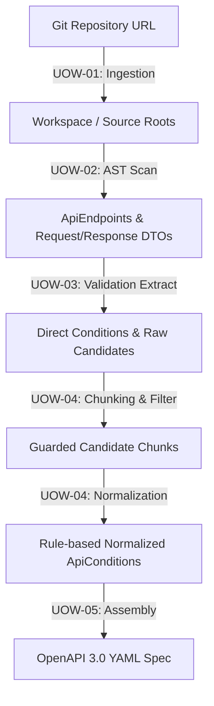

# Spec Scan (Spring API Contract & Validation Extraction Engine)

GitHub Repository URL 기반으로 Spring Boot 백엔드 소스 코드를 정적 분석하여, API 엔드포인트 명세와 다단계 유효성 검증 제약 조건(Annotation, Validator, Service Hint)을 추출하고 이를 정규화하여 최종 **OpenAPI 3.0 YAML 규격서**로 조립해내는 PoC 엔진입니다.

---

## 🛠 Technology Stack
* **Java 21**
* **Gradle 9.0**
* **JavaParser 3.25.7** (AST 기반 정적 코드 분석)
* **JUnit 5 & AssertJ** (단위 및 통합 테스트)

---

## ⚙️ Core Pipeline Architecture



1. **Repository Ingestion (UOW-01)**: Git 레포지토리를 안전하게 로컬 임시 워크스페이스에 클론하고 정적 분석 소스 루트를 자동 탐색합니다.
2. **Endpoint and Type Analysis (UOW-02)**: `@RestController` 클래스 및 메서드를 AST로 분석하여 HTTP Method, Routing Path, Parameter(Header, Path, Query, Body) 및 응답 타입을 매핑합니다.
3. **Validation Candidate Extraction (UOW-03)**:
   - DTO의 표준 Bean Validation 어노테이션 추출 및 커스텀 어노테이션 분리
   - `ConstraintValidator` 및 스프링 `Validator` 내 `errors.rejectValue(...)` 추적
   - 서비스 레이어 내 `if-throw BusinessException` 예외 흐름 정적 파싱 및 간접 필드 유추
4. **Candidate Chunk and Normalization (UOW-04)**: 추출 후보들을 엔드포인트별/타입별 청크로 분할하고, 필수 정보가 결락된 청크를 무효화(Invalid check) 가드 처리한 뒤 endpoint-scoped graph evidence를 반영한 규칙 기반 정규화로 표준 검증 규격으로 변환합니다.
5. **Contract Assembly and Output (UOW-05)**: 수집/정규화된 모든 규칙 사양과 API 명세를 병합하여 제약 조건 속성이 온전히 주입된 OpenAPI 3.0 YAML 문서를 조립 후 지정된 파일 경로에 출력합니다.

---

## 🚀 How to Run

### 1. Build and Run Tests
전체 단위 및 통합 테스트 스위트를 구동하여 컴포넌트 동작을 검증합니다.
```powershell
./gradlew test
```

### 2. Run Demo (E2E Pipeline Runner)
PoC 엔진 전체 파이프라인을 기동하여 로컬/원격 임시 소스 코드를 스캔하고 최종 `openapi.yaml` 파일을 물리적으로 생성하는 실 데모 러너입니다. (곧 실현될 실행 가이드 예시입니다.)
```powershell
./gradlew runDemo --args="https://github.com/example/sample-spring-app.git build/openapi.yaml"
```

---

## 📂 Code Directory Structure
```text
src/main/java/io/atworks/specscan/
├── ingestion/                  # Git 클론 및 워크스페이스 감지 레이어
│   ├── application/            # RepositoryIngestionService
│   ├── domain/                 # RepositorySource, WorkspaceContext, SourceTrace
│   └── support/                # GitFetcher, WorkspacePreparer
│
├── analysis/                   # Spring Controller 및 DTO 정적 분석 레이어
│   ├── application/            # SpringStaticScanService, ValidationExtractionService, NormalizationService, OpenApiAssemblyService
│   ├── domain/                 # ApiEndpoint, RequestBinding, ApiCondition, ValidationCandidate, CandidateChunk
│   └── support/                # EndpointExtractor, TypeResolver, SourceTraceResolver, OpenApiGenerator, PromptBuilder
```
