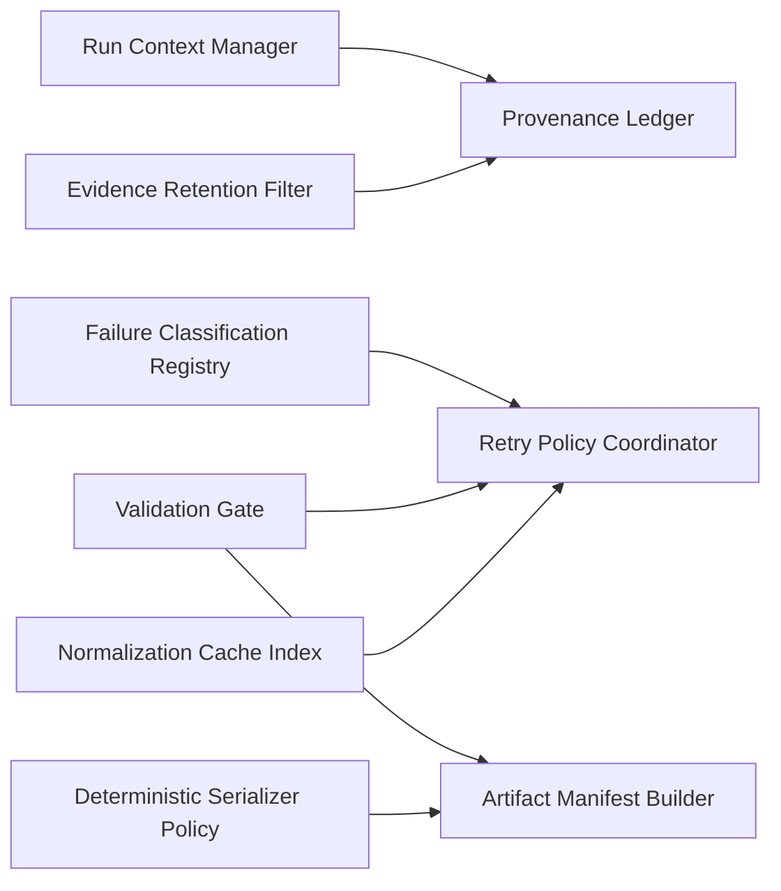

# Logical Components

## Overview
These logical components support cross-cutting NFR behavior across the PoC pipeline. They are conceptual design components, not necessarily separate deployable services.

## 1. Run Context Manager
- Responsibilities:
  - issue `sourceRunId`
  - maintain stage-level execution context
  - attach run provenance to all downstream artifacts
- Supports:
  - reproducibility
  - traceability
  - partial success review

## 2. Failure Classification Registry
- Responsibilities:
  - classify stage failures into retryable, rejectable, or terminal categories
  - standardize failure codes and severity
  - support stage-scoped failure containment
- Failure taxonomy:
  - `TERMINAL`
  - `RETRYABLE`
  - `REJECTABLE`
  - `PARTIAL`
- Stage code examples:
  - `UOW-01`:
    - `INVALID_REPOSITORY_URL`
    - `CLONE_FAILED`
    - `STATIC_ANALYSIS_POLICY_VIOLATION`
  - `UOW-02`:
    - `REQUEST_MAPPING_RESOLUTION_FAILED`
    - `REQUEST_BINDING_RESOLUTION_FAILED`
    - `TYPE_RESOLUTION_FAILED`
  - `UOW-03`:
    - `ANNOTATION_EXTRACT_FAILED`
    - `VALIDATOR_LINK_FAILED`
    - `SERVICE_HINT_EXTRACTION_FAILED`
  - `UOW-04`:
    - `CHUNK_VALIDATION_FAILED`
    - `LLM_SCHEMA_ERROR`
    - `LLM_SEMANTIC_INCONSISTENCY`
    - `FORBIDDEN_RULE_CREATION`
  - `UOW-05`:
    - `CONDITION_CONFLICT_DETECTED`
    - `OPENAPI_ASSEMBLY_FAILED`
    - `ARTIFACT_VALIDATION_FAILED`
- Supports:
  - resilience
  - failure isolation
  - consistent audit/debug output

## 3. Validation Gate
- Responsibilities:
  - `Candidate Gate`:
    - validate candidate integrity before LLM
    - enforce evidence, source trace, endpoint linkage, and candidate identity rules
  - `LLM Response Gate`:
    - validate LLM responses after invocation
    - enforce parse/schema/enum/candidateId/semantic checks
  - `Artifact Gate`:
    - validate final output artifacts before persistence
    - enforce manifest completeness, artifact schema validity, and deterministic output checks
- Supports:
  - retry gating
  - schema validation
  - semantic consistency checks

## 4. Retry Policy Coordinator
- Responsibilities:
  - apply bounded retry policy
  - track attempt count
  - record retry reason and final disposition
- Supports:
  - LLM response stability
  - controlled failure recovery

## 5. Provenance Ledger
- Responsibilities:
  - track run-level, chunk-level, and artifact-level provenance
  - maintain upstream reference links between chunks, retries, accepted results, rejected results, conflicts, and final artifacts
- Minimum field set:
  - `sourceRunId`
  - `stageId`
  - `chunkId` when applicable
  - `candidateId` when applicable
  - `artifactId` or artifact path when applicable
  - `inputHash` when applicable
  - `promptVersion` when applicable
  - `generatedAt`
  - `upstreamReferenceIds`
- Supports:
  - reproducibility
  - review/debug traceability

## 6. Normalization Cache Index
- Responsibilities:
  - compute cache keys from `inputHash` and `promptVersion`
  - determine cache eligibility
  - record cache hit/miss/bypass outcomes
  - enforce invalidation rules on prompt or schema changes
- Cacheable policy:
  - cache accepted validated normalization results
  - optionally cache deterministic rejected classes that are explicitly marked reusable
- Non-cacheable policy:
  - do not cache retryable failures
  - do not cache malformed or truncated responses
  - do not cache outputs produced under obsolete promptVersion or candidate schema
- Supports:
  - cost control
  - reproducibility
  - performance stability

## 7. Evidence Retention Filter
- Responsibilities:
  - enforce minimal evidence retention policy
  - strip forbidden source-dump style payloads
  - retain only required snippet and trace ranges
- Supports:
  - data minimization
  - safer debug artifact generation

## 8. Artifact Manifest Builder
- Responsibilities:
  - assemble machine-readable manifest
  - separate success/failure/skipped/rejected/conflict states
  - include artifact validation results and summary counters
- Supports:
  - output reviewability
  - downstream automation

## 9. Deterministic Serializer Policy
- Responsibilities:
  - enforce stable field ordering
  - enforce explicit model serialization
  - reduce non-semantic output drift
- Supports:
  - snapshot testing
  - artifact diff stability
  - deterministic final outputs

## Component Relationship Sketch

## Stage Mapping
- `UOW-01`:
  - Run Context Manager
  - Failure Classification Registry
- `UOW-02`:
  - Failure Classification Registry
  - Provenance Ledger
- `UOW-03`:
  - Provenance Ledger
  - Evidence Retention Filter
- `UOW-04`:
  - Validation Gate
  - Retry Policy Coordinator
  - Normalization Cache Index
  - Provenance Ledger
- `UOW-05`:
  - Artifact Manifest Builder
  - Deterministic Serializer Policy
  - Provenance Ledger
  - Evidence Retention Filter
