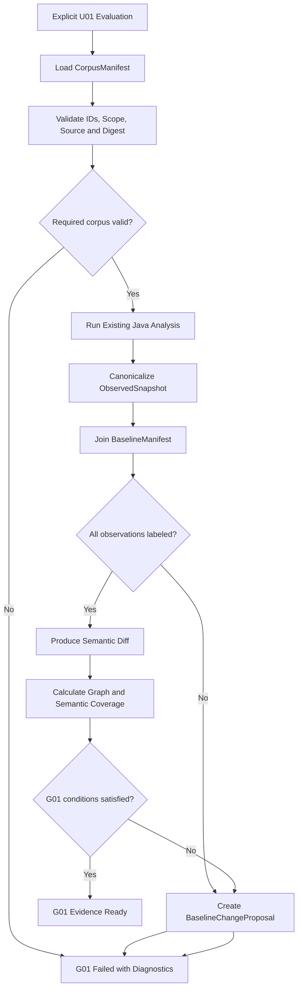
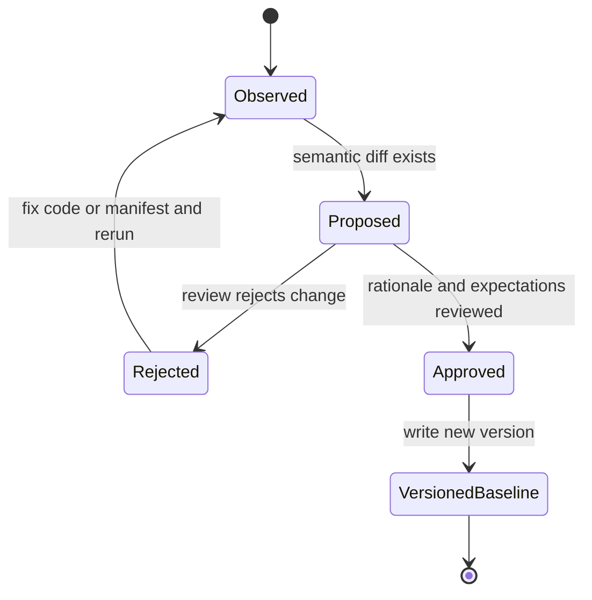

# U01 Generalization Baseline — Business Logic Model

## 1. 목적

U01은 YAML engine 구현 전에 현재 Java engine의 관찰 결과와 사람이 승인한 기대 결과를 분리하여 고정한다. 이 Unit의 산출물은 이후 U02~U06이 의미 회귀, 알려진 오탐 교정과 cross-repository 일반성을 같은 기준으로 평가하게 하는 source of truth다.

## 2. 입력과 출력

### 입력

- `CorpusManifest`: 평가 corpus, source, required 여부, integrity 정보와 endpoint scope
- 현재 Java/Spring MVC scan 및 rule engine
- 기존 graph/rule regression fixture
- 사람이 검토한 disposition과 corrected expectation
- rename/mutation variant의 scenario mapping

### 출력

- `ObservedSnapshot`: 현재 Java engine이 실제로 생성한 정렬된 관찰 결과
- `BaselineManifest`: 승인된 disposition과 기대 결과
- `BaselineDiff`: 기존 baseline과 신규 observation의 의미 차이
- `CoverageSnapshot`: graph/semantic coverage와 제외 사유
- `CorpusDiagnostic`: availability/integrity/scope 문제
- `BaselineChangeProposal`: 자동 적용되지 않는 re-baseline 후보

## 3. 상위 Workflow



Optional corpus의 누락은 `Partition`에서 diagnostic을 남기고 denominator에서 명시적으로 제외한다. required corpus 누락이나 digest mismatch는 즉시 G01 실패다.

## 4. Manifest Load and Validation

### 4.1 Corpus source 종류

- `CHECKED_IN_FIXTURE`: 작은 deterministic unit/integration fixture
- `LOCAL_SNAPSHOT`: 실제 또는 현실적 독립 repository snapshot

remote clone-on-run은 지원하지 않는다. `LOCAL_SNAPSHOT`은 local path와 content digest를 manifest에 고정하며 VCS 정보가 있으면 commit reference도 기록한다.

### 4.2 Validation 순서

1. manifest schema/version 확인
2. `corpusId`와 `scenarioId` uniqueness 확인
3. source kind별 필수 locator 확인
4. local availability 확인
5. content digest/commit reference 확인
6. Spring MVC source root 및 endpoint scope 확인
7. required/optional policy 적용

검증 실패는 Java analysis 이전에 발생해야 한다. partial manifest를 조용히 실행하지 않는다.

## 5. Observation Capture

### 5.1 실행 경계

- runner는 test 또는 명시적 evaluation entry point에서만 호출된다.
- production CLI와 정상 scan orchestration에는 연결하지 않는다.
- 정상 scan과 동일한 기존 Java 분석기를 사용할 수 있지만 baseline runner의 실패가 정상 scan 결과를 바꾸지 않는다.
- U01에는 YAML bootstrap, compiled plan 또는 YAML-budget evaluation graph가 없다.

### 5.2 처리 순서

1. corpus별 Spring endpoint inventory 수집
2. endpoint별 graph build result 및 diagnostic 수집
3. 현재 Java rule result 수집
4. observation을 canonical form으로 변환
5. repository → operation key → exact identity 순으로 정렬
6. immutable `ObservedSnapshot` 생성

### 5.3 Canonical observation

관찰 가능한 의미 필드는 다음과 같다.

- rule/category/effect
- normalized constraint kind
- target/operator/expected values
- extraction/semantic/target resolution status
- diagnostic code
- normalized evidence fingerprint

elapsed time, peak memory와 내부 trace ordering은 semantic equality에 포함하지 않고 별도 metadata로 보존한다.

## 6. Identity Model

### 6.1 Exact identity

동일 source revision의 정밀 regression 비교에 사용한다.

```text
ObservationIdentity =
  corpusId
  + operationKey
  + predicateCandidateId
  + ruleId
  + canonicalConstraint
  + evidenceFingerprint
```

같은 source에서 candidate 추가·소실·변경을 구분하는 목적이므로 source-derived identifier 사용을 허용한다.

### 6.2 Scenario identity

rename/mutation holdout 간 의미 대응에 사용한다.

```text
ScenarioIdentity = scenarioId + semanticRole + occurrenceKey
```

- `scenarioId`는 manifest가 원본과 variant에 공통 부여한다.
- `semanticRole`은 `BINARY_FAILURE_GUARD`, `NULL_GUARD` 같은 classifier family 역할이다.
- `occurrenceKey`는 같은 scenario 안의 복수 의미 슬롯을 구분하는 안정적인 manifest key다.
- source line, raw node ID와 concrete field name은 포함하지 않는다.

variant의 target 이름은 달라질 수 있으므로 target 문자열 동일성이 아니라 manifest의 expected transformation과 semantic shape를 비교한다.

## 7. Baseline Labeling

### 7.1 두 계층

- `ObservedSnapshot`: 자동 수집 사실. 승인이나 옳고 그름을 의미하지 않는다.
- `BaselineManifest`: 사람이 승인한 평가 정책과 expected observation.

### 7.2 Disposition workflow

| Disposition | 의미 | 필수 기대값 |
| :--- | :--- | :--- |
| `PRESERVE` | 현재 외부 관찰 의미를 유지해야 함 | approved observed semantic value와 rationale |
| `REPLACE` | 현재 결과가 잘못되어 교정되어야 함 | corrected semantic expectation과 rationale |
| `UNSUPPORTED` | 지원 범위 밖이며 값을 발명하면 안 됨 | expected diagnostic code/status와 rationale |

새 observation은 자동으로 disposition을 받지 않는다. `UNLABELED` change로 proposal에 포함되고 G01을 실패시킨다.

## 8. Semantic Diff

### 8.1 Exact regression diff

- `ADDED`: 신규 exact identity
- `REMOVED`: 기존 exact identity 소실
- `CHANGED`: identity가 대응되지만 canonical semantic value 변화
- `UNCHANGED`: canonical semantic value 동일

### 8.2 Disposition verdict

- `PRESERVE`: added/removed/changed 중 승인되지 않은 차이가 있으면 실패
- `REPLACE`: corrected expectation과 일치하면 통과, 기존 잘못된 값 유지 또는 다른 값이면 실패
- `UNSUPPORTED`: expected diagnostic과 일치하고 normalized business meaning을 만들지 않아야 통과

### 8.3 Rename/mutation diff

Scenario identity로 원본/variant를 묶고 다음을 비교한다.

- 같은 semantic family가 탐지되는가
- variant의 실제 target/literal이 올바르게 바인딩되는가
- operator/failure polarity 의미가 보존되는가
- recipe/project-specific tuning 없이 동일 expected shape을 만족하는가

U01에서는 Java baseline과 holdout 기대값을 정의하며 실제 YAML recipe 일반성 판정은 U04/U06에서 수행한다.

## 9. Coverage Calculation

### 9.1 Graph coverage

```text
endpointGraphCoverage = graphBuiltEndpoints / eligibleEndpoints
completeGraphCoverage = nonPartialGraphs / graphBuiltEndpoints
```

각 numerator/denominator와 제외 사유를 함께 저장한다. required corpus가 unavailable이면 denominator를 줄여 통과시키지 않고 G01 실패로 처리한다.

### 9.2 Semantic coverage

```text
classifiedCoverage = classifiedFailureCandidates / eligibleFailureCandidates
resolvedCoverage = resolvedCandidates / classifiedFailureCandidates
```

`UNCLASSIFIED`, `UNRESOLVED`, `PARTIAL_ANALYSIS`는 별도 count로 유지한다. graph coverage가 낮은 상태에서 semantic coverage만 높게 보이는 문제를 막기 위해 두 지표를 합치지 않는다.

### 9.3 U01 Gate 성격

U01은 향후 YAML engine의 수치 합격선을 설정하지 않는다. 대신 corpus completeness, labeling completeness, snapshot determinism과 coverage 계산 가능성을 G01 조건으로 사용한다.

## 10. Missing Corpus and Error Flow

| 상황 | 결과 | Gate 영향 |
| :--- | :--- | :--- |
| required corpus path 없음 | `REQUIRED_CORPUS_UNAVAILABLE` | 즉시 실패 |
| required digest mismatch | `CORPUS_INTEGRITY_MISMATCH` | 즉시 실패 |
| optional corpus path 없음 | `CORPUS_UNAVAILABLE` | 계속하되 coverage 제외 사유 기록 |
| source root/endpoint scope 없음 | `CORPUS_SCOPE_INVALID` | required 실패, optional 제외 |
| endpoint graph 실패 | graph diagnostic 및 coverage 반영 | manifest expected 여부에 따라 실패 |
| observation disposition 없음 | `BASELINE_ENTRY_UNLABELED` | 실패 |
| duplicate exact/scenario identity | `IDENTITY_COLLISION` | 실패 |

## 11. Re-baseline Flow



- baseline 파일을 evaluation 실행 중 자동 덮어쓰지 않는다.
- proposal은 변경 전후 semantic observation, 영향 disposition, corpus/scenario와 rationale 입력란을 포함한다.
- 승인된 proposal만 새 immutable baseline version을 만든다.
- 이전 version은 이력으로 유지한다.

## 12. Deterministic Ordering

모든 snapshot/diff는 다음 순서를 사용한다.

1. `corpusId`
2. `operationKey`
3. `scenarioId` 또는 exact identity
4. `semanticRole`
5. `ruleId`
6. canonical constraint/evidence fingerprint

Map/set iteration, filesystem enumeration과 diagnostic 발생 순서는 외부 ordering으로 사용하지 않는다.

## 13. G01 Exit Decision

G01은 다음이 모두 참일 때 evidence-ready다.

- required corpus availability/integrity 성공
- corpus/endpoint scope completeness
- 모든 observation disposition labeling 완료
- `REPLACE` corrected expectation 및 `UNSUPPORTED` diagnostic expectation 완료
- exact identity와 scenario identity collision 0건
- repeated snapshot의 semantic diff 0건
- graph/semantic coverage numerator, denominator와 exclusions 생성
- rename/mutation holdout이 implementation tuning corpus와 분리됨

G01 evidence-ready는 U02 착수 조건이며 최종 YAML PoC 성공 판정은 아니다.
