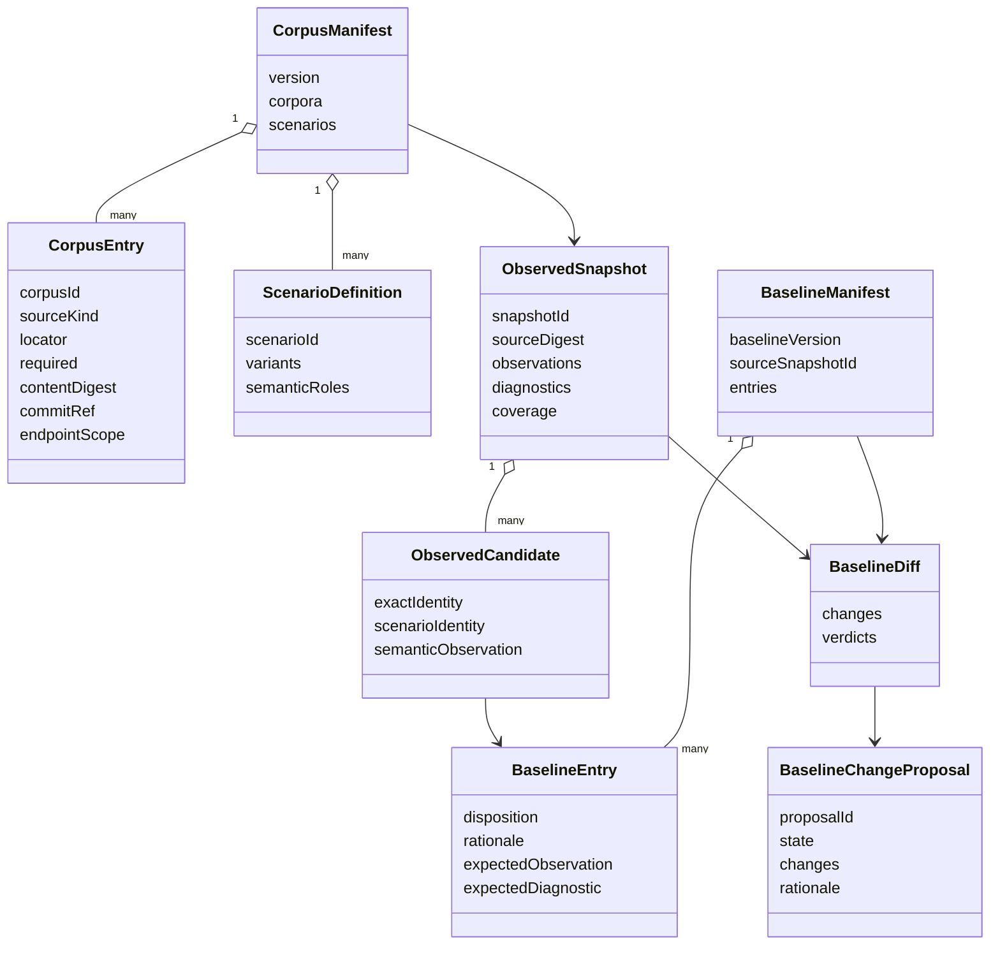

# U01 Generalization Baseline — Domain Entities

> 표기된 필드와 관계는 논리 모델이다. Java record/class 및 serialization 형식은 후속 code design에서 확정한다.

## 1. Aggregate Overview



## 2. Corpus Aggregate

### `CorpusManifest`

| Field | Type | Constraint |
| :--- | :--- | :--- |
| `schemaVersion` | string/int | supported version 필수 |
| `manifestId` | string | stable, non-blank |
| `version` | string | immutable manifest version |
| `corpora` | list of `CorpusEntry` | 5~10, `corpusId` unique |
| `scenarios` | list of `ScenarioDefinition` | `scenarioId` unique |
| `createdAt` | timestamp | metadata; semantic equality 제외 |

책임:

- corpus와 holdout의 authoritative inventory
- required/optional availability policy
- scenario correspondence의 source of truth

### `CorpusEntry`

| Field | Type | Constraint |
| :--- | :--- | :--- |
| `corpusId` | string | manifest 내 unique |
| `displayName` | string | 비어 있지 않음 |
| `sourceKind` | `CorpusSourceKind` | fixture 또는 local snapshot |
| `locator` | path reference | manifest 기준 해석 규칙 명시 |
| `required` | boolean | 누락 시 gate 정책 결정 |
| `contentDigest` | digest | 필수 |
| `commitRef` | optional string | VCS snapshot이면 권장 |
| `sourceRoots` | list | 최소 1개 |
| `expectedEndpointScope` | `EndpointScope` | discovery 대조 기준 |
| `tags` | set | domain/structure 다양성 설명용 |

### `CorpusSourceKind`

- `CHECKED_IN_FIXTURE`
- `LOCAL_SNAPSHOT`

### `EndpointScope`

| Field | Purpose |
| :--- | :--- |
| `minimumExpectedCount` | 약 6~10 endpoint 또는 동등 복잡도 확인 |
| `expectedOperations` | known operation/scenario mapping; controller allowlist가 아님 |
| `allowedExclusions` | unsupported endpoint와 승인된 이유 |

`expectedOperations`는 발견 결과 검증을 위한 manifest expectation이며 분석기가 이 목록만 탐색하도록 제한하는 allowlist가 아니다.

### `ScenarioDefinition`

| Field | Type | Constraint |
| :--- | :--- | :--- |
| `scenarioId` | string | manifest 내 unique |
| `baseCorpusId` | string | 존재하는 corpus reference |
| `variantCorpusIds` | list | 최소 1개 holdout variant |
| `roles` | list of `ScenarioRole` | variant 간 대응 정의 |
| `expectedTransformations` | list | rename/mutation 의도 명시 |

### `ScenarioRole`

| Field | Purpose |
| :--- | :--- |
| `semanticRole` | classifier family 역할 |
| `occurrenceKey` | 같은 scenario의 복수 observation 구분 |
| `expectedTargetTransform` | base→variant target rename expectation |
| `expectedSemanticShape` | operator/category/effect 등 보존 의미 |

## 3. Observation Aggregate

### `ObservedSnapshot`

| Field | Type | Constraint |
| :--- | :--- | :--- |
| `snapshotId` | string/digest | source/config/engine version에서 결정적 생성 |
| `manifestVersion` | string | 실행한 manifest와 일치 |
| `engineRevision` | string | current Java engine revision |
| `corpusRuns` | list of `CorpusRunObservation` | deterministic order |
| `diagnostics` | list of `CorpusDiagnostic` | silent omission 금지 |
| `coverage` | `CoverageSnapshot` | graph/semantic 분리 |
| `metrics` | optional metrics | semantic equality 제외 |

### `CorpusRunObservation`

| Field | Purpose |
| :--- | :--- |
| `corpusId` | corpus reference |
| `sourceDigest` | integrity proof |
| `availabilityStatus` | available/excluded/failed |
| `endpointObservations` | operation별 결과 |
| `graphDiagnostics` | endpoint graph 문제 |

### `EndpointObservation`

| Field | Purpose |
| :--- | :--- |
| `operationKey` | endpoint external identity |
| `graphStatus` | complete/partial/unavailable |
| `eligibleFailureCandidateCount` | semantic coverage denominator |
| `candidates` | `ObservedCandidate` list |
| `diagnostics` | endpoint scope diagnostics |

### `ObservedCandidate`

| Field | Type | Constraint |
| :--- | :--- | :--- |
| `exactIdentity` | `ObservationIdentity` | 동일 source 비교 key |
| `scenarioIdentity` | optional `ScenarioIdentity` | holdout 비교 시 필수 |
| `observation` | `SemanticObservation` | canonical meaning |
| `sourceMetadata` | source/node references | audit용; scenario key 아님 |

### `SemanticObservation`

| Field | Purpose |
| :--- | :--- |
| `ruleId` | current classifier/rule identity |
| `category` | normalized business rule category |
| `effect` | request/business restriction 등 |
| `constraintKind` | normalized constraint kind |
| `targetPath` | observed target; nullable |
| `operator` | observed normalized operator; nullable |
| `expectedValues` | deterministic canonical order |
| `extractionStatus` | extracted/partial 등 |
| `semanticStatus` | resolved/unresolved 등 |
| `targetResolutionStatus` | resolved/unresolved/not applicable |
| `diagnosticCodes` | deterministic set |
| `evidenceFingerprint` | canonical evidence identity |

### `ObservationIdentity`

```text
corpusId
operationKey
predicateCandidateId
ruleId
canonicalConstraintDigest
evidenceFingerprint
```

### `ScenarioIdentity`

```text
scenarioId
semanticRole
occurrenceKey
```

## 4. Baseline Aggregate

### `BaselineManifest`

| Field | Type | Constraint |
| :--- | :--- | :--- |
| `schemaVersion` | string/int | supported version |
| `baselineVersion` | string | immutable, unique |
| `corpusManifestVersion` | string | exact reference |
| `sourceSnapshotId` | string | labeling의 관찰 source |
| `entries` | list of `BaselineEntry` | observation scope completeness |
| `approval` | `ApprovalMetadata` | approved 상태 필수 |

### `BaselineEntry`

| Field | Type | Constraint |
| :--- | :--- | :--- |
| `entryId` | string | unique |
| `exactIdentity` | optional | exact regression 대상 |
| `scenarioIdentity` | optional | holdout expectation 대상 |
| `disposition` | `BaselineDisposition` | 필수 |
| `rationale` | string | non-blank |
| `expectedObservation` | optional `SemanticExpectation` | PRESERVE/REPLACE 규칙에 따름 |
| `expectedDiagnostic` | optional `DiagnosticExpectation` | UNSUPPORTED에 필수 |
| `sourceObservation` | optional reference | labeling origin |

### `BaselineDisposition`

- `PRESERVE`
- `REPLACE`
- `UNSUPPORTED`

`UNLABELED`는 저장 가능한 disposition이 아니라 diff/proposal 상태다.

### `SemanticExpectation`

`SemanticObservation`과 비교 가능한 canonical category/effect/constraint/status/evidence requirement를 가진다. `REPLACE`에서는 현재 잘못된 source observation과 다른 corrected meaning을 표현할 수 있다.

### `DiagnosticExpectation`

| Field | Purpose |
| :--- | :--- |
| `requiredStatus` | unsupported/unresolved 등 |
| `requiredCodes` | 반드시 포함할 diagnostic code |
| `forbidNormalizedMeaning` | UNSUPPORTED에서 true |

### `ApprovalMetadata`

| Field | Purpose |
| :--- | :--- |
| `state` | proposed/reviewed/approved/rejected |
| `approvedBy` | 사람 또는 승인 주체 reference |
| `approvedAt` | approval timestamp |
| `approvalRationale` | version 전체 승인 근거 |

## 5. Diff Aggregate

### `BaselineDiff`

| Field | Purpose |
| :--- | :--- |
| `baselineVersion` | 비교 기준 |
| `observedSnapshotId` | 신규 observation |
| `changes` | `BaselineChange` list |
| `verdicts` | disposition별 pass/fail summary |
| `unlabeledCount` | 신규/미배정 observation 수 |

### `BaselineChange`

| Field | Type |
| :--- | :--- |
| `changeType` | `ADDED`, `REMOVED`, `CHANGED`, `UNCHANGED` |
| `identity` | exact 또는 scenario identity |
| `before` | optional semantic observation |
| `after` | optional semantic observation |
| `baselineEntry` | optional reference |
| `verdict` | pass/fail/review-required |
| `reasonCodes` | deterministic list |

### `BaselineChangeProposal`

| Field | Constraint |
| :--- | :--- |
| `proposalId` | unique |
| `baseVersion` | existing approved baseline |
| `state` | proposed/approved/rejected |
| `changes` | non-empty |
| `rationale` | proposal 및 entry별 필수 |
| `reviewMetadata` | 승인/거부 시 필수 |

proposal이 `APPROVED`여야만 새 `BaselineManifest` version을 만들 수 있다.

## 6. Coverage Entities

### `CoverageSnapshot`

- `graphCoverage: GraphCoverage`
- `semanticCoverage: SemanticCoverage`
- `exclusions: list<CoverageExclusion>`

### `GraphCoverage`

| Field | Meaning |
| :--- | :--- |
| `eligibleEndpoints` | 분석 대상 endpoint denominator |
| `graphBuiltEndpoints` | graph 생성 성공 numerator |
| `completeGraphs` | partial이 아닌 graph 수 |
| `partialGraphs` | budget/type 문제 graph 수 |
| `unavailableGraphs` | root/source 실패 수 |

### `SemanticCoverage`

| Field | Meaning |
| :--- | :--- |
| `eligibleFailureCandidates` | semantic denominator |
| `classifiedCandidates` | 분류된 candidate |
| `resolvedCandidates` | target/meaning resolved |
| `unclassifiedCandidates` | 미분류 |
| `unresolvedCandidates` | 의미/target 미해결 |
| `partialCandidates` | partial graph/analysis |

### `CoverageExclusion`

| Field | Constraint |
| :--- | :--- |
| `corpusId` | 필수 |
| `scope` | corpus/endpoint/candidate |
| `reasonCode` | 필수 |
| `optionalOnly` | required corpus exclusion이면 false이며 gate failure 동반 |

## 7. Diagnostic Entity

### `CorpusDiagnostic`

| Field | Purpose |
| :--- | :--- |
| `corpusId` | 관련 corpus |
| `operationKey` | nullable endpoint scope |
| `code` | stable diagnostic code |
| `severity` | info/warning/error |
| `details` | 사람 검토 설명 |
| `gateEffect` | continue/exclude/fail |
| `evidenceRef` | path/digest/node 등 |

## 8. Aggregate Invariants

1. approved baseline은 정확히 하나의 corpus manifest version과 source snapshot을 참조한다.
2. baseline entry는 disposition과 non-blank rationale을 가진다.
3. `REPLACE`는 corrected expectation, `UNSUPPORTED`는 diagnostic expectation을 가진다.
4. exact/scenario identity는 각 scope에서 unique하다.
5. required corpus failure는 coverage exclusion만으로 처리할 수 없다.
6. graph/semantic coverage는 별도 aggregate로 유지한다.
7. baseline change proposal은 기존 approved version을 in-place 수정하지 않는다.
8. observation metadata의 metric/time/order는 semantic equality에 포함하지 않는다.

## 9. Entity Ownership

| Entity | U01 ownership | 후속 Unit 사용 |
| :--- | :--- | :--- |
| Corpus/Scenario manifest | authoritative | U04~U06 fixture/evaluation input |
| ObservedSnapshot | authoritative Java baseline fact | U06 comparison reference |
| BaselineManifest/Entry | authoritative disposition policy | U05 corrected expectation, U06 verdict |
| Identity models | authoritative comparison contract | U02 metadata, U04/U06 mapping |
| Coverage models | formula/denominator contract | U06 actual YAML evaluation aggregation |
| Change proposal | authoritative re-baseline workflow | 모든 regression update |
