# U01 Generalization Baseline — NFR Logical Components

## 1. Component Map

```mermaid
flowchart LR
    Request["BaselineRunRequest"]
    Facade["BaselineEvaluationFacade"]
    Determinism["DeterminismSuiteCoordinator"]
    DetCompare["DeterminismComparator"]
    Coord["SingleRunCoordinator"]
    Preflight["PreflightValidator"]
    Version["SchemaVersionReaderRegistry"]
    Guard["CorpusAccessGuard"]
    Integrity["CorpusIntegrityVerifier"]
    Deadline["RunDeadline"]
    Exec["SequentialCorpusExecutor"]
    Adapter["ExistingJavaAnalysisAdapter"]
    Collect["ObservationCollector"]
    Canon["CanonicalSnapshotBuilder"]
    Diff["BaselineDiffer"]
    Coverage["CoverageCalculator"]
    Metrics["RunMetricsCollector"]
    Result["EvaluationResultBundleModel"]
    Json["JsonArtifactRenderer"]
    Md["MarkdownSummaryRenderer"]
    Consistency["ReportConsistencyValidator"]
    Publisher["ArtifactBundlePublisher"]
    Reader["CompletedBundleReader"]
    Migrator["ExplicitArtifactMigrator"]

    Request --> Facade
    Facade -->|"single run"| Coord
    Facade -->|"determinism mode"| Determinism
    Determinism -->|"3 identical invocations"| Coord
    Coord --> Preflight
    Version --> Preflight
    Preflight --> Guard --> Integrity
    Coord --> Deadline
    Integrity --> Exec
    Deadline --> Exec
    Exec --> Adapter --> Collect --> Canon
    Exec -.-> Metrics
    Canon --> Diff
    Canon --> Coverage
    Coord --> SingleResult["SingleRunResult"]
    SingleResult --> DetCompare
    DetCompare & Diff & Coverage & Metrics --> Result
    SingleResult --> Result
    Result --> Json
    Result --> Md
    Json & Md --> Consistency --> Publisher
    Publisher --> Reader
    Version --> Reader
    Version --> Migrator
```

## 2. Orchestration Components

### `BaselineEvaluationFacade`

**책임**

- single run과 three-run determinism mode 선택
- single run은 `SingleRunCoordinator`를 1회 호출
- determinism mode는 `DeterminismVerifier`를 호출
- 두 mode의 결과를 공통 `EvaluationResultBundleModel`로 전달

**금지**

- execution/detail logic 소유
- production normal scan entry point에 연결

### `SingleRunCoordinator`

**책임**

- 하나의 pinned input에 대한 run state machine과 단계 순서 제어
- preflight 성공 전 analyzer 호출 방지
- deadline/metrics/diagnostic context 생성
- sequential corpus executor 호출
- failure terminal state와 `SingleRunResult` 조립

**입력**: `BaselineRunRequest`

**출력**: `BaselineRunResult` 또는 diagnostic-preserving failed result

**금지**

- baseline 자동 overwrite
- retry policy 구현
- semantic canonicalization 직접 수행
- production normal scan 호출 흐름 변경

### `BaselineRunRequest`

논리 필드:

- corpus manifest reference/version
- baseline manifest reference/version
- evaluation profile with positive timeout
- engine revision
- allowed corpus root
- output bundle root
- run purpose: snapshot/diff/determinism

## 3. Preflight Components

### `PreflightValidator`

**책임**

- request/profile/schema/version validation 조율
- corpus ID, scenario ID, identity collision 사전 검증
- required/optional validation outcome 통합
- immutable `PreflightResult` 생성

**의존**

- `SchemaVersionReaderRegistry`
- `CorpusAccessGuard`
- `CorpusIntegrityVerifier`

**출력**

- valid required corpus contexts
- valid optional corpus contexts
- optional exclusions
- ordered diagnostics
- fail/ready status

### `CorpusAccessGuard`

**책임**

- allowed root와 corpus locator real-path resolve
- descendant/volume/case/symlink/junction confinement 확인
- analyzer에 `ConfinedCorpusView`만 제공
- report용 relative path 생성

**실패 코드**

- `CORPUS_PATH_OUTSIDE_ALLOWED_ROOT`
- `CORPUS_PATH_ESCAPE`
- `CORPUS_PATH_UNRESOLVED`

### `ConfinedCorpusView`

제공 capability:

- `listSourcePaths()`
- `readSource(relativePath)`
- `readDigestMetadata(relativePath)`
- `relativize(evidencePath)`

미제공 capability:

- write/delete/move
- absolute unrestricted read
- process/network/class loading

### `CorpusIntegrityVerifier`

**책임**

- deterministic file enumeration
- normalized relative path + bytes의 SHA-256 계산
- manifest digest 및 commit metadata 대조
- required/optional policy를 변경하지 않고 결과 반환

## 4. Execution Components

### `SequentialCorpusExecutor`

**책임**

- corpus/endpoint canonical order 실행
- corpus별 accumulator 격리
- 각 단계 전후 deadline checkpoint
- optional corpus failure 격리
- completed immutable corpus result만 global collector에 전달

**입력**

- `PreflightResult`
- `RunDeadline`
- `ExistingJavaAnalysisAdapter`
- `RunMetricsCollector`

### `RunDeadline`

**책임**

- monotonic start/deadline 계산
- `remaining()`과 `checkpoint(scope)` 제공
- 만료 시 stable timeout diagnostic 생성

**제약**

- wall clock/timezone 사용 금지
- thread interrupt/forced stop 금지
- 자동 timeout extension 금지

### `ExistingJavaAnalysisAdapter`

**책임**

- 기존 Spring scan/graph/rule engine을 explicit evaluation에서 호출
- target code/build/network 실행 없이 source 분석
- graph/rule result와 diagnostics를 raw observation으로 반환

**격리**

- production CLI나 normal output을 수정하지 않음
- YAML loader/bootstrap을 호출하지 않음

### `ObservationCollector`

**책임**

- corpus/endpoint/graph/rule raw result 수집
- partial/error scope 보존
- source metadata를 host-independent reference로 변환
- canonicalizer 입력용 immutable raw snapshot 생성

## 5. Determinism Components

### `CanonicalSnapshotBuilder`

**책임**

- semantic field projection
- target/operator/value/diagnostic canonicalization
- evidence fingerprint canonicalization
- metrics/timestamps/host path 제외
- stable sorting
- immutable `CanonicalSnapshot` 생성

이 component만 raw observation에서 semantic comparison model을 만들 수 있다.

### `DeterminismVerifier`

**책임**

- 내부 suite coordinator가 동일 `DeterminismInput`으로 `SingleRunCoordinator`를 정확히 3회 호출
- 세 `SingleRunResult`를 stateless `DeterminismComparator`에 전달
- run 1↔2, run 1↔3 canonical diff
- identity/field-level nondeterminism report
- pass/fail summary

**금지**

- unstable field 제거로 차이를 숨기기
- 한 번 실패한 run을 자동 재시도하여 대체
- `SingleRunCoordinator`가 verifier를 다시 호출하도록 하는 순환 의존

### `DeterminismComparator`

- 세 canonical snapshot의 run 1↔2, run 1↔3 diff 계산
- identity/field-level nondeterminism report 생성
- run orchestration이나 retry를 수행하지 않는 pure/stateless component

### `DeterminismInput`

- manifest/baseline version
- corpus digests
- engine revision
- evaluation profile semantic fields

timestamp와 output directory는 identity에서 제외한다.

## 6. Baseline and Coverage Components

### `BaselineDiffer`

**책임**

- exact identity 및 scenario identity 대응
- added/removed/changed/unchanged 생성
- disposition-aware verdict
- unlabeled change proposal input 생성

NFR Design에서는 이 component가 canonical snapshot만 소비한다는 의존성 경계를 고정한다.

### `CoverageCalculator`

**책임**

- graph와 semantic numerator/denominator 분리 계산
- exclusion과 required corpus failure 구분
- incomplete states 별도 count
- 계산 결과를 immutable coverage snapshot으로 제공

## 7. Metrics Components

### `RunMetricsCollector`

**책임**

- run/corpus/endpoint monotonic elapsed observation
- JDK memory observation
- graph/node/edge/candidate count
- metrics collection diagnostic

**Failure mode**

metric 수집 실패는 `METRICS_COLLECTION_FAILED` warning을 추가하고 unavailable field를 표시한다. semantic observation, disposition verdict와 overall G01 의미 상태는 변경하지 않는다.

### `MetricsSnapshot`

canonical semantic model과 별도 value object다. renderer가 표시할 수 있지만 differ와 determinism verifier가 semantic comparison에 사용하지 않는다.

## 8. Result and Rendering Components

### `EvaluationResultBundleModel`

다음 판정 완료 model을 포함한다.

- run metadata/status
- corpus availability/integrity
- canonical observations
- baseline diff/disposition verdict
- determinism result
- graph/semantic coverage
- diagnostics
- metrics snapshot

renderer는 이 model을 변경하거나 재판정하지 않는다.

### `JsonArtifactRenderer`

- versioned deterministic JSON 생성
- stable property/collection order
- host path redaction
- payload digest 계산 대상 byte representation 제공

### `MarkdownSummaryRenderer`

- G01 status와 actionable summary 생성
- disposition/coverage/diagnostic count 표시
- re-baseline proposal reference 표시
- 별도 계산 없이 model 값을 표현

### `ReportConsistencyValidator`

- JSON/Markdown bundle ID 일치
- overall status 일치
- corpus/disposition/coverage 주요 count 일치
- payload schema와 required sections 확인

불일치 시 publisher를 호출하지 않는다.

## 9. Publication Components

### `ArtifactBundlePublisher`

**책임**

1. unique version directory 생성
2. JSON/Markdown/diagnostic/digest payload 작성
3. payload consistency/digest 검증
4. `completion-manifest.json` 마지막 작성
5. publish result 반환

**불변조건**

- existing version/approved bundle overwrite 금지
- incomplete bundle을 current로 표시 금지
- cleanup을 publication과 결합하지 않음

### `CompletionManifest`

필드:

- bundle/schema version
- run/input identity
- payload file list와 SHA-256
- overall status
- created timestamp(metadata only)
- completion marker/version

### `CompletedBundleReader`

- completion manifest 존재 및 schema 지원 확인
- 모든 payload 존재/digest 확인
- valid bundle만 consumer에 노출
- incomplete/corrupt bundle은 stable diagnostic으로 거부

## 10. Versioning Components

### `SchemaVersionReaderRegistry`

- artifact kind + exact schema version으로 reader 선택
- unsupported version은 `UNSUPPORTED_SCHEMA_VERSION`
- latest fallback 또는 automatic conversion 없음

### `ExplicitArtifactMigrator`

- source/target version을 입력으로 받음
- 원본 immutable artifact read
- 새 target-version artifact 작성
- semantic before/after diff 생성
- approval 전 current baseline 변경 금지

normal read flow에서 호출되지 않는다.

## 11. Diagnostic Component

### `RunDiagnosticCollector`

모든 logical component가 stable diagnostic을 추가하는 단일 run-scoped collector다.

정렬 key:

1. corpus ID
2. operation key
3. identity
4. component/stage
5. diagnostic code

collector는 severity를 gate verdict로 직접 변환하지 않는다. coordinator가 Functional Business Rules의 gate effect를 적용한다.

## 12. Component Lifecycle

| Component | Lifetime | State |
| :--- | :--- | :--- |
| version registry | application/test suite | immutable |
| access/integrity validator | run 또는 stateless | stateless |
| evaluation facade | evaluation request | immutable routing |
| single run coordinator | run | state machine |
| determinism verifier | three-run suite | immutable results accumulation |
| deadline | run | monotonic immutable deadline |
| corpus executor/collector | run/corpus | isolated mutable then immutable |
| canonicalizer/differ/coverage | stateless | pure/deterministic |
| metrics collector | run | best-effort mutable |
| renderer/consistency validator | stateless | deterministic |
| publisher | publication | append-only |

## 13. Dependency Rules

- preflight components는 analyzer/renderer/publisher에 의존하지 않는다.
- determinism verifier는 single run coordinator를 호출하지만 single run coordinator는 verifier에 의존하지 않는다.
- analyzer adapter는 baseline differ, renderer 또는 publisher에 의존하지 않는다.
- canonicalizer는 metrics collector를 읽지 않는다.
- renderer는 differ/coverage 로직을 호출하지 않는다.
- publisher는 semantic verdict를 계산하지 않는다.
- migrator는 normal reader/coordinator path에 자동 연결되지 않는다.
- production normal scan은 모든 U01 runner/publication component에 의존하지 않는다.

## 14. NFR Traceability

| NFR | Pattern | Logical components |
| :--- | :--- | :--- |
| SCAL-001~003 | Sequential Reference Executor | coordinator, executor, corpus accumulator |
| PERF-001 | Metrics Side Channel | metrics collector/snapshot |
| PERF-002 | Monotonic Deadline | deadline, coordinator, executor |
| PERF-003 | metrics/semantic separation | canonicalizer, metrics collector |
| AVL-001 | local component graph | coordinator; no remote dependency |
| AVL-002 | Preflight Gate | preflight validator, access/integrity verifier |
| AVL-003 | Diagnostic Abort + Bundle | coordinator, publisher, completion manifest |
| SEC-001~005 | Confined Read-only View | access guard, confined view, adapter |
| REL-001~002 | Canonicalization + Three-run | canonicalizer, verifier |
| REL-003~004 | no retry + diagnostic abort | coordinator, diagnostic collector |
| MNT-001~005 | Strict Registry + Migrator | reader registry, migrator, completed reader |
| USE-001~004 | same-model render/publication | result model, renderers, validator, publisher |

## 15. Component Acceptance Scenarios

- invalid preflight에서 analyzer invocation 0
- optional corpus exclusion 후 다른 corpus result 동일
- forced timeout에서 partial scope와 diagnostic 보존
- path traversal/symlink/junction escape 거부
- shuffled raw input에서 canonical snapshot 동일
- 3-run verifier가 injected nondeterminism을 identity/field로 보고
- metrics collector failure에서 semantic verdict 동일
- renderer count mismatch에서 completion manifest 미생성
- incomplete/corrupt bundle reader 거부
- unsupported schema reader fail-fast
- explicit migration이 원본을 보존하고 semantic diff 생성
