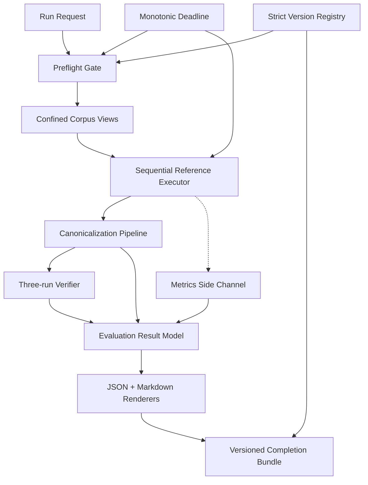

# U01 Generalization Baseline — NFR Design Patterns

## 1. Pattern Overview

정상 production scan은 이 문서의 preflight, verifier, renderer와 publisher에 의존하지 않는다. 모든 pattern은 명시적 U01 test/evaluation entry point 안에서만 조합된다.

| Pattern | Primary quality | 핵심 효과 |
| :--- | :--- | :--- |
| Preflight Gate | resilience/security | unsafe·invalid input에서 analysis invocation 0 |
| Diagnostic-preserving Abort | reliability | 실패 원인과 partial evidence 보존 |
| Sequential Reference Executor | determinism/bounded scale | canonical reference evidence 생성 |
| Monotonic Deadline + Checkpoints | termination/performance | 유한 실행과 안전한 cooperative stop |
| Confined Read-only Corpus View | security | path escape/write/execute capability 차단 |
| Canonicalization Pipeline | determinism | runtime/render ordering과 semantic equality 분리 |
| Three-run Determinism Verification | reliability | 간헐적 비결정성 탐지 |
| Versioned Completion Bundle | durability/reviewability | incomplete/approved artifact 혼동 방지 |
| Strict Reader Registry + Explicit Migrator | maintainability | silent schema meaning change 방지 |
| Best-effort Metrics Side Channel | observability | metric 실패와 semantic verdict 분리 |

## 2. Preflight Gate Pattern

### 구조

```text
Raw Run Request
  -> EvaluationProfile validation
  -> Schema/version validation
  -> Corpus locator confinement
  -> Availability/integrity validation
  -> Scope/identity validation
  -> Ready-to-run immutable context
```

### 규칙

- required precondition 오류가 하나라도 있으면 analyzer를 호출하지 않는다.
- optional corpus 오류는 exclusion diagnostic으로 변환하되 다른 corpus context를 변경하지 않는다.
- preflight 결과는 immutable `PreflightResult`로 고정한다.
- validation ordering은 stable diagnostic ordering을 위해 고정한다.

### 실패 정책

| Failure | Result |
| :--- | :--- |
| invalid timeout/schema/version | 전체 preflight 실패 |
| required path/digest/scope | 전체 preflight 실패 |
| optional path/digest/scope | 해당 corpus 제외 + diagnostic |
| identity collision | 전체 preflight 실패 |

### 만족 NFR

AVL-002, SEC-001~004, REL-003~004, MNT-001~002.

## 3. Diagnostic-preserving Abort Pattern

### 원칙

run failure는 evidence 삭제가 아니라 terminal state 전이다.

```text
COLLECTING
  -> COMPLETED
  -> or FAILED_PRECHECK
  -> or TIMED_OUT
  -> or FAILED_ANALYSIS
```

각 terminal state는 다음을 포함한다.

- run identity와 pinned input metadata
- 완료된 corpus/endpoint observation
- 실패 scope와 stable diagnostic code
- incomplete scope list
- coverage numerator/denominator/exclusion state
- metrics availability status

### 금지

- 자동 retry
- partial result를 success로 승격
- failure 시 이미 수집한 diagnostic 삭제
- baseline 자동 갱신

### 만족 NFR

PERF-002, AVL-003, REL-003~004, USE-004.

## 4. Sequential Reference Executor Pattern

### 실행 순서

1. `corpusId` canonical sort
2. corpus 내부 endpoint `operationKey` sort
3. endpoint 내부 observation canonical sort
4. 다음 corpus로 이동

### 상태 격리

- corpus별 accumulator, metric scope와 diagnostics를 새로 생성한다.
- global accumulator는 완료된 immutable corpus result만 받는다.
- optional corpus failure가 다른 corpus accumulator에 영향을 주지 않는다.

### 병렬 실행 경계

U01 G01 evidence는 sequential reference mode만 인정한다. 이후 parallel optimization이 추가되면 reference mode와 semantic equality를 별도 증명해야 한다.

### 만족 NFR

SCAL-001~003, REL-001~002.

## 5. Monotonic Deadline and Cooperative Checkpoints

### Deadline model

```text
deadline = monotonicStart + profile.timeout
remaining = deadline - monotonicNow
```

wall-clock time과 timezone은 timeout 계산에 사용하지 않는다.

### Checkpoint

- preflight 완료 후
- corpus 시작 전/완료 후
- endpoint 시작 전/완료 후
- graph/semantic observation 단계 경계
- renderer/publisher 시작 전

### 만료 처리

1. 새 작업 시작 금지
2. 현재 안전 경계까지 수집된 immutable observation 확정
3. `EVALUATION_TIMEOUT` diagnostic 생성
4. incomplete corpus/endpoint scope 표시
5. failure artifact bundle publication 시도

thread interrupt/force-stop은 사용하지 않는다. 긴 단일 parser call 동안 즉시 중단되지 않는 한계를 diagnostic/metric으로 관찰한다.

### 만족 NFR

PERF-002, AVL-003, REL-003~004.

## 6. Confined Read-only Corpus View Pattern

### 구성

```text
Manifest locator
  -> CorpusAccessGuard
      -> allowed-root real path
      -> corpus real path
      -> descendant check
      -> symlink/junction escape check
  -> ConfinedCorpusView(relative paths, read operations only)
  -> Static Analyzer
```

### Capability boundary

`ConfinedCorpusView`는 다음만 노출한다.

- normalized relative path enumeration
- source byte/text read
- metadata required for digest

다음을 노출하지 않는다.

- write/delete/move
- process/build invocation
- network/download
- dynamic class loading
- unrestricted absolute path

### Windows-specific design

- drive/volume이 allowed root와 다른 path 거부
- case-normalized/real path 기준 descendant 확인
- junction/reparse-point escape negative test
- report에는 `corpusId`와 relative path만 전달

### 만족 NFR

SEC-001~005.

## 7. Canonicalization Pipeline Pattern

### 단계

```text
Raw Graph/Rule Results
  -> Semantic Field Projection
  -> Value Normalization
  -> Evidence Fingerprint Normalization
  -> Diagnostic Code Normalization
  -> Stable Sort
  -> Immutable CanonicalSnapshot
```

### Semantic projection 포함

- category/effect/rule
- constraint kind/target/operator/expected
- extraction/semantic/target status
- diagnostic codes
- evidence fingerprint

### 제외

- timestamp
- elapsed/memory metric
- host absolute path
- non-semantic trace/log ordering

renderer와 differ는 raw result를 직접 소비하지 않고 canonical snapshot을 소비한다.

### 만족 NFR

REL-001~002, USE-001~003.

## 8. Three-run Determinism Verifier Pattern

### 알고리즘

1. 같은 pinned `DeterminismInput`을 3회 실행한다.
2. 각 run을 canonical snapshot으로 변환한다.
3. run 1↔2, run 1↔3 semantic diff를 계산한다.
4. 두 diff가 모두 0건이면 통과한다.
5. 차이가 있으면 identity/field별 `SNAPSHOT_NON_DETERMINISTIC`을 생성한다.

### Input identity

- corpus manifest version/digest
- corpus content digests
- Java engine revision
- evaluation profile excluding timestamps

세 run 사이 baseline이나 corpus를 갱신할 수 없다.

`DeterminismVerifier`는 외부 orchestration component이며 단일 실행 `SingleRunCoordinator`를 세 번 호출한다. `SingleRunCoordinator`는 verifier에 의존하지 않으므로 runtime component dependency는 순환하지 않는다.

### 비용과 timeout

evaluation profile timeout은 각 run에 동일하게 적용한다. determinism suite 전체 orchestration timeout이 필요하면 각 run deadline과 별도로 명시한다.

### 만족 NFR

REL-001, REL-002.

## 9. Versioned Completion Bundle Pattern

### Directory state

```text
bundle-root/
  <unique-version>/
    snapshot.json
    diff.json
    coverage.json
    summary.md
    diagnostics.json
    digests.json
    completion-manifest.json   # last write
```

### Publication sequence

1. 새 unique version directory 생성
2. payload artifact 작성
3. payload schema/consistency/digest 검증
4. completion manifest를 마지막에 작성
5. reader는 valid completion manifest가 있는 bundle만 공개

### Incomplete bundle

- approved/current bundle을 대체하지 않는다.
- reader는 무시하고 `INCOMPLETE_ARTIFACT_BUNDLE` diagnostic을 낸다.
- cleanup은 별도 명시적 maintenance action이며 approved bundle을 삭제하지 않는다.

### No overwrite

동일 version directory 또는 approved baseline 파일을 제자리 수정하지 않는다. re-baseline은 새 version bundle을 만든다.

### 만족 NFR

AVL-003, MNT-001~003, USE-001~004.

## 10. Strict Reader Registry and Explicit Migrator

### Read path

```text
Artifact header.schemaVersion
  -> VersionReaderRegistry.require(version)
  -> Exact reader
  -> Domain validation
```

registry에 없는 version은 `UNSUPPORTED_SCHEMA_VERSION`이다.

### Migration path

```text
Source immutable artifact
  -> ExplicitMigrator(sourceVersion, targetVersion)
  -> New version artifact
  -> Semantic diff
  -> Review/approval
```

normal reader는 migration을 호출하지 않는다. migrator는 원본을 overwrite하지 않는다.

### 만족 NFR

MNT-001~005.

## 11. Best-effort Metrics Side Channel

### 구조

```text
Execution stages -> RunMetricsCollector -> MetricsSnapshot
Semantic pipeline ----------------------> CanonicalSnapshot
```

두 snapshot은 최종 bundle에서 연결되지만 semantic equality는 metrics를 읽지 않는다.

### 수집

- monotonic elapsed time
- process/JVM memory observation
- graph/node/edge/candidate counts
- metric availability/error diagnostics

metric 수집 실패는 `METRICS_COLLECTION_FAILED` warning이며 semantic verdict를 변경하지 않는다.

### 만족 NFR

PERF-001, PERF-003, USE-002.

## 12. Renderer Consistency Pattern

- JSON renderer와 Markdown renderer는 같은 `EvaluationResultBundleModel`을 소비한다.
- renderer는 status, counts, coverage 또는 disposition verdict를 계산하지 않는다.
- `ReportConsistencyValidator`가 두 출력의 bundle ID, overall status와 주요 count를 비교한다.
- renderer 실패는 incomplete bundle로 남으며 completion manifest를 작성하지 않는다.

## 13. Pattern Composition



## 14. Pattern-level Acceptance

- preflight 오류에서 analyzer invocation 0
- path escape와 unavailable required corpus가 publish-ready result를 만들지 않음
- sequential reference run의 stable ordering
- forced deadline에서 timeout diagnostic과 partial scope 보존
- 3-run canonical diff 0 또는 identity/field-level nondeterminism diagnostic
- completion manifest 없는 bundle은 consumer에게 보이지 않음
- unsupported schema는 migration 없이 fail-fast
- metrics failure가 semantic status를 바꾸지 않음
- JSON/Markdown status/count consistency
