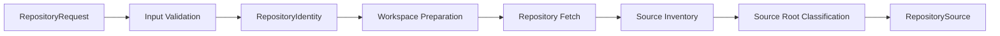

# Business Logic Model

## Goal
`UOW-01` ingests a GitHub repository URL and produces an analysis-ready repository workspace plus structured source metadata, without executing target project code.

## Main Workflow

### 1. Input Validation
- Accept repository request containing:
  - GitHub repository URL
  - optional branch
  - optional tag
  - optional commit
- Validate that the repository source is allowed:
  - allow `https://github.com/{owner}/{repo}`
  - allow `https://github.com/{owner}/{repo}.git`
  - reject non-URL input
  - reject local path input
  - reject non-GitHub hosts
  - reject archive, raw file, release asset, and SSH URL forms
- Normalize repository identity into:
  - host
  - owner
  - repo
  - normalized clone URL
  - requested ref descriptor

### 2. Workspace Preparation
- Create a fresh isolated temporary workspace for each execution.
- Associate workspace metadata with a request-scoped execution ID.
- Expose a future cache extension point:
  - cache key can be derived from normalized repository identity and requested ref
  - current PoC does not reuse cache by default

### 3. Repository Fetch
- Clone or fetch repository contents into the isolated workspace.
- Resolve requested ref if branch/tag/commit is supplied.
- Stop immediately on hard failures such as clone refusal, ref resolution failure, or workspace creation failure.

### 4. Source Inventory
- Traverse repository structure in read-only analysis mode.
- Detect build hints:
  - Maven
  - Gradle
  - mixed or unknown build layout
- Detect multi-module and single-module layouts.
- Build a source root inventory rather than selecting only one root.

### 5. Source Root Candidate Classification
- For each source root candidate, collect:
  - absolute or workspace-relative path
  - module name
  - build tool hint
  - `src/main/java` presence
  - Java file count
  - Spring annotation candidate count
  - selection priority
- Mark excluded paths and excluded reasons separately.
- Preserve warnings for suspicious but non-fatal repository structure conditions.

### 6. Output Assembly
- Produce `RepositorySource` aggregate with:
  - repository identity
  - workspace location
  - source root inventory
  - build tool hints
  - Java inventory summary
  - excluded path records
  - warnings
  - safety policy hint
  - ingestion metadata
- Return hard failure result when ingestion cannot safely proceed.

## Data Flow

## Decision Model

### Hard-Failure Decisions
- invalid repository URL
- unsupported repository source
- workspace creation failure
- clone failure
- requested ref resolution failure
- static analysis policy violation

### Soft-Warning Decisions
- source root candidate is ambiguous
- no obvious Spring module found
- Java file scan partially fails for some path
- non-standard layout detected
- some paths are excluded from inventory

## Extension Points
- cache-aware workspace provider
- richer repository host policy
- additional source root scoring heuristics
- repository fetch abstraction beyond GitHub-only PoC scope
