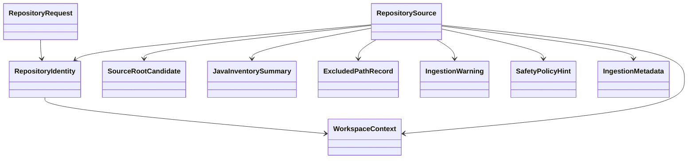

# Domain Entities

## Overview
`UOW-01` centers on the repository ingestion domain. Its output is not raw clone state alone, but a structured repository source aggregate that downstream analysis can trust.

## Core Entities

### `RepositoryRequest`
- Purpose:
  - capture ingestion request input
- Fields:
  - `repositoryUrl`
  - `branch`
  - `tag`
  - `commit`
- Notes:
  - ref fields are mutually constrained by request validation rules

### `RepositoryIdentity`
- Purpose:
  - represent normalized repository identity after input validation
- Fields:
  - `host`
  - `owner`
  - `repositoryName`
  - `normalizedCloneUrl`
  - `requestedRef`

### `WorkspaceContext`
- Purpose:
  - represent isolated execution workspace state
- Fields:
  - `executionId`
  - `workspacePath`
  - `createdAt`
  - `cacheKey`
  - `cacheEligible`

### `RepositorySource`
- Purpose:
  - aggregate root returned by ingestion
- Fields:
  - `repositoryIdentity`
  - `workspaceContext`
  - `sourceRoots`
  - `buildToolHint`
  - `javaInventorySummary`
  - `excludedPaths`
  - `warnings`
  - `safetyPolicyHint`
  - `ingestionMetadata`
- Relationships:
  - owns many `SourceRootCandidate`
  - owns many `ExcludedPathRecord`
  - owns many `IngestionWarning`

### `SourceRootCandidate`
- Purpose:
  - represent one analyzable source root or module candidate
- Fields:
  - `moduleName`
  - `rootPath`
  - `buildToolHint`
  - `hasMainJava`
  - `javaFileCount`
  - `springAnnotationCandidateCount`
  - `selectionPriority`
  - `status`

### `JavaInventorySummary`
- Purpose:
  - summarize repository-level Java source inventory
- Fields:
  - `totalJavaFileCount`
  - `sourceRootCount`
  - `moduleCount`
  - `scanCompleted`
  - `partialFailureCount`

### `ExcludedPathRecord`
- Purpose:
  - preserve why a path or module was excluded from analysis scope
- Fields:
  - `path`
  - `reasonCode`
  - `reasonMessage`

### `IngestionWarning`
- Purpose:
  - capture non-fatal repository ingestion concerns
- Fields:
  - `warningCode`
  - `message`
  - `relatedPath`
  - `severity`

### `IngestionFailure`
- Purpose:
  - capture fatal failure state for ingestion
- Fields:
  - `errorCode`
  - `message`
  - `details`
  - `stage`

### `SafetyPolicyHint`
- Purpose:
  - communicate static-analysis-only rules to downstream stages
- Fields:
  - `allowedActions`
  - `forbiddenActions`
  - `policyVersion`

### `IngestionMetadata`
- Purpose:
  - retain execution metadata and diagnostics
- Fields:
  - `startedAt`
  - `completedAt`
  - `durationMs`
  - `requestedRefType`
  - `resolvedRef`
  - `warningsCount`

## Relationships

## Lifecycle Notes
- `RepositoryRequest` is validated before any workspace action.
- `RepositoryIdentity` exists only after input contract validation succeeds.
- `RepositorySource` is created only when ingestion remains within static-analysis-only policy.
- `IngestionFailure` terminates the aggregate creation path and returns a failed result instead.
