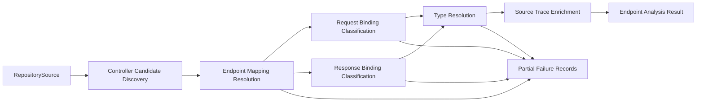

# Business Logic Model

## Goal
`UOW-02` transforms `RepositorySource` into an endpoint and type analysis result that downstream validation extraction can trust, while preserving ambiguity and partial failures instead of forcing incorrect resolution.

## Main Workflow

### 1. Controller Candidate Discovery
- Iterate through source root inventory from `RepositorySource`.
- Read Java source files in analysis scope.
- Detect controller candidates using:
  - `@RestController`
  - `@Controller`
  - `@RequestMapping` combinations
- Preserve possible meta-annotation or custom composed mapping cases as unresolved controller candidates when full resolution is not possible.

### 2. Endpoint Mapping Resolution
- For each resolved controller candidate:
  - resolve class-level mapping context
  - resolve method-level mapping context
  - compute effective HTTP method
  - compute final endpoint path
- Produce resolved endpoint record when mapping can be computed.
- Produce endpoint failure or unresolved candidate when mapping semantics are ambiguous.

### 3. Request Binding Classification
- Inspect method parameters.
- Resolve explicit binding annotations first:
  - `@PathVariable`
  - `@RequestParam`
  - `@RequestHeader`
  - `@RequestBody`
- Apply limited Spring convention heuristics for omitted annotations.
- If confidence is insufficient, preserve unresolved binding instead of forcing a wrong target location.

### 4. Response Binding Classification
- Inspect method return type.
- Distinguish:
  - plain response body type
  - `ResponseEntity<T>`
  - generic wrapper responses
  - `void`
  - no-content style responses
- Preserve response binding metadata for:
  - success response candidate
  - error response candidate
- Leave final error semantics open for later stages when exception/service analysis adds more evidence.

### 5. Type Resolution
- Resolve request and response type descriptors.
- Descend through:
  - generic wrappers
  - collections
  - nested fields
- If a type cannot be fully resolved:
  - keep best-effort structure
  - store unresolved descriptor
  - attach source trace and confidence

### 6. Source Trace Enrichment
- Attach trace to:
  - controller class
  - endpoint method
  - request parameter
  - response type
  - type field when available
- Include line number and resolution confidence whenever available.

### 7. Partial Failure Recording
- Allow endpoint-level analysis to continue even if one endpoint fails.
- Record failure by category:
  - endpoint detection failure
  - request mapping resolution failure
  - request binding resolution failure
  - response binding resolution failure
  - type resolution failure
- Preserve recoverability hint and confidence for each failure record.

### 8. Output Assembly
- Produce endpoint analysis output containing:
  - resolved endpoint inventory
  - unresolved controller/mapping candidates
  - request binding inventory
  - response binding inventory
  - type descriptor inventory
  - endpoint analysis failures

## Data Flow

## Decision Model

### Resolution Priorities
- Prefer explicit Spring annotation semantics over heuristics.
- Prefer unresolved candidate over incorrect hard resolution.
- Prefer partial success over unit-wide failure.
- Prefer traceable confidence-bearing output over opaque fallback.

### Ambiguity Strategy
- If controller status is uncertain due to meta/composed annotation, keep candidate state.
- If binding location is uncertain, keep unresolved binding.
- If type expansion is partial, keep unresolved descriptor branch instead of dropping the type tree.

## Output Characteristics
- Output is analysis-oriented, not yet validation-oriented.
- Response metadata must remain rich enough for later error-contract enrichment.
- Endpoint failures must be independently reviewable and testable.
