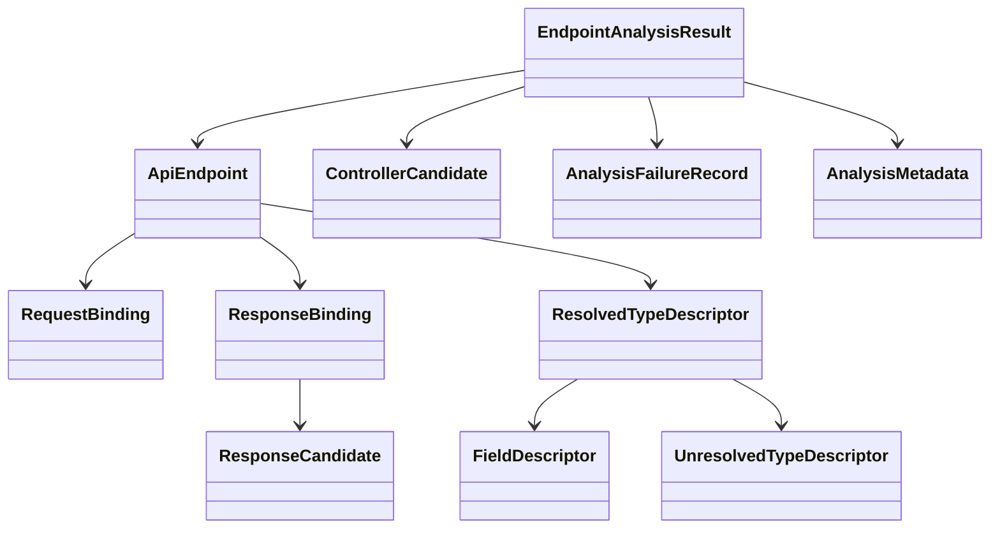

# Domain Entities

## Overview
`UOW-02` centers on endpoint analysis output. The core design principle is that resolved results, unresolved candidates, and failure records coexist in the same analysis result so that downstream stages can prefer traceable ambiguity over silent data loss.

## Core Entities

### `EndpointAnalysisResult`
- Purpose:
  - aggregate root for `UOW-02` output
- Fields:
  - `resolvedEndpoints`
  - `unresolvedControllerCandidates`
  - `unresolvedMappingCandidates`
  - `analysisFailures`
  - `analysisMetadata`

### `ApiEndpoint`
- Purpose:
  - represent one resolved API endpoint
- Fields:
  - `endpointId`
  - `controllerClassName`
  - `methodName`
  - `httpMethod`
  - `resolvedPath`
  - `requestBindings`
  - `responseBinding`
  - `requestTypeDescriptor`
  - `responseTypeDescriptor`
  - `sourceTrace`
  - `confidence`

### `ControllerCandidate`
- Purpose:
  - represent controller-like class or method not fully resolved as standard Spring controller
- Fields:
  - `candidateId`
  - `candidateKind`
  - `annotationEvidence`
  - `sourceTrace`
  - `confidence`
  - `resolutionStatus`

### `RequestBinding`
- Purpose:
  - represent one parameter binding decision
- Fields:
  - `parameterName`
  - `targetLocation`
  - `bindingName`
  - `required`
  - `bindingStatus`
  - `evidence`
  - `sourceTrace`
  - `confidence`

### `ResponseBinding`
- Purpose:
  - represent resolved or partially resolved endpoint response context
- Fields:
  - `targetLocation`
  - `successCandidate`
  - `errorCandidate`
  - `responseKind`
  - `evidence`
  - `sourceTrace`
  - `confidence`

### `ResponseCandidate`
- Purpose:
  - represent success or error response hypothesis
- Fields:
  - `candidateType`
  - `typeDescriptor`
  - `httpStatusHint`
  - `wrapperKind`
  - `confidence`

### `ResolvedTypeDescriptor`
- Purpose:
  - represent fully or mostly resolved type structure
- Fields:
  - `typeName`
  - `kind`
  - `genericArguments`
  - `fieldDescriptors`
  - `collectionElementType`
  - `sourceTrace`
  - `confidence`

### `UnresolvedTypeDescriptor`
- Purpose:
  - preserve unresolved or partially resolved type branch
- Fields:
  - `declaredTypeName`
  - `reason`
  - `sourceTrace`
  - `confidence`
  - `partialChildren`

### `FieldDescriptor`
- Purpose:
  - represent nested DTO or response field
- Fields:
  - `fieldName`
  - `fieldType`
  - `required`
  - `sourceTrace`
  - `confidence`

### `AnalysisFailureRecord`
- Purpose:
  - preserve endpoint analysis failure without collapsing the whole unit
- Fields:
  - `failureId`
  - `failureCategory`
  - `message`
  - `sourceTrace`
  - `recoverability`
  - `confidence`

### `AnalysisMetadata`
- Purpose:
  - summarize endpoint analysis run
- Fields:
  - `scannedSourceRootCount`
  - `resolvedEndpointCount`
  - `unresolvedCandidateCount`
  - `failureCount`
  - `startedAt`
  - `completedAt`

## Supporting Enums and Value Concepts
- `TargetLocation`
  - `HEADER`
  - `PATH`
  - `QUERY`
  - `BODY`
  - `RESPONSE`
- `BindingStatus`
  - `RESOLVED`
  - `HEURISTIC`
  - `UNRESOLVED`
- `ResolutionStatus`
  - `RESOLVED`
  - `CANDIDATE`
  - `UNRESOLVED`
- `ResponseKind`
  - `BODY`
  - `RESPONSE_ENTITY`
  - `GENERIC_WRAPPER`
  - `VOID`
  - `NO_CONTENT_CANDIDATE`

## Relationships

## Lifecycle Notes
- `ControllerCandidate` may become `ApiEndpoint` only after mapping resolution succeeds.
- `RequestBinding` may remain unresolved even when `ApiEndpoint` itself is resolved.
- `ResolvedTypeDescriptor` may embed unresolved branches when complete type expansion is not possible.
- `AnalysisFailureRecord` is a first-class output, not just diagnostic noise.
