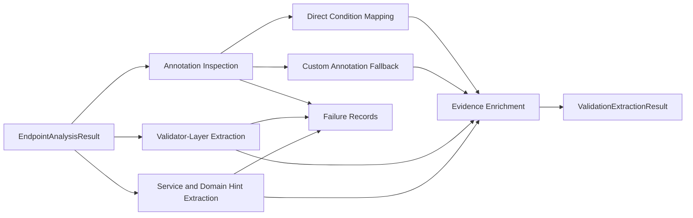

# Business Logic Model

## Goal
`UOW-03` transforms endpoint/type analysis output into two pre-LLM validation outputs:
- direct conditions that can be asserted from explicit annotation semantics
- validation candidates that preserve richer, ambiguous, or inferred validation evidence for later normalization

## Main Workflow

### 1. Annotation Inspection
- Traverse request DTO fields, parameter annotations, and relevant model elements attached to each endpoint context.
- Classify annotations into:
  - direct-mappable standard Bean Validation annotations
  - unsupported/custom annotations
  - unresolved annotation cases

### 2. Direct Condition Mapping
- Convert supported standard Bean Validation annotations into `ApiConditionDraft` outputs.
- Initial supported set includes:
  - `@NotNull`
  - `@NotBlank`
  - `@Size`
  - `@Pattern`
  - `@Min`
  - `@Max`
  - `@Positive`
  - `@PositiveOrZero`
  - `@Negative`
  - `@NegativeOrZero`
  - `@Email`
  - `@NotEmpty`
- Preserve strong evidence, trace, and high confidence when mapping is explicit.

### 3. Unsupported or Custom Annotation Fallback
- For annotation cases that are not directly mapped:
  - create `ValidationCandidate`
  - preserve annotation name
  - preserve attribute values
  - preserve target field/location
  - preserve source trace
- If the annotation references `@Constraint(validatedBy = ...)`, keep validator linkage metadata even when full binding is unresolved.

### 4. Validator-Layer Extraction
- Inspect:
  - `ConstraintValidator#isValid`
  - Spring `Validator#validate`
  - `@InitBinder`
  - `errors.rejectValue`
  - `errors.reject`
- Build validator evidence candidates with:
  - snippet evidence
  - affected field hints
  - binding trace between endpoint/request type and validator
  - connection confidence

### 5. Service and Domain Hint Extraction
- Inspect service/domain methods connected through endpoint method chains.
- Capture:
  - `if` conditions
  - `throw new BusinessException(...)`
  - `ErrorCode`
  - repository or lookup guard conditions
  - related method chain context
- When a request field cannot be directly identified, preserve the result as hypothesis candidate rather than discarding it.

### 6. Evidence Enrichment
- For every direct condition or validation candidate, attach:
  - evidence
  - source trace
  - source kind
  - extraction confidence
  - reasoning note
  - unresolved reason when applicable

### 7. Partial Failure Recording
- Allow each extractor path to fail independently:
  - annotation extraction
  - validator extraction
  - service hint extraction
- Preserve one of three outputs:
  - `ApiConditionDraft`
  - `ValidationCandidate`
  - `ValidationExtractionFailure`
- Use failure record only when extraction cannot safely produce even a candidate form.

### 8. Output Assembly
- Produce validation extraction output containing:
  - direct condition drafts
  - validation candidates
  - extraction failures
  - extraction metadata per endpoint and extractor kind

## Data Flow

## Decision Model

### Resolution Priorities
- Prefer direct condition mapping when annotation semantics are explicit and stable.
- Prefer candidate preservation over dropping ambiguous evidence.
- Prefer low-confidence hypothesis over fabricated certainty.
- Prefer failure record only when extraction cannot preserve meaningful candidate data.

### Confidence Strategy
- `HIGH`:
  - direct explicit annotation mapping
  - explicit `@InitBinder` validator linkage
  - explicit `rejectValue` field targeting
- `MEDIUM`:
  - inferred validator linkage via supported DTO matching
  - likely service/domain field association
- `LOW`:
  - hypothesis candidates from indirect business rules or weak method-chain correlation

## Output Characteristics
- `UOW-03` remains pre-LLM and must preserve evidence-rich intermediate forms.
- It is acceptable for one endpoint to have both direct conditions and unresolved candidates.
- It is acceptable for a service hint to remain disconnected from a specific request field if traceable evidence still exists.
