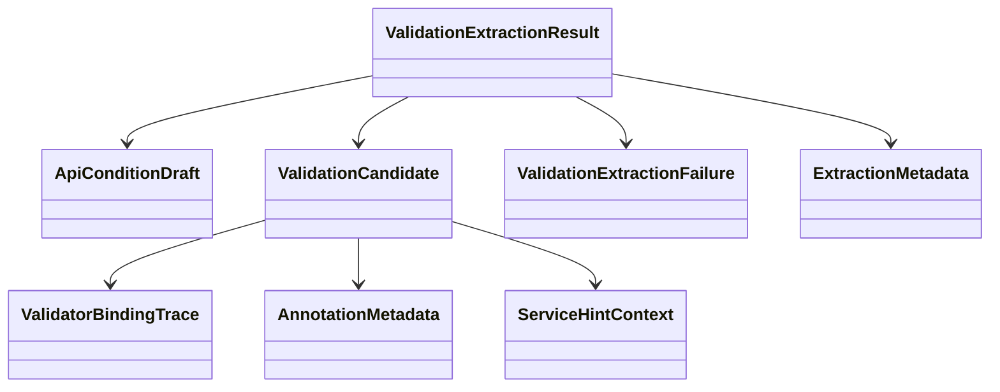

# Domain Entities

## Overview
`UOW-03` centers on validation evidence extraction. It deliberately separates finalizable direct condition drafts from evidence-bearing validation candidates and from true extraction failures.

## Core Entities

### `ValidationExtractionResult`
- Purpose:
  - aggregate root for `UOW-03` output
- Fields:
  - `directConditions`
  - `validationCandidates`
  - `extractionFailures`
  - `extractionMetadata`

### `ApiConditionDraft`
- Purpose:
  - represent pre-LLM direct condition derived from explicit annotation semantics
- Fields:
  - `draftId`
  - `endpointId`
  - `targetLocation`
  - `targetPath`
  - `operator`
  - `expected`
  - `purpose`
  - `sourceKind`
  - `evidence`
  - `sourceTrace`
  - `confidence`
  - `reasoningNote`

### `ValidationCandidate`
- Purpose:
  - represent unsupported, inferred, validator-derived, or hypothesis validation evidence
- Fields:
  - `candidateId`
  - `endpointId`
  - `candidateKind`
  - `targetLocationHint`
  - `targetPathHint`
  - `annotationName`
  - `annotationAttributes`
  - `validatorClassName`
  - `bindingTrace`
  - `conditionSnippet`
  - `errorCodeHint`
  - `evidence`
  - `sourceTrace`
  - `sourceKind`
  - `confidence`
  - `reasoningNote`
  - `unresolvedReason`
  - `hypothesis`

### `ValidatorBindingTrace`
- Purpose:
  - explain how a validator candidate is linked to endpoint/request context
- Fields:
  - `bindingKind`
  - `controllerTrace`
  - `binderMethodTrace`
  - `supportsType`
  - `linkEvidence`
  - `confidence`

### `AnnotationMetadata`
- Purpose:
  - preserve annotation evidence for custom or unsupported annotation cases
- Fields:
  - `annotationName`
  - `attributeMap`
  - `declaredOn`
  - `constraintValidatorReferences`

### `ServiceHintContext`
- Purpose:
  - preserve contextual information for service/domain hypothesis candidates
- Fields:
  - `methodChain`
  - `conditionSnippet`
  - `exceptionType`
  - `errorCode`
  - `repositoryLookupHint`

### `ValidationExtractionFailure`
- Purpose:
  - represent extraction attempts that could not yield a safe draft or candidate
- Fields:
  - `failureId`
  - `extractorKind`
  - `failureCategory`
  - `message`
  - `sourceTrace`
  - `unresolvedReason`
  - `recoverability`
  - `confidence`

### `ExtractionMetadata`
- Purpose:
  - summarize extraction run state
- Fields:
  - `endpointCount`
  - `directConditionCount`
  - `candidateCount`
  - `failureCount`
  - `extractorStats`
  - `startedAt`
  - `completedAt`

## Supporting Enums and Value Concepts
- `CandidateKind`
  - `UNSUPPORTED_ANNOTATION`
  - `CUSTOM_ANNOTATION`
  - `CONSTRAINT_VALIDATOR`
  - `SPRING_VALIDATOR`
  - `REJECT_VALUE`
  - `REJECT`
  - `SERVICE_HINT`
  - `BUSINESS_EXCEPTION_HINT`
- `SourceKind`
  - `ANNOTATION`
  - `VALIDATOR`
  - `INIT_BINDER`
  - `SERVICE_LOGIC`
  - `DOMAIN_LOGIC`
- `ExtractorKind`
  - `ANNOTATION_EXTRACTOR`
  - `VALIDATOR_EXTRACTOR`
  - `SERVICE_HINT_EXTRACTOR`

## Relationships

## Lifecycle Notes
- `ApiConditionDraft` is produced only for explicit and directly mappable annotation semantics.
- `ValidationCandidate` is the primary carrier for unsupported, inferred, or ambiguous validation evidence.
- `ValidationExtractionFailure` exists only when traceable candidate preservation is not possible.
- The same endpoint may have outputs in all three categories simultaneously.
