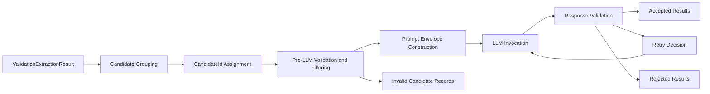

# Business Logic Model

## Goal
`UOW-04` transforms pre-LLM validation evidence into guarded candidate chunks, submits only valid chunks to the LLM, and classifies normalization outcomes into accepted, retried, or rejected results with full traceability.

## Main Workflow

### 1. Candidate Grouping
- Receive direct validation evidence outputs from `UOW-03`.
- Group normalization targets using two primary scopes:
  - endpoint scope
  - validator method scope
- Preserve chunk metadata for source sub-grouping such as:
  - `BEAN_VALIDATION_UNSUPPORTED`
  - `CONSTRAINT_VALIDATOR`
  - `SPRING_VALIDATOR`
  - `SERVICE_DOMAIN_HINT`

### 2. Candidate Identity Assignment
- Assign stable `candidateId` values before LLM invocation.
- Ensure chunk metadata also carries:
  - endpoint linkage
  - source kind
  - source trace
  - target hints
  - evidence bundle

### 3. Pre-LLM Validation and Filtering
- Validate each candidate and chunk for:
  - evidence presence
  - source trace presence
  - candidateId integrity
  - endpoint linkage
  - enum/domain validity
  - duplicate `candidateId`
- Exclude invalid candidates from LLM submission.
- Preserve invalid results as reviewable records rather than dropping them silently.

### 4. Prompt Envelope Construction
- Build fixed JSON input envelope.
- Include:
  - endpoint context
  - chunk metadata
  - candidate list
  - allowed operator enum
  - allowed confidence enum
  - allowed target location enum
  - evidence and source trace
  - forbidden behaviors
- The prompt contract explicitly forbids:
  - new candidateId creation
  - evidence-free rule invention
  - operator outside allowed enum
  - non-JSON output
  - whole-source speculation beyond supplied evidence

### 5. LLM Invocation
- Submit one prompt envelope per chunk or batch unit according to chunking strategy.
- Record:
  - prompt version
  - input hash
  - raw request
  - raw response
  - attempt count

### 6. Response Validation
- Validate raw response in multiple layers:
  - JSON parse success
  - schema validation
  - enum validation
  - candidateId validation
  - evidence presence
  - forbidden rule creation checks
  - semantic consistency checks
- Semantic consistency includes:
  - candidateId must exist in input
  - targetPath must be grounded in static facts or evidence
  - rule must not contradict known chunk constraints

### 7. Retry or Rejection Decision
- Retry limited cases:
  - parse failure
  - schema failure
  - enum failure
  - candidateId mismatch
  - semantic inconsistency
  - low-quality response
- Reject immediately or after bounded retries when:
  - evidence-free rule invention persists
  - input-unrelated rule creation occurs
  - repeated validation failure reaches retry limit

### 8. Result Classification
- Produce:
  - accepted normalization results
  - rejected normalization results
  - retry history
  - validator findings
- Preserve all intermediate artifacts for debugging and reproducibility.

## Data Flow

## Decision Model

### Pre-LLM Boundary Strategy
- LLM is not allowed to create new business evidence.
- Only candidates that pass strong structural checks may cross the boundary.
- Invalid candidate filtering is part of business correctness, not just defensive programming.

### Response Quality Strategy
- Prefer bounded retry over immediate rejection for recoverable formatting or consistency errors.
- Prefer rejection over silent degradation when the LLM fabricates or drifts beyond evidence.

## Output Characteristics
- Accepted and rejected normalization results are first-class outputs.
- Retry history and raw request/response logs are preserved for reproducibility.
- Validator findings explain why a response was accepted, retried, or rejected.
