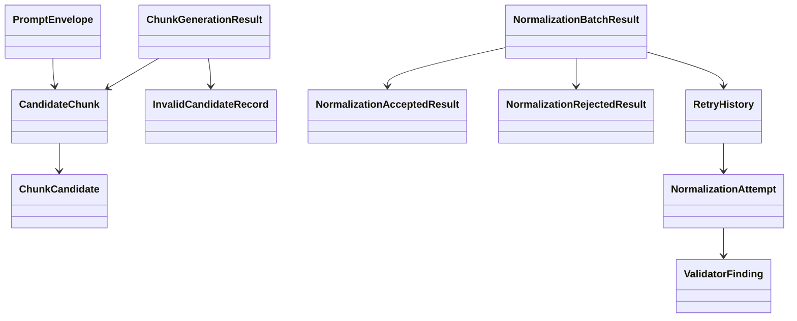

# Domain Entities

## Overview
`UOW-04` centers on guarded handoff across the pre-LLM and post-LLM boundary. The model must preserve what was sent, what was received, how it was validated, and why it was accepted, retried, or rejected.

## Core Entities

### `ChunkGenerationResult`
- Purpose:
  - aggregate root for pre-LLM chunk preparation
- Fields:
  - `chunks`
  - `invalidCandidates`
  - `generationMetadata`

### `CandidateChunk`
- Purpose:
  - represent one LLM input unit
- Fields:
  - `chunkId`
  - `chunkScope`
  - `endpointId`
  - `validatorMethodId`
  - `sourceKinds`
  - `candidates`
  - `allowedOperators`
  - `allowedConfidenceValues`
  - `allowedTargetLocations`
  - `chunkMetadata`

### `ChunkCandidate`
- Purpose:
  - normalized LLM-facing view of a validation candidate
- Fields:
  - `candidateId`
  - `targetLocationHint`
  - `targetPathHint`
  - `evidence`
  - `sourceTrace`
  - `sourceKind`
  - `confidence`
  - `unresolvedReason`

### `InvalidCandidateRecord`
- Purpose:
  - preserve pre-LLM candidate rejection
- Fields:
  - `candidateId`
  - `failureReasons`
  - `endpointId`
  - `sourceTrace`
  - `rawCandidateReference`

### `PromptEnvelope`
- Purpose:
  - fixed JSON request contract for LLM normalization
- Fields:
  - `promptVersion`
  - `inputHash`
  - `chunk`
  - `forbiddenBehaviors`
  - `outputSchemaRef`

### `NormalizationAttempt`
- Purpose:
  - represent one invocation attempt for a given prompt envelope
- Fields:
  - `attemptNumber`
  - `promptVersion`
  - `inputHash`
  - `rawRequest`
  - `rawResponse`
  - `attemptStatus`
  - `validatorFindings`

### `NormalizationAcceptedResult`
- Purpose:
  - represent validated normalization output accepted for downstream assembly
- Fields:
  - `candidateId`
  - `operator`
  - `expected`
  - `targetLocation`
  - `targetPath`
  - `confidence`
  - `llmReason`
  - `supportingEvidence`
  - `attemptReference`

### `NormalizationRejectedResult`
- Purpose:
  - represent rejected normalization output
- Fields:
  - `candidateId`
  - `rejectionReasons`
  - `finalAttemptReference`
  - `rawResponseReference`

### `ValidatorFinding`
- Purpose:
  - capture validation feedback on a normalization attempt
- Fields:
  - `findingType`
  - `severity`
  - `message`
  - `candidateId`
  - `path`

### `RetryHistory`
- Purpose:
  - preserve retry progression for a chunk or candidate set
- Fields:
  - `inputHash`
  - `attempts`
  - `finalDisposition`

### `NormalizationBatchResult`
- Purpose:
  - aggregate root for post-LLM results
- Fields:
  - `acceptedResults`
  - `rejectedResults`
  - `retryHistories`
  - `batchMetadata`

## Supporting Enums and Value Concepts
- `ChunkScope`
  - `ENDPOINT`
  - `VALIDATOR_METHOD`
- `AttemptStatus`
  - `ACCEPTED`
  - `RETRYABLE_FAILURE`
  - `REJECTED`
- `FindingType`
  - `PARSE_ERROR`
  - `SCHEMA_ERROR`
  - `ENUM_ERROR`
  - `CANDIDATE_ID_ERROR`
  - `EVIDENCE_ERROR`
  - `SEMANTIC_INCONSISTENCY`
  - `LOW_QUALITY_RESPONSE`
  - `FORBIDDEN_RULE_CREATION`

## Relationships

## Lifecycle Notes
- `InvalidCandidateRecord` is created before any LLM call.
- `PromptEnvelope` is immutable for a given attempt input hash.
- `NormalizationAttempt` captures every retry cycle.
- `NormalizationAcceptedResult` and `NormalizationRejectedResult` are both durable outputs.
