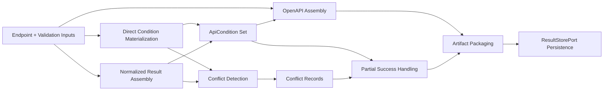

# Business Logic Model

## Goal
`UOW-05` assembles authoritative direct conditions and validated normalization results into final contract artifacts, preserves conflicts and failures, and emits reviewable output packages for OpenAPI, ApiCondition, and diagnostics.

## Main Workflow

### 1. Input Collection
- Receive:
  - endpoint analysis output
  - direct condition drafts
  - accepted normalization results
  - rejected normalization results
  - invalid candidate records
  - retry history and validator findings
- Associate all inputs to endpoint-level assembly context.

### 2. Direct Condition Materialization
- Convert `ApiConditionDraft` into final `ApiCondition` records.
- Treat direct conditions as authoritative when they come from explicit static semantics.
- Preserve evidence, trace, and confidence as final provenance.

### 3. Normalized Result Assembly
- Convert accepted normalization results into `ApiCondition` records only when they do not conflict with authoritative direct conditions.
- Allow normalized results to:
  - add new conditions
  - refine unresolved or previously non-authoritative evidence
- Do not allow normalized results to overwrite authoritative direct conditions.

### 4. Conflict Detection
- Compare direct condition and normalized result by:
  - endpoint linkage
  - targetPath
  - operator
  - expected value
- If normalized output contradicts authoritative direct condition:
  - preserve direct condition
  - create conflict record
  - attach evidence source, normalizedBy, confidence, and llmReason

### 5. OpenAPI Assembly
- Build endpoint/path/method structure from endpoint analysis output.
- Map schema-compatible validation to OpenAPI when possible:
  - required
  - minLength
  - maxLength
  - minimum
  - maximum
  - pattern
- Preserve rules that do not fit cleanly into OpenAPI only inside internal `ApiCondition`.
- Maintain trace connection between OpenAPI operation/schema and `ApiCondition` via endpointId, operationId, and targetPath.

### 6. Partial Success Handling
- If some endpoints fail assembly:
  - continue producing successful endpoint outputs
  - store failed endpoint records separately
- Keep successful and failed outputs visible together through manifest summary.

### 7. Artifact Packaging
- Produce file-oriented artifact set including:
  - `openapi.json`
  - `api-conditions.json`
  - `normalization-rejections.json`
  - `conflicts.json`
  - `manifest.json`
- Optionally produce:
  - invalid candidate outputs
  - chunk JSON
  - retry history summary
  - failure summary

### 8. Output Persistence
- Persist artifacts through `ResultStorePort`.
- Standardize artifact metadata:
  - path
  - type
  - generatedAt
  - sourceRunId
  - endpointCount

## Data Flow

## Decision Model

### Authority Strategy
- Direct static conditions are authoritative.
- LLM-normalized conditions are additive or supplemental.
- Conflict results must be explicit, never silently resolved by overwriting authoritative conditions.

### Representation Strategy
- Use OpenAPI for standardizable schema constraints.
- Use internal `ApiCondition` for richer or non-standardizable validation logic.
- Keep both connected with traceable identifiers.

## Output Characteristics
- Final output is not just a success artifact; it is a review package.
- Successful endpoints, failed endpoints, skipped candidates, rejected normalizations, and conflicts must all remain visible in the manifest.
- Debug outputs should preserve evidence-centered intermediate artifacts without storing the entire source tree.
