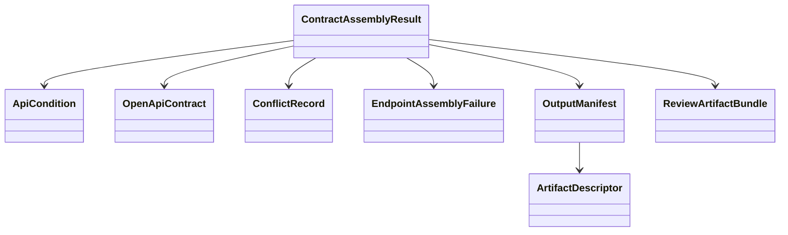

# Domain Entities

## Overview
`UOW-05` centers on final contract materialization. Its model must preserve authoritative conditions, supplemental normalized conditions, conflicts, failures, and artifact-level output metadata in one reviewable package.

## Core Entities

### `ContractAssemblyResult`
- Purpose:
  - aggregate root for final assembly output
- Fields:
  - `apiConditions`
  - `openApiContract`
  - `conflicts`
  - `failedEndpoints`
  - `outputManifest`

### `ApiCondition`
- Purpose:
  - final internal contract condition record
- Fields:
  - `conditionId`
  - `endpointId`
  - `targetLocation`
  - `targetPath`
  - `operator`
  - `expected`
  - `purpose`
  - `source`
  - `confidence`
  - `errorCode`
  - `sourceClass`
  - `sourceMethod`
  - `lineNumber`
  - `evidence`
  - `llmReason`
  - `llmGenerated`
  - `normalizedBy`
  - `evidenceSource`
  - `reviewStatus`
  - `conflict`
  - `active`

### `ConflictRecord`
- Purpose:
  - preserve contradiction between authoritative direct condition and normalized result
- Fields:
  - `conflictId`
  - `endpointId`
  - `targetPath`
  - `operator`
  - `directExpected`
  - `normalizedExpected`
  - `evidenceSource`
  - `normalizedBy`
  - `confidence`
  - `llmReason`
  - `sourceTrace`

### `OpenApiContract`
- Purpose:
  - represent final OpenAPI output
- Fields:
  - `documentVersion`
  - `paths`
  - `operations`
  - `schemaComponents`
  - `generationMetadata`

### `EndpointAssemblyFailure`
- Purpose:
  - preserve failed final assembly for one endpoint
- Fields:
  - `endpointId`
  - `failureCategory`
  - `message`
  - `sourceTrace`
  - `recoverability`

### `ArtifactDescriptor`
- Purpose:
  - describe one persisted artifact
- Fields:
  - `artifactType`
  - `path`
  - `generatedAt`
  - `sourceRunId`
  - `endpointCount`
  - `recordCount`

### `OutputManifest`
- Purpose:
  - summarize final outputs and review/debug artifacts
- Fields:
  - `sourceRunId`
  - `successfulEndpoints`
  - `failedEndpoints`
  - `skippedCandidates`
  - `rejectedNormalizations`
  - `conflicts`
  - `artifacts`
  - `generatedAt`

### `ReviewArtifactBundle`
- Purpose:
  - represent non-primary but review-critical outputs
- Fields:
  - `rejectedNormalizationArtifact`
  - `invalidCandidateArtifact`
  - `failureSummaryArtifact`
  - `chunkArtifact`
  - `retryHistoryArtifact`
  - `conflictArtifact`

## Supporting Enums and Value Concepts
- `ArtifactType`
  - `OPENAPI`
  - `API_CONDITIONS`
  - `NORMALIZATION_REJECTIONS`
  - `INVALID_CANDIDATES`
  - `FAILURE_SUMMARY`
  - `CHUNK_JSON`
  - `RETRY_HISTORY`
  - `CONFLICTS`
  - `MANIFEST`
- `ReviewStatus`
  - `AUTO_ACCEPTED`
  - `REVIEW_REQUIRED`
  - `CONFLICT`

## Relationships

## Lifecycle Notes
- `ApiCondition` may come from direct authoritative mapping or accepted normalized result, but provenance must remain visible.
- `ConflictRecord` is produced whenever normalized output contradicts authoritative direct condition.
- `OutputManifest` is a required first-class artifact, not an optional convenience file.
