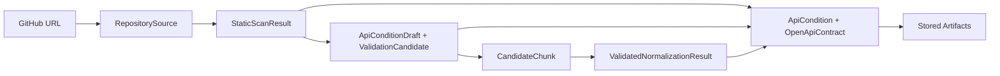

# Component Dependency

## Dependency Rules
- Application services depend on ports, domain models, and feature-local support components.
- Adapters depend on external libraries and implement ports.
- Extractors may depend on shared support components such as `TypeResolver` and `SourceTraceResolver`.
- Contract assembly must not depend directly on LLM adapter internals.

## Service Dependency Graph

```mermaid
flowchart TD
    CLI["ContractExtractionApplicationService"]
    RIS["RepositoryIngestionService"]
    SSS["SpringStaticScanService"]
    VES["ValidationExtractionService"]
    CGS["CandidateChunkGenerationService"]
    NS["NormalizationService"]
    CAS["ContractAssemblyService"]
    OS["OutputService"]

    RFP["RepositoryFetcherPort"]
    WPP["WorkspacePreparerPort"]
    EE["EndpointExtractor"]
    TR["TypeResolver"]
    STR["SourceTraceResolver"]
    ACE["AnnotationConditionExtractor"]
    VCE["ValidatorCandidateExtractor"]
    SHE["ServiceHintExtractor"]
    CCG["CandidateChunkGenerator"]
    CCV["CandidateChunkValidator"]
    CIG["CandidateIdGenerator"]
    PB["PromptBuilder"]
    LNA["LlmNormalizationAdapter"]
    LRV["LlmResponseValidator"]
    ACA["ApiConditionAssembler"]
    OAA["OpenApiAssembler"]
    RSP["ResultStorePort"]

    CLI --> RIS
    CLI --> SSS
    CLI --> VES
    CLI --> CGS
    CLI --> NS
    CLI --> CAS
    CLI --> OS

    RIS --> RFP
    RIS --> WPP

    SSS --> EE
    SSS --> TR
    SSS --> STR

    VES --> ACE
    VES --> VCE
    VES --> SHE
    VES --> TR
    VES --> STR

    CGS --> CCG
    CGS --> CCV
    CGS --> CIG

    NS --> PB
    NS --> LNA
    NS --> LRV

    CAS --> ACA
    CAS --> OAA

    OS --> RSP
```

## Pipeline Data Flow

## Dependency Matrix

| Component | Depends On | Why |
| --- | --- | --- |
| `RepositoryIngestionService` | `RepositoryFetcherPort`, `WorkspacePreparerPort` | external repository acquisition and workspace normalization |
| `SpringStaticScanService` | `EndpointExtractor`, `TypeResolver`, `SourceTraceResolver` | endpoint inventory and type/trace resolution |
| `ValidationExtractionService` | `AnnotationConditionExtractor`, `ValidatorCandidateExtractor`, `ServiceHintExtractor`, `TypeResolver`, `SourceTraceResolver` | 3-layer validation extraction with shared support |
| `CandidateChunkGenerationService` | `CandidateChunkGenerator`, `CandidateChunkValidator`, `CandidateIdGenerator` | chunk creation and invalid filtering |
| `NormalizationService` | `PromptBuilder`, `LlmNormalizationAdapter`, `LlmResponseValidator` | LLM input generation, invocation, and guarded validation |
| `ContractAssemblyService` | `ApiConditionAssembler`, `OpenApiAssembler` | final contract materialization |
| `OutputService` | `ResultStorePort` | output persistence without storage lock-in |

## Adapter Boundaries
- `RepositoryFetcherPort` adapter:
  - git client or GitHub transport implementation
- `LlmNormalizationAdapter`:
  - OpenAI-compatible or other LLM provider implementation
- `ResultStorePort` adapter:
  - file output implementation first
- Parser technology:
  - JavaParser-based adapter/support implementation inside analysis feature

## Guardrails
- Candidate chunk generation is a hard boundary before LLM.
- Unsupported/custom annotations do not bypass candidate stage.
- `RESPONSE` is modeled separately from request target locations.
- Evidence and source trace must survive every transformation step.
