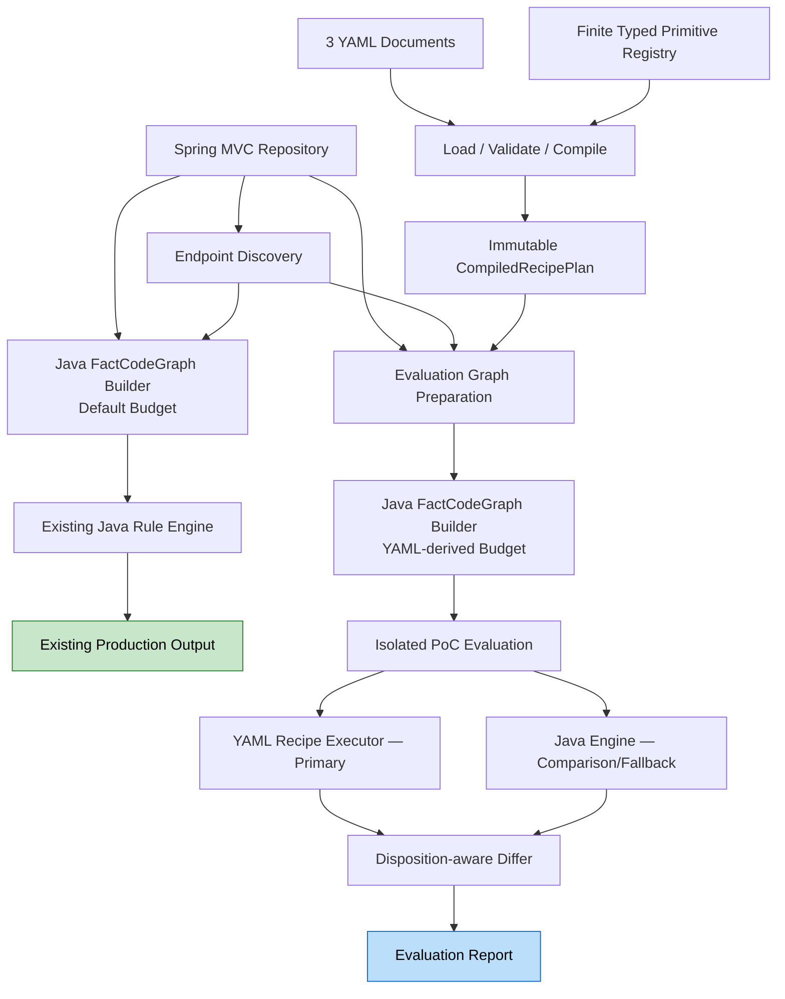

# YAML Rule Engine PoC — Application Design

> **상태**: 설계 완료, 사용자 승인 대기
> **기준**: Requirements v2 및 승인된 Workflow Planning
> **상세 문서**: `components.md`, `component-methods.md`, `services.md`, `component-dependency.md`

## 1. 설계 결론

이 PoC는 Semantic Analysis & Rule Engine Layer 전체를 YAML interpreter로 바꾸지 않는다. Java가 제공하는 graph/index, type resolution, cycle/budget enforcement 및 typed semantic primitive를 실행 기반으로 유지하고, repository-independent classifier family의 **실행 조합과 framework catalog**를 YAML로 외부화한다.

외부화 대상은 `quantity < 0` 같은 concrete rule이 아니라 다음 형태다.

```text
failure condition 발견
  -> binary comparison 결합
  -> request origin과 literal binding
  -> failure polarity로 operator 정규화
  -> evidence를 가진 normalized constraint emit
```

field path, literal, enum constant, normalized operator와 evidence는 매 실행 시 `FactCodeGraph`에서 바인딩한다.

## 2. 확정 Architecture Decisions

| ID | 결정 | 근거 |
| :--- | :--- | :--- |
| AD-01 | 신규 domain/support 경계를 `analysis.domain.recipe`, `analysis.support.recipe`로 분리 | 기존 module을 유지하면서 PoC 제거·rollback 용이 |
| AD-02 | 명시적 PoC evaluation 시작 시 세 YAML을 compile-once하여 immutable plan으로 재사용 | 정상 scan 독립성, 실행 중 schema/type 오류 차단, 결정론과 성능 관찰 |
| AD-03 | YAML은 유한한 typed primitive ID와 binding만 사용 | arbitrary DSL/새 프로그래밍 언어 방지 |
| AD-04 | 정상 scan은 Java authoritative와 기존 output을 유지 | Phase 2 호환성과 rollback 보장 |
| AD-05 | 격리된 evaluation에서는 YAML primary, Java comparison 및 명시적 fallback | YAML 중심 실행을 검증하면서 silent regression 관찰 |
| AD-06 | YAML은 engine config, semantic recipes, framework catalog 3개 파일 | schema와 변경 책임 분리 |
| AD-07 | 신규 상태와 diff는 evaluation report에만 출력 | production exporter 계약 무변경 |
| AD-08 | DelegatedGuard는 evaluation 기본 pack에서 제거하고 unresolved로 교정 | domain 추측 제거와 무추측 원칙 |

## 3. 시스템 경계

### 지원

- Java source와 Spring MVC annotation 기반 endpoint
- Controller root에서 도달 가능한 application subgraph
- 현재 CodeGraph가 표현하는 condition/outcome/call/operand/read-write/origin/value-flow
- core Java/JDK recipes와 evidence 기반 optional Spring Data/Security/JPA packs

### 비지원

- Kotlin, WebFlux functional routing, runtime reflection/AOP 완전 복원
- FactCodeGraph node/edge 생성 알고리즘의 YAML화
- arbitrary expression, script, Java callback 또는 reflection
- repository별 field/literal/status/permission을 recipe에 등록
- production hot-reload, version registry, exporter 계약 변경

## 4. Logical Architecture



## 5. YAML 책임과 예시

### `engine-config.yaml`

```yaml
schema_version: 1
engine:
  traversal:
    max_depth: 15
    max_visited_methods_per_api: 500
    max_edges_per_api: 10000
  behavior:
    deterministic_order: true
    report_unclassified: true
    report_truncation: true
```

이 값은 **evaluation graph용** Java `FactGraphTraversalBudget`과 recipe follow budget으로 변환된다. 정상 scan은 기존 default budget을 사용하며 YAML에 의존하지 않는다. traversal 알고리즘 자체는 Java에 남는다.

### `semantic-recipes.yaml`

```yaml
schema_version: 1
recipes:
  - id: JAVA_BINARY_FAILURE_GUARD
    family: binary_failure_guard
    steps:
      - op: match.failure_condition
        out: failure
      - op: match.binary_comparison
        in: failure
        out: comparison
      - op: resolve.request_input_path
        in: comparison
        out: target
      - op: bind.literal_operand
        in: comparison
        out: expected
      - op: normalize.comparison_by_failure_polarity
        in: [comparison, failure]
        out: operator
      - op: emit.normalized_constraint
        in: [target, operator, expected]
```

`target`, `expected`, `operator`는 YAML 상수가 아니라 typed runtime binding이다.

### `framework-catalog.yaml`

```yaml
schema_version: 1
catalog:
  guards:
    - id: JDK_REQUIRE_NON_NULL
      owner_type: java.util.Objects
      method: requireNonNull
      argument_role: guarded_value
      semantics: NOT_NULL
```

Spring framework entry는 resolved owner/receiver/signature/annotation evidence를 요구한다. method name만으로 의미를 확정하지 않는다.

## 6. Compile Lifecycle

1. 세 파일을 UTF-8로 읽는다.
2. 파일별 schema와 unknown/duplicate/required field를 검증한다.
3. schema version과 cross-document reference를 검증한다.
4. primitive stable ID를 registry descriptor로 resolve한다.
5. step binding의 정의 순서와 input/output type을 검증한다.
6. recipe/catalog ordering을 정규화한다.
7. immutable `CompiledRecipePlan`과 content digest를 만든다.
8. 오류가 하나라도 있으면 plan을 publish하지 않고 evaluation graph 생성과 recipe evaluation을 시작하지 않는다. 정상 scan은 영향을 받지 않는다.

## 7. Runtime Binding and Execution

각 endpoint의 graph에서 predicate를 candidate ID 순으로 평가한다. recipe는 다음 상태 중 하나를 반환한다.

| 상태 | 의미 |
| :--- | :--- |
| `RESOLVED` | target/operator/value와 evidence가 증명됨 |
| `UNCLASSIFIED` | 활성 recipe가 candidate 의미를 인식하지 못함 |
| `UNRESOLVED` | 의미 shape는 인식했으나 target/origin을 증명하지 못함 |
| `PARTIAL_ANALYSIS` | graph 또는 recipe traversal이 budget/해석 한계로 일부 중단됨 |
| `FAILED` | compile을 통과했지만 primitive execution 오류 발생 |

같은 source/plan/graph에서 result와 ordering은 결정적이어야 한다. `follow` primitive는 cycle detection과 endpoint-local finite budget을 사용한다.

## 8. 정상 경로와 Evaluation 경로

### 정상 scan

- 기존 `ScanPreparationService`, `DefaultGraphRuleEngine`, `RuleOutputService`, exporter를 사용한다.
- 세 YAML, `RecipePlanBootstrapService`와 `CompiledRecipePlan`에 의존하지 않는다.
- 기존 `FactGraphTraversalBudget.defaults()`로 normal graph를 생성한다.
- Java candidate가 authoritative다.
- 신규 상태나 diff를 `EndpointRuleOutput`에 넣지 않는다.

### PoC evaluation

- bootstrap 성공 후 YAML-derived budget으로 evaluation graph를 별도 생성한다.
- YAML raw와 Java raw를 같은 **evaluation graph/scope**에서 항상 실행한다.
- bootstrap 또는 evaluation graph 생성 실패는 evaluation에만 반영되며 정상 scan을 중단하지 않는다.
- YAML이 evaluation primary다.
- YAML이 `UNCLASSIFIED` 또는 `FAILED`이고 Java 결과가 있을 때만 effective result는 `JAVA_FALLBACK`이다.
- fallback reason과 원래 YAML 결손은 반드시 report한다.
- `UNRESOLVED`와 `PARTIAL_ANALYSIS`는 숨기지 않고 YAML 결과로 유지한다.

이 구조는 “YAML primary”를 실제로 검증하면서도 기존 production output 무변경 결정을 만족한다.

## 9. Framework Packs

| Pack | 활성 evidence | Negative 조건 |
| :--- | :--- | :--- |
| Core Java/JDK | language fact 또는 resolved JDK signature | project-specific allowlist 불필요 |
| Spring Data | repository receiver/type + lookup/Optional chain | 같은 method name만 존재 |
| Spring Security | `PasswordEncoder` resolved type/signature | unrelated `matches` call, unresolved type |
| JPA | `@Version` 또는 resolved persistence metadata | 이름이 `version`인 일반 field만 존재 |

pack selection 실패는 core 실행 실패가 아니며, 관련 recipe를 비활성화하고 evidence diagnostic을 남긴다.

## 10. DelegatedGuard Correction

evaluation 기본 pack에는 legacy `DelegatedGuardRule`을 포함하지 않는다. generic delegated semantics는 다음 evidence chain이 완성될 때만 허용한다.

```text
caller argument -> callee parameter -> return predicate -> domain/request origin
```

완성되지 않으면 `UNRESOLVED_DELEGATED_GUARD`이며 업무 target/operator를 합성하지 않는다. 기존 hardcoded 결과는 baseline `REPLACE`로 분류한다. 정상 Java path 제거는 PoC 결과 승인 이후 별도 migration 결정이다.

## 11. Differential Evaluation

### 비교 축

- graph coverage: endpoint root, reachable method, edge와 truncation
- semantic coverage: recipe family별 resolved/unclassified/unresolved/partial/failed
- normalized observation: category, effect, target, operator, expected, evidence fingerprint
- framework activation evidence
- fallback frequency와 reason
- recipe/primitive execution count, elapsed time, peak memory

### Disposition 판정

| Disposition | 합격 조건 |
| :--- | :--- |
| `PRESERVE` | 외부 관찰 결과 diff 0건 |
| `REPLACE` | 승인된 corrected expectation과 일치 |
| `UNSUPPORTED` | 값을 발명하지 않고 명시적 diagnostic 생성 |

## 12. Security and Safety Boundary

- YAML은 선언 데이터이며 code execution capability가 없다.
- 허용 schema 외 field는 모두 거부한다.
- primitive registry 밖의 ID는 compile 오류다.
- YAML이 filesystem/network/process/reflection/class loading을 요청할 수 없다.
- loader의 read와 report writer의 write는 고정된 application adapter가 수행한다.
- invalid pack은 부분 적용하지 않는다.

## 13. Requirement Traceability

| Requirement | 주요 설계 요소 |
| :--- | :--- |
| R2-YAML-001 | Spring MVC endpoint/graph 보존, repository-name 비종속 recipe |
| R2-YAML-002 | `EngineRecipeConfiguration` → `FactGraphTraversalBudget` adapter |
| R2-YAML-003 | descriptor 기반 finite primitive registry와 compile type check |
| R2-YAML-004 | typed `BindingEnvironment`, no-guess unresolved 처리 |
| R2-YAML-005 | core family recipe와 cross-domain runtime binding |
| R2-YAML-006 | evidence-based optional `FrameworkPackSelector` |
| R2-YAML-007 | evaluation pack에서 DelegatedGuard 제거 및 unresolved correction |
| R2-YAML-008 | 5개 execution status와 별도 report |
| R2-YAML-009 | repository/endpoint/recipe coverage와 rename holdout report |
| R2-YAML-010 | disposition-aware `RecipeDiffer` |

## 14. 후속 Unit에서 상세화할 항목

- primitive별 정확한 input/output binding type과 graph edge semantics
- YAML schema의 정식 JSON Schema 또는 Jackson model
- candidate identity/evidence fingerprint canonicalization
- graph build budget과 recipe follow budget의 계수 단위
- corpus manifest 및 baseline labeling format
- evaluation report serialization schema
- evaluation runner의 CLI/test entry point

이 항목들은 현재 컴포넌트 경계를 변경하지 않는 하위 설계다.

## 15. Application Design Gate

설계는 승인 전 구현을 허가하지 않는다. 승인 후 Units Generation에서 U01~U06의 최종 책임, 의존성과 검증 evidence를 확정한다.
