# YAML Rule Engine PoC — Component Dependency

## 1. 상위 의존성 구조

```mermaid
flowchart LR
    subgraph Sources["Immutable YAML Sources"]
        EC["engine-config.yaml"]
        SR["semantic-recipes.yaml"]
        FC["framework-catalog.yaml"]
    end

    Bootstrap["RecipePlanBootstrapService"]
    Schema["RecipeSchemaValidator"]
    Compiler["SemanticRecipeCompiler"]
    Registry["Typed Primitive Registry"]
    Plan["CompiledRecipePlan"]

    Repo["RepositorySource"]
    Scan["SpringStaticScanService"]
    NormalGraph["DefaultFactCodeGraphBuilder<br/>Default Budget"]
    NormalContext["Normal ScanAnalysisContext"]
    ProdJava["DefaultGraphRuleEngine<br/>Production Authority"]
    Prod["Existing Production Output"]

    EvalPrep["RecipeEvaluationPreparationService"]
    EvalGraph["DefaultFactCodeGraphBuilder<br/>YAML-derived Budget"]
    EvalContext["RecipeEvaluationRunContext"]
    Eval["SemanticRecipeEvaluationService"]
    Yaml["SemanticRecipeExecutor"]
    CompareJava["DefaultGraphRuleEngine<br/>Comparison/Fallback"]
    Diff["RecipeDiffer"]
    Report["Isolated Evaluation Report"]

    EC & SR & FC --> Bootstrap
    Bootstrap --> Schema --> Compiler
    Registry --> Compiler
    Compiler --> Plan
    Repo --> Scan
    Repo & Scan --> NormalGraph --> NormalContext --> ProdJava --> Prod
    Repo & Scan --> EvalPrep
    Plan --> EvalPrep
    EvalPrep --> EvalGraph --> EvalContext --> Eval
    Eval --> Yaml
    Registry --> Yaml
    Eval --> CompareJava
    Yaml --> Diff
    CompareJava --> Diff
    Diff --> Report

    style Prod fill:#C8E6C9,stroke:#2E7D32,color:#000
    style Report fill:#BBDEFB,stroke:#1565C0,color:#000
    style Plan fill:#FFE0B2,stroke:#EF6C00,color:#000
```



핵심 분리점은 graph 준비 단계부터 존재한다. 정상 graph는 default budget으로 YAML과 무관하게 생성되고, evaluation graph만 compiled plan의 YAML-derived budget으로 생성된다. PoC evaluation의 결과 선택이나 diagnostic은 기존 production output으로 흐르지 않는다.

## 2. Package 의존 방향

```text
analysis.application
  -> analysis.domain.recipe
  -> analysis.support.recipe
       -> analysis.domain.recipe
       -> analysis.domain.fact / candidate / semantic / rule
       -> existing analysis.support.semantic / rule adapters

analysis.domain.recipe
  -> analysis.domain.fact / candidate / rule value types only
  -X-> analysis.support.*
```

`analysis.domain.recipe`는 YAML/Jackson, filesystem 또는 support 구현에 의존하지 않는다. YAML parsing과 기존 engine adapter는 `analysis.support.recipe`에 둔다.

## 3. Dependency Matrix

| From | To | 방식 | 허용 데이터 | 비고 |
| :--- | :--- | :--- | :--- | :--- |
| `RecipePlanBootstrapService` | `RecipeSourceLoader` | direct call | `RecipeSourceSet` | evaluation 시작 전 1회 |
| `RecipePlanBootstrapService` | `RecipeSchemaValidator` | direct call | loaded documents | fail-closed |
| `RecipePlanBootstrapService` | `RecipeCompiler` | direct call | validated sources | immutable plan 생성 |
| `RecipeCompiler` | primitive registry | lookup | descriptor only | 구현 실행 금지 |
| `RecipeEvaluationPreparationService` | `TraversalBudgetAdapter` | direct call | compiled engine config | evaluation 전용 |
| `RecipeEvaluationPreparationService` | `DefaultFactCodeGraphBuilder` | direct call | source/scan/YAML-derived budget | 정상 graph와 별도 생성 |
| `SemanticRecipeExecutor` | `FactGraphIndex`/`SemanticContext` | read-only | graph facts | graph mutation 금지 |
| `SemanticRecipeExecutor` | primitive registry | invocation | typed bindings | ID/type compile 검증 완료 |
| `FrameworkPackSelector` | catalog + graph evidence | read-only | type/signature/annotation | method name 단독 금지 |
| `SemanticRecipeEvaluationService` | YAML executor | direct call | plan/graph/scope | evaluation primary |
| `SemanticRecipeEvaluationService` | Java engine | adapter call | graph/scope | comparison 및 fallback |
| `RecipeDiffer` | baseline manifest | read-only | disposition/expected | corpus별 승인 자료 |
| report writer | filesystem adapter | write | evaluation report only | production output과 분리 |

## 4. 정상 Scan Data Flow

```text
RepositorySource
  -> Spring endpoint discovery
  -> DefaultFactCodeGraphBuilder(default budget)
  -> FactCodeGraph
  -> DefaultGraphRuleEngine / SemanticRuleDispatcher
  -> RuleOutputService
  -> existing EndpointRuleOutput / exporters
```

Phase 2에서 이 경로의 컴포넌트 선택, candidate authority와 exporter schema는 변경하지 않는다. 이 경로는 YAML loader, bootstrap, compiled plan과 evaluation graph에 의존하지 않는다.

## 5. PoC Evaluation Data Flow

```text
Three YAML files
  -> strict validation
  -> typed compile
  -> immutable CompiledRecipePlan

Repository + Spring endpoint
  -> RecipeEvaluationPreparationService
  -> separate FactCodeGraph with YAML-derived budget
  -> PredicateCandidate set
       -> YAML recipe execution -> YAML raw status/candidates/evidence
       -> Java engine execution -> Java comparison candidates/evidence
  -> effective source selection
  -> disposition-aware semantic diff
  -> isolated evaluation report
```

## 6. Shared State and Lifetime

| 객체 | 범위 | 가변성 | 공유 규칙 |
| :--- | :--- | :---: | :--- |
| `CompiledRecipePlan` | explicit evaluation run | 불변 | evaluation의 모든 endpoint에서 공유 가능 |
| normal `FactCodeGraph` | 정상 scan endpoint | 불변 | production Java path만 사용 |
| evaluation `FactCodeGraph` | evaluation endpoint | 불변 | YAML/Java comparison 양쪽이 같은 graph를 읽음 |
| `BindingEnvironment` | predicate × recipe invocation | 가변, 비공유 | invocation 종료 후 폐기 |
| cycle/budget counter | endpoint execution | 가변, 비공유 | parallel endpoint 간 공유 금지 |
| evaluation accumulator | repository run | 제한적 가변 | 결과 수집 후 deterministic sort |

## 7. 금지 의존성

- YAML document → Java class name/callback/reflection
- primitive → repository-specific package, field, aggregate 또는 method allowlist
- domain recipe model → Jackson/YAML parser
- YAML evaluation → `EndpointRuleOutput` 또는 production exporter mutation
- normal scan → YAML loader, bootstrap, compiled plan 또는 evaluation graph
- framework pack → method name 단독 activation
- fallback selector → YAML failure/unclassified diagnostic 삭제
- DelegatedGuard → `currentUser`, `order.state`, 특정 permission 이름 합성

## 8. 변경 영향 경계

| 기존 영역 | 허용 변경 | 금지 변경 |
| :--- | :--- | :--- |
| graph builder | YAML config를 변환한 budget 주입 | traversal/graph fact 알고리즘 YAML화 |
| semantic/rule engine | evaluation adapter에서 재사용 | Phase 2 정상 authority 교체 |
| output/exporter | 없음 | evaluation 상태 혼입 |
| YAML legacy loader | adapter 또는 migration reference로 재사용 가능 | 기존 method-name rule을 generic recipe로 간주 |
| default packs | evaluation용 구성 분리 | 정상 scan에서 즉시 제거 |

## 9. 순환 의존성 방지

- compiler는 primitive **descriptor**에만 의존하고 executor 구현을 호출하지 않는다.
- executor는 compiled plan을 소비하되 loader/compiler를 호출하지 않는다.
- evaluation service가 Java와 YAML 경로를 조율하며 두 engine이 서로를 호출하지 않는다.
- report writer는 engine/domain 결과를 serialize할 뿐 실행 정책을 결정하지 않는다.
