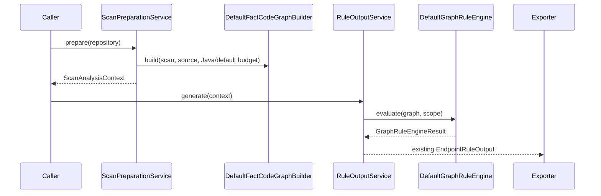
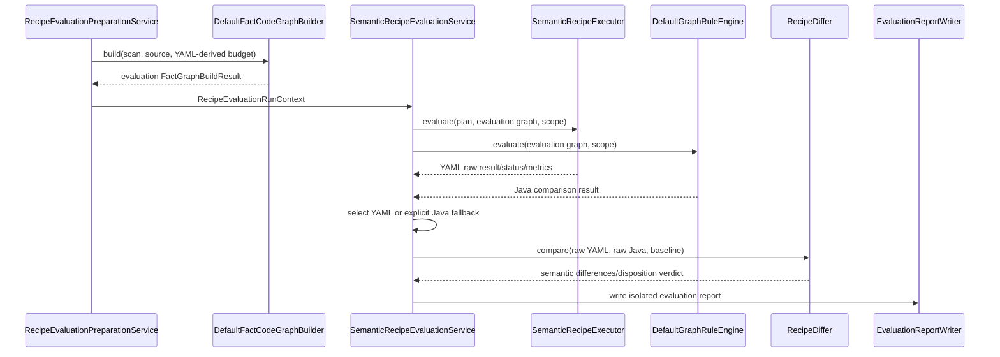

# YAML Rule Engine PoC — Services

## 1. 서비스 경계

PoC는 정상 scan 서비스를 교체하지 않는다. 두 경로는 `RepositorySource`와 필요 시 `StaticScanResult`까지만 재사용할 수 있으며 graph는 서로 분리한다. 정상 scan은 default budget graph를, evaluation은 YAML-derived budget graph를 사용한다.

| 서비스 | 실행 시점 | 결과 권위 | 출력 |
| :--- | :--- | :--- | :--- |
| 기존 `RuleOutputService` | 정상 scan | Java authoritative | 기존 `EndpointRuleOutput` 및 exporter output |
| `RecipePlanBootstrapService` | 명시적 PoC evaluation 시작 전 1회 | evaluation 설정/plan authoritative | immutable `CompiledRecipePlan` |
| `RecipeEvaluationPreparationService` | bootstrap 성공 후 | evaluation graph authority | YAML-derived budget의 evaluation graph |
| `SemanticRecipeEvaluationService` | 명시적 PoC evaluation | YAML primary, Java comparison/fallback | 별도 `RecipeEvaluationReport` |

## 2. Bootstrap Service

### 책임

- `engine-config.yaml`, `semantic-recipes.yaml`, `framework-catalog.yaml`을 하나의 source set으로 읽는다.
- 세 schema와 cross-reference를 strict validation한다.
- typed primitive registry에 binding해 immutable plan을 한 번 compile한다.
- plan version, source digest와 compile diagnostics를 기록한다.
- traversal config를 graph builder 및 recipe runtime이 사용할 value object로 제공한다.

### 실행 흐름

```text
RecipeSourceSet
  -> UTF-8 load
  -> syntax/schema validation
  -> cross-document version/reference validation
  -> primitive/binding type check
  -> deterministic compile
  -> immutable CompiledRecipePlan publish
```

하나라도 실패하면 plan을 publish하지 않으며 **evaluation graph 생성과 recipe evaluation만** 시작하지 않는다. 정상 scan은 YAML을 읽지 않으므로 계속 실행할 수 있다. 이전 plan 재사용이나 hot-reload는 Phase 4 범위다.

## 3. 정상 Scan Service — 변경 없음



Phase 2에서는 기존 Java engine, `SemanticRuleDispatcher`, rule pack, `RuleOutputService`와 exporter 계약을 보존한다. YAML evaluation report는 이 흐름에 합류하지 않는다.

정상 scan entry point는 `RecipePlanBootstrapService`, `CompiledRecipePlan` 또는 YAML 파일의 존재 여부에 의존하지 않는다. YAML syntax/schema 오류도 정상 scan의 성공·실패에 영향을 주지 않는다.

## 4. PoC Evaluation Service

### 책임

1. 승인된 compiled plan, `RepositorySource`와 재사용 가능한 `StaticScanResult`를 받는다. 정상 scan의 `FactGraphBuildResult`는 받지 않는다.
2. `RecipeEvaluationPreparationService`가 YAML traversal config로 evaluation graph를 별도 생성한다.
3. endpoint/graph별 method scope를 결정한다.
4. YAML engine과 기존 Java engine을 같은 evaluation graph/scope에서 실행한다.
5. YAML raw 결과를 primary evaluation result로 선택한다.
6. YAML no-match 또는 failure에서 Java 결과를 effective fallback으로 선택한다.
7. fallback이 가린 YAML 결손까지 포함하여 항상 raw-to-raw diff를 만든다.
8. baseline disposition과 coverage를 집계해 별도 report를 쓴다.

### 실행 흐름



Java comparison은 YAML 성공 여부와 관계없이 실행한다. 따라서 fallback은 결과 선택 정책이지 비교 경로의 조건부 실행을 의미하지 않는다. bootstrap 또는 evaluation graph 생성이 실패해도 그 실패는 evaluation report/exit status에만 반영되고 정상 scan을 중단시키지 않는다.

## 5. Evaluation Result 선택 규칙

| YAML 상태 | Java 결과 | Effective source | 필수 report |
| :--- | :--- | :--- | :--- |
| `RESOLVED` | 유/무 | `YAML` | Java와 diff, evidence 및 metrics |
| `UNRESOLVED` | 유/무 | `YAML` | unresolved reason, Java와 의미 차이 |
| `PARTIAL_ANALYSIS` | 유/무 | `YAML` | 초과 budget·중단 지점·partial 범위 |
| `UNCLASSIFIED` | 있음 | `JAVA_FALLBACK` | fallback reason과 YAML coverage gap |
| `FAILED` | 있음 | `JAVA_FALLBACK` | primitive/recipe failure와 Java 결과 |
| `UNCLASSIFIED`/`FAILED` | 없음 | `NONE` | unsupported 또는 failure diagnostic |

`UNRESOLVED`와 `PARTIAL_ANALYSIS`는 정보가 불완전하다는 명시적 YAML 결과이므로 조용히 Java 결과로 대체하지 않는다. comparison 정보는 나란히 제공한다.

## 6. Framework Pack Selection Service

선택은 두 단계로 수행한다.

1. **Repository evidence 단계**: dependency/type index에서 관련 framework 후보를 확인한다.
2. **Graph evidence 단계**: resolved receiver type, signature, annotation, call chain을 확인한다.

양쪽 evidence가 recipe/catalog의 요구조건을 충족해야 pack이 활성화된다. type resolution 실패는 method name match로 보완하지 않고 diagnostic으로 남긴다.

## 7. DelegatedGuard 처리

- evaluation registry에서 legacy `DelegatedGuardRule`을 제외한다.
- generic delegated recipe는 호출 argument, callee parameter, return predicate 및 target origin을 모두 연결할 수 있을 때만 `RESOLVED`를 생성한다.
- 이번 PoC에서 그 연결을 구현하지 않거나 evidence가 부족하면 `UNRESOLVED_DELEGATED_GUARD`를 낸다.
- 기존 Java 결과와의 차이는 baseline `REPLACE`로 평가한다.
- 정상 scan의 기존 output은 Application Design 단계에서 변경하지 않는다.

## 8. Report Service

### 최소 report section

- plan metadata: schema version, pack version, digest
- repository/endpoint/graph coverage
- recipe family별 matched/unclassified/unresolved/partial/failed count
- framework pack activation과 근거
- Java fallback count 및 reason distribution
- `PRESERVE`, `REPLACE`, `UNSUPPORTED`별 diff
- graph traversal과 primitive evaluation metrics
- rename/mutation holdout 결과

### 저장 경계

- evaluation 전용 output directory에 저장한다.
- 기존 OpenAPI, structured spec, execution spec과 `EndpointRuleOutput`에는 신규 상태를 넣지 않는다.
- deterministic sorting은 repository → operation key → predicate candidate ID → recipe ID 순이다.

## 9. 서비스 비기능 계약

- **결정론**: 동일 source/plan/graph는 동일 result와 report ordering을 만든다.
- **종료**: 모든 graph follow에 cycle detection과 endpoint-local finite budget을 적용한다.
- **격리**: YAML로 network, process, reflection, filesystem write를 요청할 수 없다.
- **무추측**: 증명되지 않은 target/operator/meaning을 생성하지 않는다.
- **관찰성**: fallback, truncation과 type-resolution failure를 정상 성공으로 숨기지 않는다.
