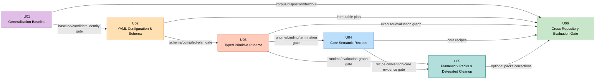

# YAML Rule Engine PoC — Unit of Work Dependency

## 1. Dependency 원칙

- 의존 관계는 구현 순서가 아니라 **승인된 evidence의 소비 관계**다.
- 선행 Unit의 Exit Gate가 승인되지 않으면 후속 Unit implementation을 시작하지 않는다.
- 문서, schema example과 fixture 초안은 contract 승인 후에만 제한적으로 병렬 준비할 수 있다.
- 정상 scan과 PoC evaluation 경로의 분리는 모든 Unit에서 유지해야 하는 전역 invariant다.

## 2. Dependency Graph



Critical path는 `U01 → U02 → U03 → U04 → U05 → U06`이다. U05가 U03에도 직접 의존하는 것은 framework pack 실행과 evaluation graph가 core recipe 구현을 통해 간접 제공되는 책임이 아니기 때문이다.

## 3. Direct Dependency Matrix

| Consumer \ Provider | U01 | U02 | U03 | U04 | U05 |
| :--- | :---: | :---: | :---: | :---: | :---: |
| U02 | Required | — | — | — | — |
| U03 | Transitive | Required | — | — | — |
| U04 | Transitive | Transitive | Required | — | — |
| U05 | Transitive | Transitive | Required | Required | — |
| U06 | Required | Required | Required | Required | Required |

`Transitive`는 구현 선행조건이지만 consumer가 provider artifact를 직접 소유하거나 변경하지 않는다는 뜻이다.

## 4. Gate 계약

| Gate | Provider | Consumer | Required artifact/evidence | 실패 시 |
| :--- | :--- | :--- | :--- | :--- |
| G01 Baseline | U01 | U02, U06 | corpus manifest, disposition, identity, holdout, deterministic snapshot | schema/runtime 착수 금지 |
| G02 Schema | U02 | U03, U06 | 3 schemas, strict validation, compiled plan, normal-scan isolation | runtime 착수 금지 |
| G03 Runtime | U03 | U04, U05, U06 | primitive contract, binding, termination, evaluation graph isolation | recipe 등록 금지 |
| G04 Core | U04 | U05, U06 | 4 family recipes, cross-domain/rename evidence | framework integration 및 final gate 금지 |
| G05 Framework | U05 | U06 | optional activation, negative tests, delegated correction | final decision gate 금지 |
| G06 Decision | U06 | Phase 3/4 decision | disposition diff, coverage, fallback, holdout, Go/Partial/No-Go | Phase 2 미완료 |

## 5. Provider → Consumer 계약

### U01 → U02

- U02 schema example은 U01 corpus의 concrete field/literal을 schema 상수로 복제하면 안 된다.
- candidate identity와 disposition format은 compiler diagnostic/result metadata가 추적할 수 있어야 한다.
- U01 baseline 변경은 U02 schema 의미를 바꾸지 않지만 U02 fixtures를 재검토하게 한다.

### U02 → U03

- U03는 raw YAML tree를 해석하지 않고 `CompiledRecipePlan`만 소비한다.
- primitive descriptor, binding type, version과 ordering contract는 U02 compile gate에서 고정한다.
- U02가 unknown/forbidden input을 허용하면 U03는 방어적 escape hatch를 추가하지 않고 gate를 실패시킨다.

### U03 → U04

- U04는 공개된 primitive ID/type만 사용한다.
- 표현력이 부족하면 custom expression을 만들지 않고 primitive gap으로 U03에 반환한다.
- 신규 primitive 승격 시 U03 contract/evidence 재승인 후 U04 recipe를 갱신한다.

### U03 + U04 → U05

- U05 framework recipe는 U03 evidence/type contract와 U04 recipe convention을 모두 따른다.
- framework selector는 method name 단독 일치나 repository allowlist를 추가할 수 없다.
- U04 core와 중복되는 semantics는 optional pack에서 다시 정의하지 않는다.

### U01~U05 → U06

- U06는 앞선 artifact를 변경하지 않고 조율·비교·집계한다.
- U06에서 발견한 결함은 소유 Unit으로 반환하며 report layer에서 결과를 보정하지 않는다.
- fallback은 U03/U04/U05 결손을 숨기는 통과 조건이 아니다.

## 6. Data Dependency

| Data artifact | Owner | Consumers | Mutability |
| :--- | :--- | :--- | :---: |
| `CorpusManifest` | U01 | U04~U06 | versioned immutable |
| `BaselineManifest` | U01 | U04~U06 | review-controlled |
| `CompiledRecipePlan` | U02 | U03, U06 | immutable per evaluation run |
| primitive descriptors | U03 | U02 compiler, U04, U05 | versioned contract |
| `RecipeEvaluationRunContext` | U03 | U04~U06 runtime | invocation-scoped immutable graph view |
| core recipe pack | U04 | U05 conventions, U06 | immutable input |
| framework catalog/pack | U05 | U06 | immutable input |
| corrected delegated expectations | U05 | U06 | baseline-linked |
| `RecipeEvaluationReport` | U06 | Phase decision | immutable output |

## 7. Code/Package Ownership

| Package/area | Primary Unit | Secondary consumer | 변경 규칙 |
| :--- | :--- | :--- | :--- |
| evaluation fixtures/resources | U01 | U04~U06 | baseline change review 필요 |
| `analysis.domain.recipe` source/schema model | U02 | U03~U06 | public contract change는 G02 재승인 |
| `analysis.support.recipe` loader/compiler | U02 | U03/U06 | runtime logic 혼입 금지 |
| `analysis.domain.recipe` runtime result/binding | U03 | U04~U06 | type contract change는 G03 재승인 |
| `analysis.support.recipe` primitives/executor | U03 | U04~U06 | repository-specific logic 금지 |
| core YAML resources | U04 | U06 | framework-specific entry 금지 |
| framework YAML resources/selectors | U05 | U06 | core semantics 중복 금지 |
| evaluation runner/differ/report | U06 | 없음 | upstream 결과 보정 금지 |

한 package가 여러 Unit에 나타나더라도 동시에 수정하지 않는다. 단일 팀이 Unit gate 순서에 따라 primary ownership을 넘긴다.

## 8. 정상 Scan 격리 의존성

```text
Normal scan
  -> existing ScanPreparationService
  -> FactGraphTraversalBudget.defaults()
  -> existing Java RuleOutputService
  -X-> U02 RecipePlanBootstrapService
  -X-> U03 RecipeEvaluationPreparationService
  -X-> U06 EvaluationReportWriter

Explicit evaluation
  -> U02 bootstrap/CompiledRecipePlan
  -> U03 YAML-budget evaluation graph
  -> U04/U05 recipe packs
  -> U06 YAML primary + Java comparison/fallback report
```

U02~U06 중 어느 Unit이 실패하거나 비활성화되어도 정상 scan dependency graph는 완결되어야 한다.

## 9. 허용되는 병렬 작업

| 선행 gate 이후 | 허용 | 금지 |
| :--- | :--- | :--- |
| G01 승인 후 | U02 schema example, U04/U05 fixture 초안 | U03~U05 implementation |
| G02 승인 후 | U03 design, U04 recipe sketch | compiled contract 없는 executor/recipe 구현 |
| G03 승인 후 | U04 구현; U05 positive/negative fixture 준비 | U05 framework runtime 구현 |
| G04 승인 후 | U05 구현; U06 report fixture 준비 | U06 final orchestration 구현 |
| G05 승인 후 | U06 구현/통합 | upstream 결과의 report-layer 보정 |

## 10. Change Propagation

| 변경 | 무효화되는 gate | 재검증 범위 |
| :--- | :--- | :--- |
| corpus/disposition/identity 변경 | G01 | U01 및 영향받는 U04~U06 snapshot |
| YAML schema/compiled plan contract 변경 | G02 | U02~U06 |
| primitive ID/type/termination 변경 | G03 | U03~U06 |
| core recipe semantics 변경 | G04 | U04~U06 |
| framework activation/delegated correction 변경 | G05 | U05~U06 |
| report serialization만 변경 | G06 | U06 determinism/consumer check |

## 11. 순환 의존성 검증

- U01은 어떤 구현 Unit에도 의존하지 않는다.
- U02 compiler는 U03 primitive **descriptor contract**만 참조할 수 있으나 U03 runtime implementation을 호출하지 않는다. 초기 descriptor interface는 U02/U03 경계 계약으로 U02에 정의하고 구현은 U03가 제공한다.
- U03 executor는 U04/U05 YAML contents를 소유하지 않는다.
- U04는 U05 framework catalog에 의존하지 않는다.
- U05는 U06 differ/report에 의존하지 않는다.
- U06은 결과를 소비할 뿐 upstream contract를 제공하지 않는다.

따라서 runtime dependency와 Unit completion dependency 모두 DAG이며 순환이 없다.

## 12. Per-unit Design 진입 순서

1. U01 Functional Design → NFR Requirements → NFR Design → 구현/evidence → G01 승인
2. U02 동일 micro-loop → G02 승인
3. U03 동일 micro-loop → G03 승인
4. U04 동일 micro-loop → G04 승인
5. U05 동일 micro-loop → G05 승인
6. U06 동일 micro-loop → G06 및 Phase 2 decision

각 Unit의 Deep Interview는 해당 Unit의 상세 설계에 미결정 사항이 있을 때만 실행한다.
