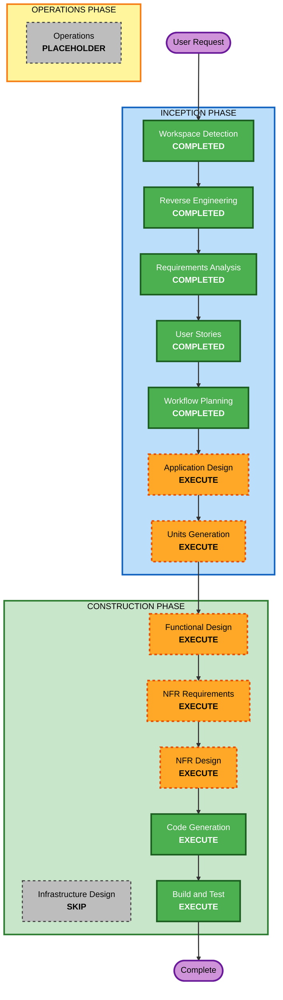

# Execution Plan

## Detailed Analysis Summary

### Transformation Scope
- **Transformation Type**: 신규 Java PoC 설계 및 구현
- **Primary Changes**:
  - GitHub Repository URL 입력 기반 source ingestion
  - Spring endpoint/type extraction
  - 3단계 validation extraction
  - candidate chunk generation
  - LLM normalization
  - ApiCondition/OpenAPI output assembly
- **Related Components**:
  - source ingestion module
  - static scan module
  - validation extraction module
  - chunk generation module
  - normalization adapter
  - result assembler

### Change Impact Assessment
- **User-facing changes**: Yes
  - PoC 사용자는 GitHub URL만으로 분석을 시작하고 결과를 검토한다.
- **Structural changes**: Yes
  - ingestion, extraction, normalization, assembly의 명확한 모듈 분리가 필요하다.
- **Data model changes**: Yes
  - `ValidationCandidate`, `ApiCondition`, chunk schema, normalization response schema가 필요하다.
- **API changes**: Yes
  - GitHub URL 입력 계약, OpenAPI 출력 계약, 내부 JSON 출력 계약이 정의된다.
- **NFR impact**: Yes
  - 정적 분석 안전성, traceability, failure isolation, schema validation, partial PBT가 필요하다.

### Component Relationships
- **Primary Component**: Java 기반 Spring API Contract PoC CLI
- **Infrastructure Components**: 없음. 초기 PoC는 로컬 CLI 범위
- **Shared Components**:
  - AST abstraction
  - candidate model
  - normalization schema
  - output serializer
- **Dependent Components**:
  - 샘플 GitHub Repository
  - LLM provider adapter
- **Supporting Components**:
  - 테스트 harness
  - JSON schema validator
  - PBT utility

### Risk Assessment
- **Risk Level**: High
- **Rollback Complexity**: Moderate
- **Testing Complexity**: Complex

## Module Update Strategy
- **Update Approach**: Sequential
- **Critical Path**:
  1. source ingestion
  2. endpoint/type extraction
  3. validation extraction
  4. candidate chunk generation
  5. normalization
  6. result assembly
- **Coordination Points**:
  - endpoint metadata key
  - candidateId strategy
  - LLM input/output schema
  - ApiCondition output model
- **Testing Checkpoints**:
  - source ingestion 완료 후 repo 구조 검증
  - endpoint extraction 완료 후 API skeleton 검증
  - validation extraction 완료 후 candidate inventory 검증
  - chunk generation 완료 후 invalid filtering 검증
  - normalization 완료 후 schema validation 검증
  - assembly 완료 후 OpenAPI/ApiCondition 동시 검증

## Requirement Verification Plan

| Requirement/Story | Acceptance Criteria or Contract | Required Test Evidence | Test Level | Planned Test File or Scenario | Required Result |
| --- | --- | --- | --- | --- | --- |
| R-001 / S-01 | GitHub URL로 source ingestion 수행 | clone 성공/실패, source root 식별 | integration | `RepositoryIngestionIntegrationTest` | Pass |
| R-002 / S-02 | endpoint, request location, response schema 추출 | endpoint/type extraction 검증 | integration | `SpringEndpointExtractionIntegrationTest` | Pass |
| R-003 / S-03 | 표준 annotation은 ApiCondition, custom은 ValidationCandidate | annotation mapping, fallback 검증 | unit | `AnnotationConditionMapperTest` | Pass |
| R-004 / S-04 | validator bean, ConstraintValidator, InitBinder 연결 추출 | validator candidate extraction | integration | `ValidatorCandidateExtractionIntegrationTest` | Pass |
| R-005 / S-05 | service/domain hint 추출 | exception/if snippet extraction | integration | `ServiceHintExtractionIntegrationTest` | Pass |
| R-006 / S-06 | 작은 candidate chunk 생성과 invalid filtering | candidateId uniqueness, invalid filter | unit | `CandidateChunkGeneratorTest` | Pass |
| R-007 / S-07 | LLM normalization 응답 검증 | schema validation, retry/reject | unit | `NormalizationResponseValidatorTest` | Pass |
| R-008 / S-08 | ApiCondition assembly | output snapshot 검증 | unit | `ApiConditionAssemblerTest` | Pass |
| R-009 / S-08 | OpenAPI와 ApiCondition 동시 출력 | final output integration | integration | `ContractOutputIntegrationTest` | Pass |
| R-010 | 워크플로/LLM 호출 플랜 문서화 | 문서 검토 | N/A | `workflow-plan review` | Pass |

## Workflow Visualization

## Text Alternative
- 완료된 단계: Workspace Detection, Reverse Engineering, Requirements Analysis, User Stories, Workflow Planning
- 다음 단계로 Application Design과 Units Generation을 실행한다.
- 이후 Functional Design, NFR Requirements, NFR Design, Code Generation, Build and Test를 실행한다.
- Infrastructure Design은 현재 PoC 범위에서 건너뛴다.

## Phases to Execute

### INCEPTION PHASE
- [x] Workspace Detection (COMPLETED)
- [x] Reverse Engineering (COMPLETED)
- [x] Requirements Analysis (COMPLETED)
- [x] User Stories (COMPLETED)
- [x] Workflow Planning (COMPLETED)
- [ ] Application Design - EXECUTE
  - **Rationale**: ingestion, scanner, candidate model, normalization adapter, output assembler 등 신규 컴포넌트 경계 정의가 필요하다.
- [ ] Units Generation - EXECUTE
  - **Rationale**: source ingestion, static analysis, candidate generation, normalization, assembly를 별도 작업 단위로 나눌 필요가 있다.

### CONSTRUCTION PHASE
- [ ] Functional Design - EXECUTE
  - **Rationale**: 각 unit의 모델, 메서드 시그니처, 데이터 흐름 설계가 필요하다.
- [ ] NFR Requirements - EXECUTE
  - **Rationale**: 정적 분석 안전성, traceability, failure isolation, partial PBT, schema validation 요구가 있다.
- [ ] NFR Design - EXECUTE
  - **Rationale**: retry, cache, validation, evidence 추적 전략을 구조에 반영해야 한다.
- [ ] Infrastructure Design - SKIP
  - **Rationale**: 초기 PoC는 로컬 CLI 범위이며 별도 인프라 설계가 아직 필요 없다.
- [ ] Code Generation - EXECUTE
  - **Rationale**: 구현 계획과 코드 생성이 필요하다.
- [ ] Build and Test - EXECUTE
  - **Rationale**: 샘플 repo 기반 검증과 requirement verification이 필요하다.

### OPERATIONS PHASE
- [ ] Operations - PLACEHOLDER
  - **Rationale**: 현재 범위 밖이다.

## Package Change Sequence
1. domain model and contracts
2. source ingestion
3. Spring endpoint/type scanner
4. validation extractors
5. candidate chunk generator
6. normalization adapter
7. result assembler and serializers
8. tests and demo fixtures

## Estimated Timeline
- **Total Phases**: 8 active stages remaining
- **Estimated Duration**: Moderate to High

## Success Criteria
- **Primary Goal**: GitHub URL 입력만으로 Spring 기반 API Contract 추출 가능성을 증명하는 Java PoC 실행 경로를 확정한다.
- **Key Deliverables**:
  - application design artifacts
  - unit of work artifacts
  - code generation plan
  - Java PoC implementation
  - OpenAPI output
  - ApiCondition JSON output
  - workflow and LLM invocation plan
- **Quality Gates**:
  - request/response extraction 정확성
  - annotation vs candidate 분기 명확성
  - candidate chunk validity
  - normalization schema validation
  - evidence and trace preservation
- **Requirement Verification**:
  - feature tests for ingestion, extraction, chunking, normalization, assembly
  - regression tests for mapping and serialization layers
  - workflow/LLM plan 문서 검토
