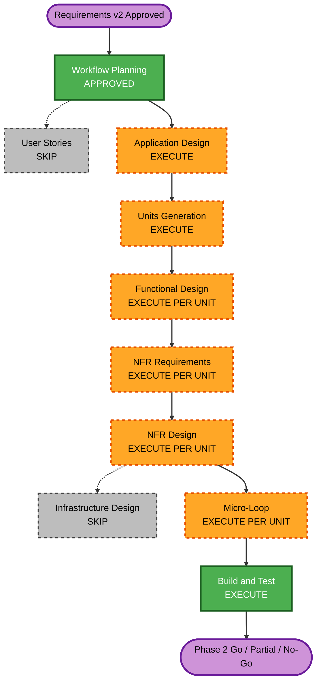

# YAML Rule Engine PoC — 실행 계획

> **기준 요구사항**: `../requirements/yaml-rule-engine-poc/requirements-v2.md`
> **상태**: Workflow Planning 승인 완료 (2026-07-22)
> **범위**: Phase 2 Go/Partial/No-Go 판정까지

## 1. 상세 분석 요약

### Transformation Scope

- **유형**: Semantic Analysis & Rule Engine Layer의 제한적 아키텍처 전환 PoC
- **핵심 변경**: Java classifier의 실행 조합을 typed primitive와 generic YAML semantic recipe로 분리
- **보존 경계**: Spring MVC endpoint discovery, FactCodeGraph 생성, graph index, cycle/budget 집행, candidate/evidence 무결성
- **교정 대상**: `DelegatedGuardRule` 및 domain-specific 의미 추측
- **운영 변경**: 없음

### Change Impact Assessment

| 영향 영역 | 영향 | 설명 |
| :--- | :---: | :--- |
| 사용자 UI | 없음 | 내부 정적 분석 엔진 PoC |
| 구조 | 높음 | semantic classifier 실행 구조와 YAML schema 추가 |
| 데이터 모델 | 중간 | typed primitive, recipe, binding, diagnostic 모델 필요 가능 |
| 외부 API | 없음 | 기존 CLI/HTTP 계약 변경은 범위 밖 |
| 출력 계약 | 높음 | candidate/evidence 호환성과 corrected expectation 관리 필요 |
| 성능 | 중간 | 해석 계층 오버헤드를 측정하되 합격선으로 사용하지 않음 |
| 보안 | 중간 | YAML arbitrary execution 금지와 엄격한 schema 검증 필요 |
| 배포/인프라 | 없음 | hot-reload, registry service와 CI 배포는 범위 밖 |

### Risk Assessment

- **Risk Level**: High
- **주요 위험**: 의미 회귀, false positive/negative, repository-specific 과적합, silent truncation, YAML DSL 팽창
- **Rollback Complexity**: Moderate — 기존 Java classifier 경로를 병행 보존하면 feature switch로 복귀 가능
- **Testing Complexity**: Complex — graph coverage와 semantic coverage를 분리하고 cross-repository holdout이 필요

## 2. Component Relationships

| Component | Change Type | 역할 | 우선순위 |
| :--- | :--- | :--- | :---: |
| `analysis.support.rule.yaml` | Major | configuration/schema/recipe loading | Critical |
| `analysis.domain.rule` 및 신규 recipe model | Major | typed primitive와 binding 계약 | Critical |
| `analysis.support.semantic` | Major | primitive adapter와 recipe 실행 연계 | Critical |
| `analysis.support.rule` | Major | 병행 실행, disposition, diagnostic와 conflict 처리 | Critical |
| `analysis.support.rule.pack` | Major | core/framework pack 재분류와 DelegatedGuard 교정 | Important |
| `analysis.application.ValidationExtractionService` | Minor | configuration 및 runtime 연결 | Important |
| evaluation/test resources | Major | cross-repository corpus, rename holdout와 snapshot | Critical |
| Assembly/Exporter | Minor 또는 없음 | 신규 diagnostic 상태가 필요한 경우에만 반영 | Optional |

## 3. Workflow Visualization



### Text Alternative

```text
Requirements v2 Approved
  -> Workflow Planning approval
  -> Application Design
  -> Units Generation
  -> Per-unit Functional/NFR Design
  -> Per-unit Micro-Loop and evidence-backed execution
  -> Integrated Build and Test
  -> Phase 2 Go/Partial/No-Go Gate

Skipped: User Stories, Infrastructure Design, Operations
```

## 4. 단계 결정

### INCEPTION

- [x] Workspace Detection — 기존 brownfield 상태 재사용
- [x] Reverse Engineering — 2026-07-21 승인 산출물 재사용
- [x] Requirements Analysis Revision 2 — 승인 완료
- [x] User Stories — SKIP
  - **Rationale**: 최종 사용자 기능이나 다중 persona가 아닌 내부 엔진 아키텍처 PoC
- [x] Workflow Planning — 승인 완료
- [ ] Application Design — EXECUTE, Comprehensive
  - **Rationale**: configuration, recipe model, primitive registry, runtime binding과 병행 실행 경계를 설계해야 함
- [ ] Units Generation — EXECUTE, Comprehensive
  - **Rationale**: 안전망부터 runtime, recipes, framework packs와 evaluation까지 의존성 있는 다중 UoW 필요

### CONSTRUCTION

- [ ] Functional Design — EXECUTE PER UNIT
  - **Rationale**: typed operation 계약, binding semantics와 disposition 상태 전이가 복잡함
- [ ] NFR Requirements — EXECUTE PER UNIT
  - **Rationale**: 결정론, 종료 보장, 무추측, 진단성과 schema security가 핵심 성공 조건
- [ ] NFR Design — EXECUTE PER UNIT
  - **Rationale**: budget enforcement, immutable snapshot과 fail-closed loading 설계 필요
- [x] Infrastructure Design — SKIP
  - **Rationale**: 서비스 배포, storage, network, hot-reload와 CI infrastructure는 범위 밖
- [ ] Deep Interview Gating — CONDITIONAL PER UNIT
  - **Rationale**: Requirements/Application Design 이후에도 구현 선택이 남을 때만 실행
- [ ] Consensus Planning — EXECUTE PER UNIT
- [ ] Goal-Driven Execution — EXECUTE PER UNIT
- [ ] Build and Test — EXECUTE

### OPERATIONS

- [x] Operations — PLACEHOLDER/SKIP
  - **Rationale**: 프로덕션 배포 및 운영 전환은 PoC 범위 밖

## 5. 예비 Unit 구조

최종 Unit은 Units Generation 단계에서 승인한다.

| Unit | 목적 | 선행 의존성 |
| :--- | :--- | :--- |
| U01 Generalization Baseline | corpus, disposition, graph/rule coverage와 holdout 안전망 | 없음 |
| U02 YAML Configuration & Schema | engine config, recipe/catalog schema와 strict validation | U01 |
| U03 Typed Primitive Runtime | registry, binding environment, deterministic execution와 budget | U02 |
| U04 Core Semantic Recipes | binary, composite, standard guard와 JDK Optional recipe | U03 |
| U05 Framework Packs & Delegated Cleanup | Spring Data/Security/JPA pack 및 domain hardcoding 제거 | U03, U04 |
| U06 Cross-Repository Evaluation Gate | preserve/replace/unsupported 비교와 Go/Partial/No-Go report | U01~U05 |

## 6. Package Update Strategy

- **Update Approach**: Sequential critical path with isolated test checkpoints
- **순서**:
  1. evaluation harness와 corpus 계약
  2. domain model 및 YAML schema
  3. typed primitive runtime
  4. core recipe adapter
  5. framework pack와 delegated cleanup
  6. application wiring와 cross-repository gate
- **Rollback**: 기존 Java classifier 경로 유지, 신규 YAML 경로 비활성화 가능 상태를 Phase 2 종료까지 보존
- **Coordination Point**: candidate identity, evidence ordering, diagnostic와 output adapter 계약
- **Parallelization**: corpus fixture 작성과 schema 예제는 계약 승인 후 병렬 가능하나 runtime/recipe 구현은 순차

## 7. Requirement Verification Plan

| Requirement | Acceptance Contract | Required Test Evidence | Level | Planned Scenario | Result |
| :--- | :--- | :--- | :--- | :--- | :---: |
| R2-YAML-001 | Spring MVC repository/domain 이름 비종속 | 서로 다른 package/domain endpoint와 graph | integration | `SpringMvcRepositoryCoverageTest` | Pass |
| R2-YAML-002 | YAML budget default/override/truncation | 15/500/10000, invalid 및 각 초과 diagnostic | unit, integration | `YamlTraversalConfigurationTest` | Pass |
| R2-YAML-003 | typed primitive registry | unknown/type mismatch/follow budget | unit | `SemanticPrimitiveRegistryTest` | Pass |
| R2-YAML-004 | runtime binding | field rename variant에서 올바른 target/expected | metamorphic, integration | `SemanticRuntimeBindingRenameTest` | Pass |
| R2-YAML-005 | core recipe 4 family | family별 2개 이상의 cross-domain fixture | integration | `CoreSemanticRecipeIntegrationTest` | Pass |
| R2-YAML-006 | optional framework pack | dependency/evidence 존재·부재 및 unrelated method | integration, negative | `FrameworkRulePackIsolationTest` | Pass |
| R2-YAML-007 | delegated 무추측 | hardcoded domain 결과 제거, resolved/unresolved 구분 | regression, negative | `DelegatedGuardGeneralizationTest` | Pass |
| R2-YAML-008 | 명시적 불완전성 | UNCLASSIFIED/UNRESOLVED/PARTIAL_ANALYSIS | integration | `SemanticDiagnosticCompletenessTest` | Pass |
| R2-YAML-009 | cross-repository corpus | graph coverage, semantic coverage와 holdout report | evaluation | `CrossRepositorySemanticEvaluationTest` | Pass |
| R2-YAML-010 | disposition별 회귀 | PRESERVE diff 0, REPLACE corrected, UNSUPPORTED diagnostic | snapshot, regression | `SemanticBaselineDispositionTest` | Pass |

## 8. Quality Gates

1. **Schema Gate**: unknown field, duplicate ID, invalid primitive와 forbidden expression 거부
2. **Graph Gate**: corpus별 endpoint와 required fact coverage 확보
3. **No-Guess Gate**: graph evidence 없는 domain target/operator 생성 0건
4. **Generalization Gate**: rename 및 cross-repository holdout에서 recipe 수정 없이 통과
5. **Regression Gate**: disposition별 기대 결과 충족
6. **Truncation Gate**: budget 초과가 silent omission이 아니라 명시적 partial 결과
7. **Phase 2 Decision Gate**: 승인된 Go/Partial/No-Go 기준으로 결론

## 9. 일정 표현

- **총 예비 Unit**: 6
- **정확한 기간**: Units Generation과 corpus 접근성 확인 후 산정
- **Phase 3/4 투자**: Phase 2 Go 판정 전 금지

## 10. Workflow Planning 승인 조건

- 단계 실행/생략 결정 승인
- 예비 Unit 경계와 순서 승인
- requirement verification mapping 승인
- 기존 Java 경로를 Phase 2까지 보존하는 rollback 전략 승인
