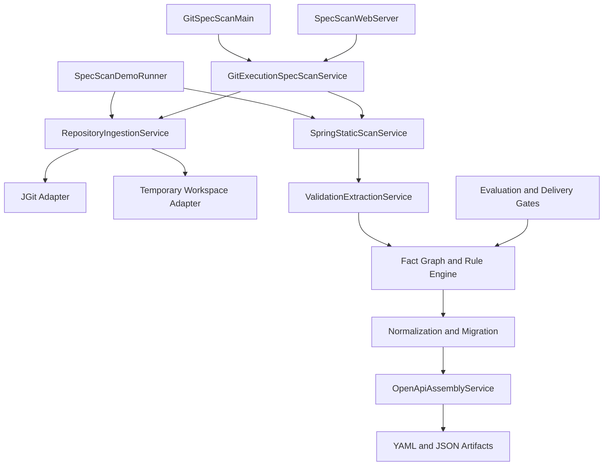
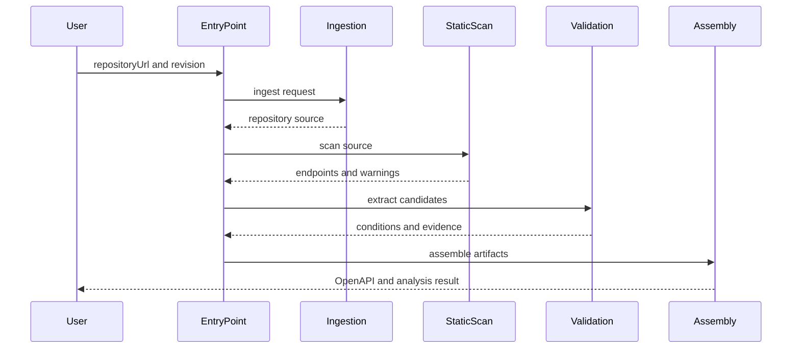

# 시스템 아키텍처

## 시스템 개요

단일 Gradle Java 애플리케이션이며 영속 데이터베이스는 없다. CLI, Demo, Web UI가 진입점이고 Git 수집 및 분석 계층을 공유한다. 분석 대상 코드는 실행하지 않으며 JavaParser AST와 symbol solver로 정적 해석한다.

## 아키텍처 다이어그램

텍스트 대안: 모든 실행 방식은 저장소 수집 후 Spring 정적 스캔과 검증 추출을 수행한다. 이후 사실 그래프와 규칙 엔진, 정규화 및 migration 계층을 거쳐 YAML/JSON 산출물을 만든다.

## 계층과 책임

### 진입 및 전달 계층

- `GitSpecScanMain`: Git URL과 선택적 revision을 받아 실행 JSON을 stdout으로 출력한다.
- `SpecScanDemoRunner`: 실제 Git 또는 내장 샘플로 E2E 파이프라인과 파일 출력을 시연한다.
- `SpecScanWebServer`: 정적 Web UI와 `POST /api/scan`을 제공한다.
- `GitExecutionSpecScanService`: Git 기반 실행을 위한 공통 facade지만 Demo는 아직 직접 orchestration한다.

### 수집 계층

- `RepositoryIngestionService`: GitHub URL 안전성 검사, identity 생성, clone, inventory 생성.
- `GitRepositoryFetcherAdapter`: JGit clone 및 revision checkout.
- `TempWorkspacePreparerAdapter`: 실행별 임시 디렉터리 준비와 정리.

### 분석 계층

- `SpringStaticScanService`: Controller endpoint와 바인딩/응답 메타데이터 추출.
- `ValidationExtractionService`: annotation, validator, service hint와 evidence 후보 추출.
- fact/candidate/rule 하위 계층: 결정적 ID, 소스 추적, 제한된 메서드 순회, 격리된 규칙 실행.
- `NormalizationService`와 `RuleOutputMigrationService`: legacy 및 rule 기반 결과를 endpoint 출력 계약으로 정리.
- `OpenApiAssemblyService`: 전체 산출물 생성의 조립점.

## 주요 데이터 흐름

텍스트 대안: 입력 → clone/inventory → endpoint 스캔 → 검증 후보/근거 추출 → 규칙 판정/정규화 → 산출물 조립 → 임시 작업공간 정리 순서다.

## 통합 및 인프라

- 외부 통합: HTTPS GitHub clone과 Maven Central 빌드 의존성.
- 데이터베이스/메시지 브로커: 없음.
- 네트워크: Web 모드는 기본 8088 포트를 사용하며 분석 요청마다 최대 4개 worker pool을 공유한다.
- 배포: fat JAR 태스크(`gitSpecScanJar`, `webSpecScanJar`) 또는 Gradle JavaExec 태스크.
- 주요 위험: Demo와 Web/CLI의 orchestration이 중복되어 향후 파이프라인 변경 시 drift 가능성이 있다.
