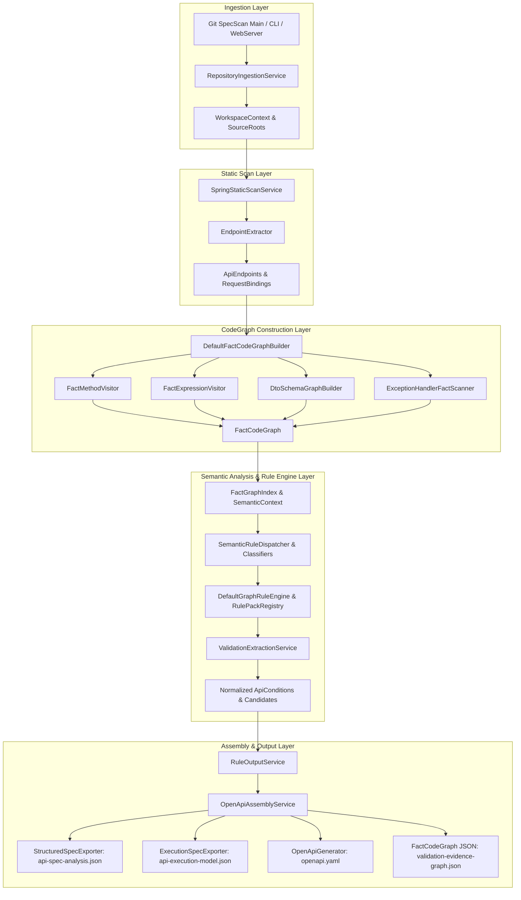
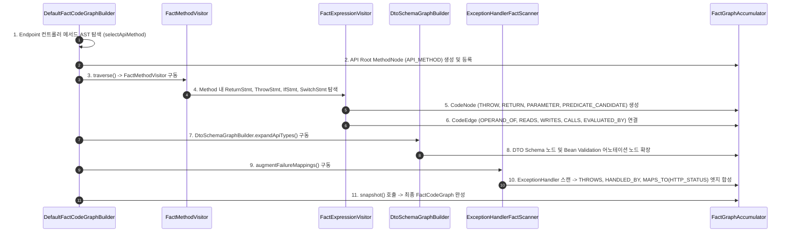
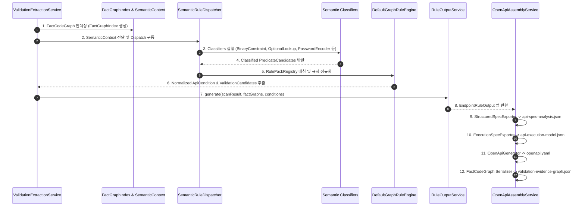
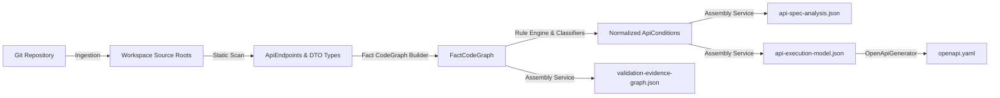

# System Architecture & Detailed Design

## System Overview

Auto-OAS (SpecScan)는 Java 21 및 JavaParser AST를 기반으로 Spring Boot 백엔드 웹 애플리케이션의 소스 코드를 정적 파싱하여, 백엔드 엔드포인트 명세와 제약 조건을 추출하고 OpenAPI 3.0 사양 문서로 자동 조립하는 정적 분석 및 파이프라인 엔진입니다.

---

## Layer Architecture & Component Roles

파이프라인을 구성하는 5개 주요 계층(Layer)의 개별 역할과 각 계층 내부 요소(Component)들의 구체적인 역할 명세입니다.

### 1. Ingestion Layer (입력 및 임시 워크스페이스 격리 계층)
- **전체 레이어 역할**: 분석 대상 외부 Git 레포지토리를 안전하게 로컬 임시 디렉토리에 클론하고 분석 가능한 자바 소스 루트(`src/main/java`)를 탐지하여 격리된 환경을 준비합니다.
- **내부 요소 역할**:
  - `A [Git SpecScan Main / CLI / WebServer]`: 사용자 입력을 전달받아 전체 정적 분석 파이프라인을 기동하는 진입점.
  - `B [RepositoryIngestionService]`: Git fetch/clone 및 로컬 임시 워크스페이스 디렉토리 생성을 수행하는 서비스.
  - `C [WorkspaceContext & SourceRoots]`: 준비된 워크스페이스 경로 및 실제 활성 자바 소스 루트 목록을 유지하는 도메인 데이터.

### 2. Static Scan Layer (엔드포인트 및 DTO 구조 탐색 계층)
- **전체 레이어 역할**: 자바 소스 코드를 빠른 정적 스캔으로 탐색하여 백엔드 컨트롤러, URL 경로, HTTP 메서드, 요청 파라미터 및 DTO 바인딩 정보를 1차 스캔합니다.
- **내부 요소 역할**:
  - `D [SpringStaticScanService]`: 소스 루트 전체의 자바 파일들을 순회하며 `EndpointExtractor`를 구동하는 정적 스캔 서비스.
  - `E [EndpointExtractor]`: Spring 컨트롤러 어노테이션(`@RestController`, `@GetMapping` 등)과 메서드 AST를 해석하여 진입점을 추출하는 추출기.
  - `F [ApiEndpoints & RequestBindings]`: 발견된 API 진입점, URL 라우팅 경로, 파라미터/DTO 타입 바인딩 정보를 담은 모델.

### 3. CodeGraph Construction Layer (코드 그래프 및 AST 파싱 계층)
- **전체 레이어 역할**: 1차 탐색된 API 진입점을 시작으로, 메서드 제어 흐름, 표현식 연산자, DTO 스키마, 예외 핸들러를 깊이 있게 파싱하여 다차원 `FactCodeGraph`(노드/엣지)를 구축합니다.
- **내부 요소 역할**:
  - `G [DefaultFactCodeGraphBuilder]`: API 진입점부터 하위 메서드 호출 체인을 순회하며 전체 `FactCodeGraph` 생성을 총괄하는 오케스트레이터.
  - `H [FactMethodVisitor]`: 메서드 내부의 제어 흐름(`RETURN`, `THROW`, `IF`, `SWITCH`, `LAMBDA` 스코프)을 파싱하는 AST Visitor.
  - `I [FactExpressionVisitor]`: 연산식(`BinaryExpr`, `MethodCallExpr`, `InstanceOfExpr`) 및 변수 읽기/쓰기, 호출 엣지를 구축하는 AST Visitor.
  - `J [DtoSchemaGraphBuilder]`: DTO 클래스 필드 구조 및 Bean Validation 어노테이션(`@NotNull`, `@Size` 등)을 그래프 노드로 확장하는 빌더.
  - `K [ExceptionHandlerFactScanner]`: `@ExceptionHandler` 메서드를 스캔하여 예외 객체 ➔ 예외 핸들러 ➔ HTTP Status 상태 코드를 엣지로 합성하는 파서.
  - `L [FactCodeGraph]`: 노드(`CodeNode`)와 엣지(`CodeEdge`)로 구성된 소스 코드의 다차원 추상화 도메인 모델.

### 4. Semantic Analysis & Rule Engine Layer (시맨틱 분류 및 규칙 추론 계층)
- **전체 레이어 역할**: 구축된 `FactCodeGraph`를 인덱싱하고 시맨틱 분류기 스위트와 규칙 엔진을 통해 숨겨진 비즈니스 규칙 및 유효성 검증 사양을 도출하고 정규화합니다.
- **내부 요소 역할**:
  - `M [FactGraphIndex & SemanticContext]`: `FactCodeGraph`를 노드/엣지/호출 경로별로 Fast Lookup 가능하게 구조화한 인덱스 및 실행 컨텍스트.
  - `N [SemanticRuleDispatcher & Classifiers]`: 6종의 시맨틱 분류기(`BinaryConstraint`, `OptionalLookup`, `OptimisticLock`, `PasswordEncoder`, `AuthorizationGuard`, `StandardGuard`)를 구동하여 코드의 의미적 의도를 분류하는 디스패처.
  - `O [DefaultGraphRuleEngine & RulePackRegistry]`: 등록된 규칙 팩들을 매칭하여 `PredicateCandidate` 및 `BusinessRuleCandidate`를 도출하는 규칙 엔진.
  - `P [ValidationExtractionService]`: 직/간접 조건, 커스텀 Validator, 서비스 레이어 힌트를 통합 추론하는 서비스.
  - `Q [Normalized ApiConditions & Candidates]`: API 엔드포인트 파라미터 및 DTO 필드 경로에 1:1로 정규화 바인딩된 최종 검증 사양.

### 5. Assembly & Output Layer (다중 아티팩트 조립 및 아웃풋 출력 계층)
- **전체 레이어 역할**: 추론/정규화된 비즈니스 규칙 사양과 그래프 근거(Evidence)를 수집하여 OpenAPI 3.0 YAML 및 각종 JSON 분석 보고서 파일로 포맷팅하고 직렬화하여 출력합니다.
- **내부 요소 역할**:
  - `R [RuleOutputService]`: 엔드포인트별 검증 조건과 예외 상태 매핑, 그래프 근거를 `EndpointRuleOutput` 아웃풋 객체로 패키징하는 서비스.
  - `S [OpenApiAssemblyService]`: 패키징된 객체를 각각의 포맷터(Exporter)로 전달하여 물리적 파일 생성을 총괄하는 서비스.
  - `T [StructuredSpecExporter]`: 검증 조건 및 소스 증거를 정밀 출력하는 `api-spec-analysis.json` 생성기.
  - `U [ExecutionSpecExporter]`: 런타임 조건 검증 순서 및 예외 응답 경로를 담은 `api-execution-model.json` 생성기.
  - `V [OpenApiGenerator]`: 표준 OpenAPI 3.0 사양을 준수하는 **`openapi.yaml`** 문서 생성기.
  - `W [FactCodeGraph JSON]`: 검증의 투명한 근거가 되는 `FactCodeGraph` 원본 데이터를 담은 `validation-evidence-graph.json` 직렬화기.

---

## 1. CodeGraph / FactGraph 생성 로직 (CodeGraph Construction Logic)

`DefaultFactCodeGraphBuilder`를 중심으로 AST(Abstract Syntax Tree)에서 심층적 코드 그래프(`FactCodeGraph`)를 구축하는 파이프라인 알고리즘입니다.

### 1.1 AST 파싱 및 메서드 순회 (`FactMethodVisitor`)
- **API Root 선택 (`selectApiMethod`)**:
  - `EndpointExtractor`로 수집된 `ApiEndpoint` 정보를 바탕으로, 컨트롤러 클래스 및 메서드 시그니처, 소스 라인 번호, 파라미터 개수(Arity)를 매칭하여 정확한 JavaParser `MethodDeclaration` AST 노드를 선택합니다.
- **Scope 분리 및 Outcome 통합**:
  - `RETURN` 및 `THROW` 구문 방문 시 `FactMethodVisitor` 내 단일화된 메서드를 통하여 중복 노드 생성을 방지하고, 단일 Outcome 노드를 생성하여 예외/반환 표현식 하위 그래프와 바인딩합니다.
  - Lambda 표현식(`LambdaExpr`) 내의 `RETURN` / `THROW`는 외부 Method Scope를 오염시키지 않도록 Lambda Node 하위 Scope로 완전하게 분리 수집합니다.
- **Constructor & Virtual Field Synthesis**:
  - Java 14+ Record (`RecordDeclaration`) 및 Lombok 어노테이션(`@Value`, `@AllArgsConstructor`)이 적용된 DTO 생성자 호출 시, 가상의 생성자 노드(`CONSTRUCTOR`) 및 필드 값 흐름(`VALUE_FIELD`, `VALUE_FLOWS_TO`)을 파싱하여 그래프에 합성합니다.

### 1.2 표현식 그래프 및 엣지 바인딩 (`FactExpressionVisitor`)
- **수집 표현식 종류**:
  - `BinaryExpr` (`==`, `!=`, `<`, `>`, `<=`, `>=`), `MethodCallExpr` (`Objects.requireNonNull`, `Assert.hasText`), `InstanceOfExpr`, `ConditionalExpr` (삼항 연산자), `UnaryExpr` (`!`), `CastExpr`, `ArrayAccessExpr`.
- **노드/엣지 생성 규칙**:
  - 변수 할당(`AssignExpr`, `VariableDeclarator`) 파싱 시, 복합 표현식의 하위 구조를 재귀적으로 방문하여 `READS`, `WRITES` 엣지를 구축하고, 지역 변수에 할당된 Boolean 조건식을 보존합니다.
  - 메서드 호출 시 매개변수와 실인자(Argument) 간 `CALL_ARGUMENT_TO_PARAMETER` 및 `ORIGINATES_FROM` 엣지를 생성하여 Inter-method 데이터 흐름 추적을 제공합니다.

### 1.3 DTO 스키마 및 예외 매핑 확장
- **DTO 스키마 그래프 (`DtoSchemaGraphBuilder`)**:
  - DTO 클래스의 필드 구조, 제네릭 타입, 중복 Nesting 구조를 탐색하여 `VALUE_FIELD` 노드를 생성하고, `@NotNull`, `@Size`, `@Pattern`, `@Min`, `@Max`, `@Email` 등의 Bean Validation 어노테이션을 그래프 조건 노드로 확장합니다.
- **예외-HTTP 상태 매핑 (`ExceptionHandlerFactScanner`)**:
  - `@ExceptionHandler`, `@ResponseStatus` 메서드를 전체 소스 루트에서 스캔하여, 비즈니스 예외(`Exception`) -> 예외 핸들러(`EXCEPTION_HANDLER`) -> HTTP Response Status (`HTTP_STATUS`, 예: 400, 404, 409) 간의 `THROWS`, `HANDLED_BY`, `MAPS_TO` 엣지를 자동으로 증강(Augment)시킵니다.

---

## 2. Graph 기반 Output 생성 로직 (Graph-Based Output Generation Logic)

생성된 `FactCodeGraph`로부터 시맨틱을 분류하고, 규칙을 매칭하여 OpenAPI 3.0 사양 문서 및 각종 스펙 아웃풋을 조립하는 파이프라인 알고리즘입니다.

### 2.1 그래프 인덱싱 및 시맨틱 분류 (Semantic Classification)
- **FactGraphIndex**:
  - `FactCodeGraph`의 노드 및 엣지를 Fast Lookup 구조(Node ID Index, Node Type Map, Incoming/Outgoing Edge Maps, Call Path Maps)로 인덱싱합니다.
- **Semantic Classifiers (시맨틱 분류기 스위트)**:
  - `BinaryConstraintClassifier`: 숫자/문자열 범위 비교식(`age >= 18`) 감지 및 제약 타입 판별.
  - `OptionalLookupClassifier`: `findById().orElseThrow()` 또는 `findByUsername().orElseThrow()` 패턴 탐지하여 404 Entity Not Found 규칙으로 도출.
  - `OptimisticLockClassifier`: 낙관적 락(Version mismatch) 관련 예외 흐름 도출.
  - `PasswordEncoderSemanticClassifier`: 비밀번호 일치 검증 (`passwordEncoder.matches()`) 패턴 도출.
  - `AuthorizationGuardClassifier`: 권한/역할 검증 (`hasRole`, `isGranted`) 패턴 도출.
  - `StandardGuardMethodClassifier`: `Objects.requireNonNull`, `Assert.hasText` 등 가드 API 감지.

### 2.2 규칙 정규화 및 Candidate Resolution (`DefaultGraphRuleEngine`)
- **Rule Pack Matching**:
  - `RulePackRegistry`에 등록된 규칙 팩들이 인덱싱된 그래프 노드 패턴을 검사하여 `PredicateCandidate` 및 `BusinessRuleCandidate`를 생성합니다.
- **Evidence-Based Target Normalization**:
  - `CandidateToOutputAdapter`, `RequestBindingConditionAdapter`, `ResponseInvariantAdapter`를 통해, 추출된 제약 조건들을 API 엔드포인트의 DTO 필드 경로(Target Path, 예: `order.totalAmount`) 및 파라미터 위치로 안전하게 바인딩합니다.

### 2.3 다중 아티팩트 조립 및 출력 (`OpenApiAssemblyService`)
- **`RuleOutputService`**:
  - 엔드포인트별로 수집된 직/간접 조건, 규칙 매칭 결과, 예외 응답 매핑을 결합하여 `EndpointRuleOutput` 모델을 조립합니다.
- **`StructuredSpecExporter` -> `api-spec-analysis.json`**:
  - 컨트롤러/DTO/서비스 레이어별 검증 규칙과 증거(Evidence), 소스 트레이스 정보를 포함한 상세 정적 분석 리포트를 JSON으로 출력합니다.
- **`ExecutionSpecExporter` -> `api-execution-model.json`**:
  - 실제 백엔드 런타임 실행 경로상의 조건 검증 순서, 입력 파라미터 제약, 에러 응답 매핑 정보를 나타내는 실행 모델 JSON을 생성합니다.
- **`OpenApiGenerator` -> `openapi.yaml`**:
  - 실행 모델 JSON을 해석하여 OpenAPI 3.0 사양(Paths, Operations, Parameters, RequestBody, Schemas, Responses, Validation Extensions)을 준수하는 정식 YAML 문서를 생성합니다.
- **`FactCodeGraph Serializer` -> `validation-evidence-graph.json`**:
  - 검증의 근거가 되는 전체 `FactCodeGraph`의 노드 및 엣지 데이터를 JSON으로 직렬화하여 투명한 감사 추적성을 제공합니다.

---

## Data Flow & Pipeline Architecture

