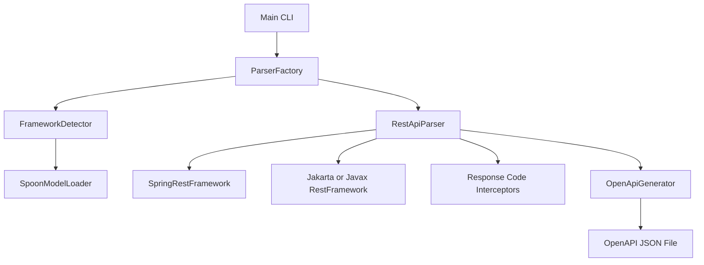
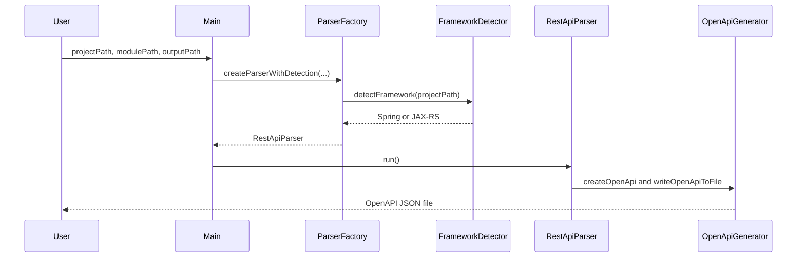

# System Architecture

## System Overview
이 시스템은 실행 시점에 웹 서버를 띄우는 서비스가 아니라, Java 소스 트리를 입력으로 받아 OpenAPI 명세 JSON을 생성하는 배치형 CLI 도구다. 배포 단위는 `auto-oas.jar` 하나이며, Docker 이미지에서는 `java -jar /app/auto-oas.jar` 엔트리포인트로 실행된다.

## Architecture Diagram

## Text Alternative
- `Main`이 CLI 입력을 받는다.
- `ParserFactory`가 프레임워크 후보를 등록하고 적절한 파서를 만든다.
- `FrameworkDetector`와 `SpoonModelLoader`가 소스 모델을 읽고 분석 전략을 결정한다.
- `RestApiParser`가 컨트롤러, 모델, 응답 정보를 수집한다.
- `OpenApiGenerator`가 결과를 JSON 파일로 저장한다.

## Component Descriptions
### Main CLI
- **Purpose**: 실행 진입점
- **Responsibilities**: 인자 개수 검증, 입력 경로 배치, 예외 로깅 플래그 전달
- **Dependencies**: `ParserFactory`
- **Type**: Application

### ParserFactory
- **Purpose**: 프레임워크별 파서 생성
- **Responsibilities**: 지원 프레임워크 인스턴스 등록, 자동 감지 기반 파서 구성
- **Dependencies**: `RestFramework`, `FrameworkDetector`, `RestApiParser`
- **Type**: Application

### FrameworkDetector
- **Purpose**: 분석 대상 프레임워크 탐지
- **Responsibilities**: Spoon 모델 로딩 후 타입/메서드 애노테이션 검색
- **Dependencies**: `SpoonModelLoader`, `RestFramework`
- **Type**: Application

### RestApiParser
- **Purpose**: 핵심 정적 분석 엔진
- **Responsibilities**: 관련 클래스 추출, 경로/파라미터/스키마 생성, 결과 파일 작성
- **Dependencies**: Spoon, Swagger models, schema generator 계열 라이브러리, `OpenApiGenerator`
- **Type**: Application

### Framework Adapters
- **Purpose**: Spring/Jakarta/Javax REST 해석
- **Responsibilities**: 컨트롤러 애노테이션, 파라미터 애노테이션, 예외 처리 규칙 통합
- **Dependencies**: Spring Web 또는 JAX-RS API
- **Type**: Shared

### Interceptors and Code Analysis
- **Purpose**: 응답 코드와 내부 메서드 행위 추론 강화
- **Responsibilities**: 예외 핸들러 응답 매핑, 메서드 본문 분석
- **Dependencies**: Spoon AST
- **Type**: Shared

## Data Flow

## Text Alternative for Data Flow
1. 사용자가 프로젝트 경로와 출력 경로를 전달한다.
2. 팩토리가 프레임워크를 자동 감지한다.
3. 파서가 소스를 분석해 OpenAPI 객체를 만든다.
4. 제너레이터가 JSON 파일로 저장한다.

## Integration Points
- **External APIs**: 없음. 네트워크 호출형 서비스가 아니라 로컬 코드 분석 도구다.
- **Databases**: 없음
- **Third-party Services**: 없음. 단, Docker 베이스 이미지는 Adoptium OpenJDK 21을 사용한다.

## Infrastructure Components
- **CDK Stacks**: 없음
- **Deployment Model**: Alpine Linux 기반 Docker 이미지에 fat JAR를 복사해 실행
- **Networking**: 필요 없음. 파일 시스템 기반 오프라인 분석이 기본 사용 시나리오다.
