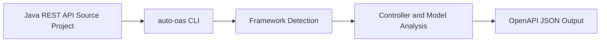

# Business Overview

## Business Context Diagram

## Text Alternative
- 입력은 Java 기반 REST API 소스 프로젝트다.
- `auto-oas`는 입력 프로젝트를 정적 분석한다.
- 프레임워크를 감지한 뒤 컨트롤러와 모델을 분석한다.
- 결과로 OpenAPI JSON 문서를 파일로 저장한다.

## Business Description
- **Business Description**: `auto-oas`는 Java REST API 소스코드를 분석해 OpenAPI 명세를 자동 생성하는 개발자용 정적 분석 도구다.
- **Business Transactions**:
  - 프로젝트 경로 수집: 분석 대상 소스 루트와 선택적 REST 모듈 경로를 입력받는다.
  - REST 프레임워크 감지: Spring 또는 JAX-RS 계열 애노테이션을 스캔해 분석 전략을 결정한다.
  - 엔드포인트 추출: 컨트롤러, HTTP 메서드, 파라미터, 요청 본문, 응답 코드 후보를 추출한다.
  - 모델 스키마 생성: 요청/응답 타입을 기반으로 OpenAPI `components.schemas`를 만든다.
  - 명세 파일 저장: 생성된 OpenAPI 객체를 정리된 JSON 파일로 기록한다.
- **Business Dictionary**:
  - **Framework Detection**: 소스 애노테이션을 기준으로 지원 프레임워크를 판별하는 과정
  - **Controller**: REST 엔드포인트를 제공하는 클래스
  - **Sub-resource**: JAX-RS 또는 유사 구조에서 하위 경로를 위임하는 리소스
  - **Profile Split**: Spring `@Profile` 등에 따라 명세를 논리적으로 분리하는 동작
  - **OpenAPI Output**: JSON 파일로 저장되는 최종 명세 산출물

## Component Level Business Descriptions
### Parsers
- **Purpose**: 프로젝트 입력값을 해석하고 전체 분석 파이프라인을 오케스트레이션한다.
- **Responsibilities**: CLI 인자 처리, 프레임워크 자동 감지, Spoon 모델 로딩, 실행 제어

### Framework Adapters
- **Purpose**: Spring/JAX-RS별 애노테이션 차이를 통합한다.
- **Responsibilities**: HTTP 메서드 판별, 파라미터 매핑, 요청 본문 추론, 예외 응답 처리

### OpenAPI Generator
- **Purpose**: 분석 결과를 OpenAPI 객체와 파일로 변환한다.
- **Responsibilities**: `Info`, `Paths`, `Components` 조합, JSON 직렬화, 파일 생성

### Code Analysis
- **Purpose**: 컨트롤러 내부 메서드와 타입 참조를 분석한다.
- **Responsibilities**: 응답 코드 힌트 추출, 관련 클래스 선별, 보조 유틸리티 제공
