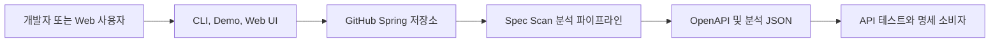

# 비즈니스 개요

## 비즈니스 목적

`spec-scan`은 GitHub의 Spring Java 저장소를 복제하고 소스 코드를 실행하지 않은 채 정적 분석하여 OpenAPI 문서, API 실행 모델, 검증 근거 그래프 및 규칙 기반 비즈니스 조건을 생성하는 개발 도구다.

## 비즈니스 컨텍스트

텍스트 대안: 사용자가 Git 저장소와 revision을 제공하면 분석기가 Spring API와 검증 규칙을 추출하고, API 테스트 및 검토에 사용할 명세 산출물을 반환한다.

## 핵심 비즈니스 트랜잭션

1. 저장소 수집: GitHub URL을 정규화하고 branch, tag 또는 commit을 임시 작업공간에 clone한다.
2. API 탐색: Spring Controller와 HTTP 매핑, 요청/응답 바인딩을 식별한다.
3. 검증 근거 추출: Bean Validation, 사용자 Validator, 서비스 조건과 예외 흐름을 수집한다.
4. 사실 및 규칙 판정: 코드 사실 그래프를 만들고 내장 또는 YAML 규칙 팩으로 후보를 판정한다.
5. 결과 정규화: 중복, 충돌, 미해결 후보를 보수적으로 처리하고 endpoint 단위 실행 조건으로 변환한다.
6. 산출물 생성: `openapi.yaml`, 실행 모델, 분석 JSON, evidence graph와 migration 비교 자료를 생성한다.
7. 품질 판정: golden/holdout 데이터셋으로 precision, recall 및 전달 준비 상태를 평가한다.

## 비즈니스 용어

- **Endpoint**: HTTP method와 path로 식별되는 Spring API 작업.
- **Validation Candidate**: 코드에서 발견했지만 아직 정규화되지 않은 검증 조건.
- **Fact Code Graph**: 조건식, 호출, 분기 결과와 소스 위치를 보존하는 코드 사실 그래프.
- **Rule Pack**: 사실 그래프를 비즈니스 규칙 후보로 변환하는 우선순위 규칙 집합.
- **Evidence Graph**: 최종 조건과 원본 코드 근거의 추적 관계.
- **Execution Model**: API 호출 전제조건과 예상 결과를 구조화한 JSON 모델.

## 컴포넌트별 비즈니스 책임

- `ingestion`: 안전한 저장소 수집, 소스 루트 인벤토리, 임시 작업공간 정리.
- `analysis.application`: 스캔, 추출, 정규화, migration 및 산출물 조립.
- `analysis.domain`: endpoint, candidate, fact, rule, output, evaluation 계약.
- `analysis.support`: AST 탐색, 그래프 구축, 규칙 실행, 출력 변환과 품질 게이트.
- CLI/Demo/Web 진입점: 동일 분석 기능을 파일, 콘솔 또는 HTTP JSON으로 노출.
