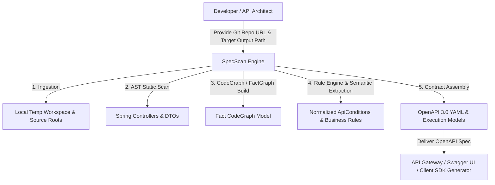

# Business Overview - SpecScan (Auto-OAS Engine)

## Business Context Diagram

## Business Description

- **System Purpose**: Spring Boot 백엔드 애플리케이션의 Git 레포지토리 소스 코드를 정적 분석(Static Code Analysis)하여, 백엔드에 숨겨진 API 엔드포인트 명세, 파라미터 제약조건, DTO Bean Validation 어노테이션, 커스텀 검증기, 비즈니스 로직(예외 흐름 및 서비스 가드 조건)을 자동으로 도출하고, 이를 정규화하여 **표준 OpenAPI 3.0 YAML 규격서 및 비즈니스 검증 모델**로 조립하는 자동화 엔진입니다.
- **Key Business Objectives**:
  1. **수동 명세서 작성 비용 절감**: 개발자가 손수 작성하거나 지속적으로 업데이트하기 힘든 API 명세서를 소스 코드 기반의 단일 진실 출처(Single Source of Truth)로 자동 추출.
  2. **숨겨진 비즈니스 규칙 및 검증 로직 가시화**: 단순 어노테이션 수준을 넘어 서비스 레이어의 `if-throw` 문, `Objects.requireNonNull`, `Assert.hasText`, 커스텀 Validator 내의 유효성 검증 규칙까지 식별하여 명세화.
  3. **결정론적 및 재현 가능한 명세 생성**: 동일한 소스 코드에 대해 항상 동일한 Graph 구조와 정규화된 규칙 명세, OpenAPI 3.0 사양을 출력하여 시스템 신뢰성 보장.

---

## Business Transactions

1. **Repository Ingestion & Workspace Setup Transaction**:
   - Git URL 및 커밋/브랜치 레퍼런스를 전달받아 안전한 임시 디렉토리에 클론하고, 활성 소스 루트(Source Roots, 예: `src/main/java`)를 자동 탐지.
2. **Endpoint & Type Discovery Transaction**:
   - Spring 컨트롤러 어노테이션(`@RestController`, `@Controller`)과 매핑 어노테이션(`@GetMapping`, `@PostMapping`, `@PutMapping`, `@DeleteMapping`, `@RequestMapping`)을 스캔하여 HTTP Method, Routing Path, Parameter(Header, Path, Query, Body) 및 응답 타입을 추출.
3. **Fact CodeGraph Construction Transaction**:
   - 컨트롤러 메서드부터 서비스, 리포지토리, DTO에 이르는 AST 흐름을 다차원 `FactCodeGraph`(노드 및 엣지)로 구조화.
4. **Validation Candidate & Rule Semantic Analysis Transaction**:
   - AST 노드 및 그래프 구조상에서 어노테이션 제약, 커스텀 Validator, 서비스 가드 표현식, 예외 던짐(`ThrowStmt`)을 탐지하고, 비즈니스 규칙 카테고리(`MANDATORY`, `FORMAT`, `RANGE`, `MUTUAL_EXCLUSION`, `AUTHORIZATION` 등)로 정규화.
5. **Contract Assembly & Multi-Artifact Export Transaction**:
   - 정규화된 비즈니스 규칙과 API 엔드포인트를 병합하여 `openapi.yaml`, `api-spec-analysis.json`, `api-execution-model.json`, `validation-evidence-graph.json` 등의 아티팩트로 조립하여 저장.

---

## Business Dictionary

| 용어 (Term) | 비즈니스 의미 (Business Meaning) | 시스템 매핑 객체 |
| :--- | :--- | :--- |
| **ApiEndpoint** | HTTP 메서드와 URL 경로로 식별되는 백엔드 진입점 | `io.atworks.specscan.analysis.domain.ApiEndpoint` |
| **RequestBinding** | 요청 시 전달되는 파라미터 또는 DTO 바인딩 정보 | `io.atworks.specscan.analysis.domain.RequestBinding` |
| **FactCodeGraph** | 소스코드 AST 및 제어/데이터 흐름을 표현한 다차원 그래프 | `io.atworks.specscan.analysis.domain.fact.FactCodeGraph` |
| **PredicateCandidate** | 소스 코드상에서 조건 판단(Predicate)으로 동작하는 검증 후보 | `io.atworks.specscan.analysis.domain.candidate.PredicateCandidate` |
| **BusinessRuleCandidate** | 특정 비즈니스 규칙(제약 조건)을 성립시키는 검증 후보 | `io.atworks.specscan.analysis.domain.candidate.BusinessRuleCandidate` |
| **ApiCondition** | 최종 정규화되어 OpenAPI 또는 명세서에 반영되는 검증 사양 | `io.atworks.specscan.analysis.domain.ApiCondition` |
| **EndpointRuleOutput** | 엔드포인트별로 정규화된 규칙 및 검증 집계 아웃풋 | `io.atworks.specscan.analysis.domain.output.EndpointRuleOutput` |

---

## Component Level Business Descriptions

### 1. Ingestion Component (`io.atworks.specscan.ingestion.*`)
- **Purpose**: 외부 Git 레포지토리를 안전하게 로컬 워크스페이스로 격리 클론하고 소스 루트를 구성.
- **Responsibilities**: Git 레치, 원격/로컬 워크스페이스 준비, 소스 루트 감지, Ingestion 에러/경고 수집.

### 2. Analysis Component (`io.atworks.specscan.analysis.*`)
- **Purpose**: Spring 컨트롤러, DTO, 서비스 계층에 대한 정적 분석 및 Fact Graph 구축, 규칙 정규화, 스펙 조립.
- **Responsibilities**:
  - 컨트롤러 및 타입 파싱 (`SpringStaticScanService`, `EndpointExtractor`, `TypeResolver`)
  - Fact CodeGraph 구축 (`DefaultFactCodeGraphBuilder`, `FactMethodVisitor`, `FactExpressionVisitor`, `DtoSchemaGraphBuilder`)
  - 시맨틱 분류 및 규칙 엔진 구동 (`SemanticRuleDispatcher`, `DefaultGraphRuleEngine`, `ValidationExtractionService`)
  - OpenAPI 3.0 사양 조립 및 파일 저장 (`OpenApiAssemblyService`, `OpenApiGenerator`, `StructuredSpecExporter`, `ExecutionSpecExporter`)

### 3. API Intelligence Core (`io.atworks.apiintelligence.*`)
- **Purpose**: 코드 그래프 도메인 모델(`CodeGraph`, `CodeNode`, `CodeEdge`)과 추상화 포트/어댑터를 정의.
- **Responsibilities**: 도메인 엔티티 유지, JavaParser 기반 코드 그래프 추출 어댑터 제공, LLM 연동 포트 정의.
