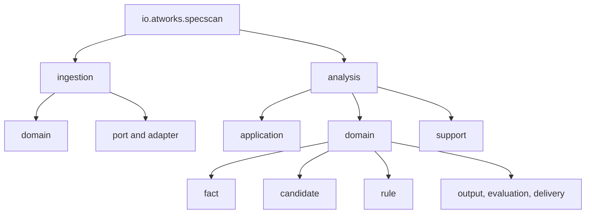

# 코드 구조

## 빌드 시스템

- Gradle Java/Application 프로젝트, 이름 `spec-scan`, 버전 `1.0-SNAPSHOT`.
- Java 21 toolchain, Maven Central.
- 기본 application main: `SpecScanDemoRunner`.

## 모듈 계층

텍스트 대안: 루트 진입점 아래 ingestion과 analysis가 분리되고, analysis는 application/domain/support로 나뉜다. domain은 fact, candidate, rule, output/evaluation/delivery 계약을 보유한다.

## 주요 파일 인벤토리

- `build.gradle`, `settings.gradle`: 빌드, dependency, 실행 및 품질 태스크.
- `GitSpecScanMain.java`: Git CLI.
- `SpecScanDemoRunner.java`: E2E 데모.
- `SpecScanWebServer.java`: 정적 UI와 scan API.
- `GitExecutionSpecScanService.java`: Git 분석 facade.
- `ingestion/application/RepositoryIngestionService.java`: 수집 정책과 orchestration.
- `ingestion/adapter/GitRepositoryFetcherAdapter.java`: JGit clone/checkout.
- `analysis/application/SpringStaticScanService.java`: endpoint scan.
- `analysis/application/ValidationExtractionService.java`: 검증 후보 추출.
- `analysis/application/NormalizationService.java`: legacy 정규화.
- `analysis/application/RuleOutputMigrationService.java`: 규칙 출력 migration.
- `analysis/application/OpenApiAssemblyService.java`: artifact assembly.
- `analysis/support/fact/*`: 사실 그래프 구축 및 무결성 검증.
- `analysis/support/candidate/*`: 후보 생성, ID, resolution 및 invariant.
- `analysis/support/rule/*`: 규칙 실행, registry, 격리, dedup 및 report.
- `analysis/support/rule/pack/*`: 내장 규칙 카탈로그.
- `analysis/support/rule/yaml/*`: YAML 규칙 정의와 loader/composer.
- `analysis/support/output/*`: candidate-to-output adapter와 comparator.
- `analysis/support/evaluation/*`: 품질 평가와 report writer.
- `analysis/support/delivery/*`: delivery readiness gate.
- `src/main/resources/static/*`: Web UI.
- `src/test/java/io/atworks/specscan/**`: 44개 테스트 소스.
- `src/test/resources/rule-based-static-analysis/**`: golden, holdout, synthetic fixture.

전체 운영 Java 파일 189개의 세부 목록은 `rg --files src/main/java`로 재현할 수 있으며, 이 문서는 변경 후보를 역할 단위로 묶어 제시한다.

## 설계 패턴

- Ports and Adapters: repository fetch/workspace 준비를 port로 분리.
- Application Service: scan/extract/normalize/assemble use case 구성.
- Immutable Domain Model: record와 불변 collection 중심 결과 계약.
- Pipeline: ingestion → scan → extraction → fact/rule → normalization/migration → export.
- Strategy/Registry: migration mode, rule pack, detector 및 traversal policy 교체.
- Adapter: legacy/candidate/structural 데이터를 공통 endpoint output으로 변환.
- Deterministic Identity: fact와 candidate ID를 소스 위치/의미 기반으로 생성.
