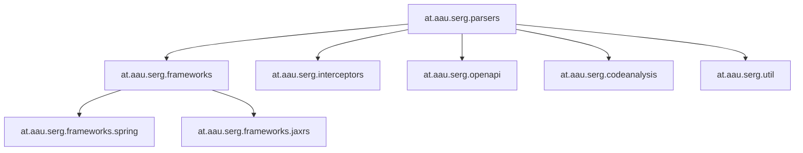

# Code Structure

## Build System
- **Type**: Maven
- **Configuration**:
  - 아티팩트 정보: `at.aau.serg:auto-oas:1.2.0`
  - 패키징: `maven-assembly-plugin` 기반 `jar-with-dependencies`
  - Main-Class: `at.aau.serg.parsers.Main`
  - 컴파일 타깃: Java 21

## Key Classes and Module Hierarchy

## Text Alternative
- `parsers`가 중심 오케스트레이션 패키지다.
- `frameworks` 아래에 Spring/JAX-RS 어댑터가 있다.
- `openapi`, `interceptors`, `codeanalysis`, `util`이 보조 역할을 맡는다.

### Existing Files Inventory
- `auto-oas.jar` - 배포 단위이자 분석 대상 바이너리
- `META-INF/MANIFEST.MF` - `Main-Class: at.aau.serg.parsers.Main`
- `META-INF/maven/at.aau.serg/auto-oas/pom.xml` - Maven 빌드 설정과 의존성 목록
- `at/aau/serg/parsers/Main.class` - CLI 엔트리포인트
- `at/aau/serg/parsers/ParserFactory.class` - 프레임워크 등록 및 파서 생성
- `at/aau/serg/parsers/FrameworkDetector.class` - 애노테이션 기반 프레임워크 탐지
- `at/aau/serg/parsers/RestApiParser.class` - 핵심 OpenAPI 생성 로직
- `at/aau/serg/openapi/OpenApiGenerator.class` - OpenAPI 직렬화와 파일 쓰기
- `at/aau/serg/frameworks/spring/*.class` - Spring MVC 지원 어댑터
- `at/aau/serg/frameworks/jaxrs/*.class` - Jakarta/Javax JAX-RS 지원 어댑터
- `at/aau/serg/interceptors/*.class` - 응답 코드 보정 인터셉터
- `at/aau/serg/codeanalysis/MethodBodyAnalyser.class` - 메서드 본문 분석 보조기

## Design Patterns
### Strategy Pattern
- **Location**: `RestFramework` 인터페이스와 Spring/JAX-RS 구현체
- **Purpose**: 프레임워크별 애노테이션 규칙을 분리하기 위해
- **Implementation**: `ParserFactory`가 구현체를 등록하고 `RestApiParser`가 선택된 전략을 사용

### Factory Pattern
- **Location**: `ParserFactory`
- **Purpose**: 감지 결과에 따라 적절한 `RestApiParser`를 생성하기 위해
- **Implementation**: 등록된 프레임워크 인스턴스를 기반으로 생성 메서드 제공

### Adapter Pattern
- **Location**: `frameworks/*/adapters`
- **Purpose**: 서로 다른 애노테이션 모델을 공통 추상화로 변환하기 위해
- **Implementation**: HTTP 메서드, 파라미터, 매핑 애노테이션별 전용 어댑터 제공

## Critical Dependencies
### Spoon Core
- **Version**: 11.2.0
- **Usage**: Java 소스 AST 모델 로딩 및 탐색
- **Purpose**: 정적 코드 분석의 핵심 엔진

### Swagger Models and Annotations
- **Version**: 2.0.10
- **Usage**: OpenAPI 객체 생성
- **Purpose**: 표준 명세 모델 표현

### Spring Web
- **Version**: 6.2.6
- **Usage**: Spring 애노테이션 타입 참조
- **Purpose**: Spring MVC 프로젝트 지원

### Jakarta and Javax WS RS APIs
- **Version**: 3.1.0 / 2.1.1
- **Usage**: JAX-RS 애노테이션 타입 참조
- **Purpose**: Jakarta 및 legacy Javax REST 프로젝트 지원

### Jackson Databind
- **Version**: 2.19.0
- **Usage**: OpenAPI JSON pretty-print 저장
- **Purpose**: 최종 산출물 직렬화
