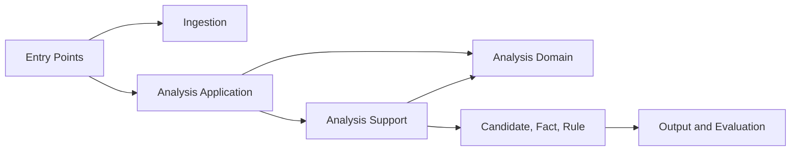

# 의존성

## 내부 의존성

텍스트 대안: 진입점은 ingestion과 application을 호출하고 application/support는 domain 계약에 의존한다. fact/rule 결과는 output/evaluation으로 전달된다.

## 외부 의존성

| 의존성 | 버전 | 용도 | 라이선스 계열 |
|---|---:|---|---|
| Eclipse JGit | 6.8.0 | Git clone/checkout | EPL 2.0 |
| Jackson Databind/YAML | 2.15.2 | JSON/YAML | Apache 2.0 |
| JavaParser Core/Symbol Solver | 3.25.7 | AST/타입 해석 | Apache 2.0/LGPL 선택형 |
| SLF4J Simple | 1.7.36 | 로깅 | MIT |
| JUnit Jupiter | 5.9.3 | 테스트 | EPL 2.0 |
| AssertJ Core | 3.24.2 | assertion | Apache 2.0 |
| jqwik | 1.7.4 | 속성 테스트 | EPL 2.0 |

라이선스는 일반 공개 라이선스 기준이며 배포 전 공식 NOTICE 검증이 필요하다.

## 런타임 경계

- 분석 대상 저장소 코드를 빌드하거나 실행하지 않는다.
- GitHub 외 URL과 SSH URL은 수집 정책에서 거부한다.
- 임시 작업공간은 성공/실패와 무관하게 정리한다.
