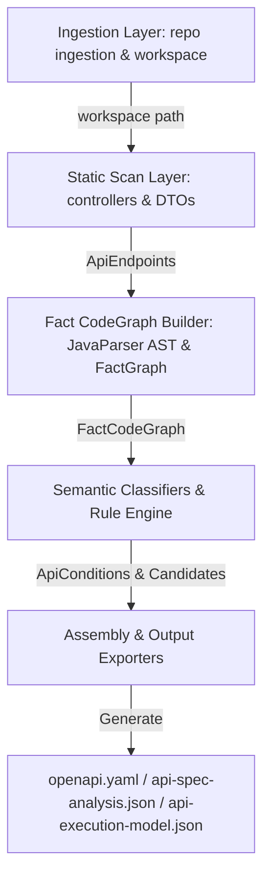

# Dependencies Analysis

## Internal Package Dependencies

Auto-OAS (SpecScan) 분석 엔진의 모듈 및 계층 간 내부 의존성 다이어그램입니다.



### Module Boundary Principles
1. **Ingestion -> Static Scan**: Ingestion 계층은 외부 소스를 가져와 로컬 워크스페이스를 격리 생성하고, Static Scan 계층은 유효한 소스 루트만을 수신합니다.
2. **Static Scan -> Fact Graph**: Static Scan은 Spring 어노테이션 기반으로 API 엔드포인트를 빠르게 식별한 후, Fact Graph 빌더로 AST 및 파라미터 타입을 넘깁니다.
3. **Fact Graph -> Rule Engine**: Fact Graph 빌더가 만든 다차원 `FactCodeGraph`는 불변(Immutable) 객체로서 `FactGraphIndex`를 거쳐 시맨틱 분류기 및 규칙 엔진에 전달됩니다.
4. **Rule Engine -> Output Assembly**: 정규화된 비즈니스 규칙과 검증 사양은 독립된 Exporter 클래스들을 통해 최종 사양 아티팩트로 조립됩니다.

---

## External Library Dependencies (`build.gradle`)

```groovy
dependencies {
    // JavaParser Core & Symbol Solver
    implementation 'com.github.javaparser:javaparser-core:3.25.7'
    implementation 'com.github.javaparser:javaparser-symbol-solver-core:3.25.7'

    // Jackson Databind & YAML format
    implementation 'com.fasterxml.jackson.core:jackson-databind:2.17.0'
    implementation 'com.fasterxml.jackson.dataformat:jackson-dataformat-yaml:2.17.0'

    // Testing & Assertion Frameworks
    testImplementation 'org.junit.jupiter:junit-jupiter-api:5.10.2'
    testRuntimeOnly 'org.junit.jupiter:junit-jupiter-engine:5.10.2'
    testImplementation 'org.assertj:assertj-core:3.25.3'

    // Property-Based Testing
    testImplementation 'net.jqwik:jqwik:1.9.2'
}
```

### Dependency Rationale
- **JavaParser 3.25.7**: 백엔드 소스 코드를 바이트코드가 아닌 AST 원본 수준에서 완벽히 파싱하고 심볼을 추적하기 위한 핵심 의존성.
- **Jackson YAML & Databind**: JSON 스펙 아웃풋 및 표준 OpenAPI 3.0 YAML 문서의 직렬화를 담당.
- **JUnit 5 / AssertJ / Jqwik**: 결정론적 그래프 구조 및 정규화 결과의 무결성을 검증하기 위한 테스트 스위트.
