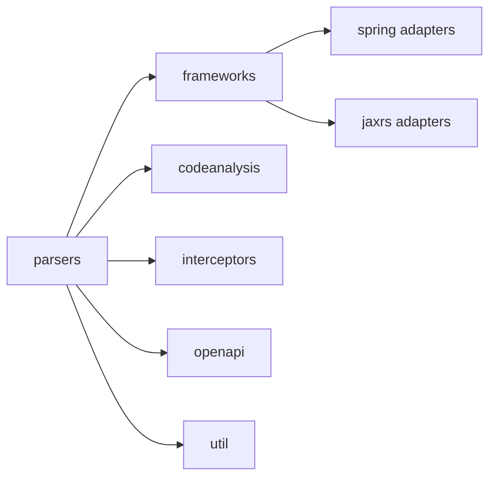

# Dependencies

## Internal Dependencies

## Text Alternative
- `parsers`가 거의 모든 내부 패키지에 의존하는 중심 계층이다.
- `frameworks`는 Spring/JAX-RS 세부 구현으로 분기된다.
- `openapi`, `interceptors`, `codeanalysis`, `util`은 `parsers`를 지원한다.

### `parsers` depends on `frameworks`
- **Type**: Compile
- **Reason**: 지원 프레임워크별 규칙을 사용해 엔드포인트를 해석하기 위해

### `parsers` depends on `openapi`
- **Type**: Compile
- **Reason**: OpenAPI 객체 생성과 파일 저장을 위임하기 위해

### `parsers` depends on `codeanalysis`
- **Type**: Compile
- **Reason**: 메서드 본문 기반 응답/타입 분석을 강화하기 위해

### `parsers` depends on `interceptors`
- **Type**: Compile
- **Reason**: 예외 처리기와 응답 상태 코드를 반영하기 위해

### `frameworks` depends on `spring` and `jaxrs`
- **Type**: Compile
- **Reason**: 공통 추상화 뒤에 프레임워크별 구현을 배치하기 위해

## External Dependencies
### `fr.inria.gforge.spoon:spoon-core`
- **Version**: 11.2.0
- **Purpose**: Java 소스 AST 생성 및 탐색
- **License**: JAR 내부 metadata 기준 별도 라이선스 파일 포함

### `io.swagger.core.v3:swagger-models`
- **Version**: 2.0.10
- **Purpose**: OpenAPI 모델 생성
- **License**: JAR 내부 metadata 기준 별도 라이선스 파일 포함

### `org.springframework:spring-web`
- **Version**: 6.2.6
- **Purpose**: Spring REST 애노테이션 타입 지원
- **License**: JAR 내부 metadata 기준 별도 라이선스 파일 포함

### `jakarta.ws.rs:jakarta.ws.rs-api`
- **Version**: 3.1.0
- **Purpose**: Jakarta REST 애노테이션 지원
- **License**: JAR 내부 metadata 기준 별도 라이선스 파일 포함

### `javax.ws.rs:javax.ws.rs-api`
- **Version**: 2.1.1
- **Purpose**: Legacy Javax REST 애노테이션 지원
- **License**: JAR 내부 metadata 기준 별도 라이선스 파일 포함

### `com.fasterxml.jackson.core:jackson-databind`
- **Version**: 2.19.0
- **Purpose**: OpenAPI JSON 파일 직렬화
- **License**: JAR 내부 metadata 기준 별도 라이선스 파일 포함
