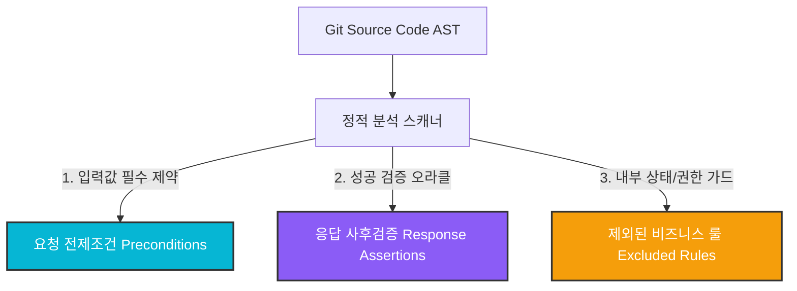
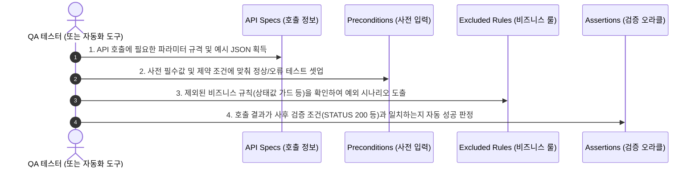

# 📊 [PoC 요약] Git 정적 분석 기반 API 테스트 계약(Contract) 자동화

---

## 🎯 1. PoC 한눈에 보기 (Bento Highlights)

````carousel
### 🔍 1. 분석 대상
- **Target Repository**: `ddd-start2` (Git URL)
- **분석 기술**: AST(추상 구문 트리) 정적 분석
- **분석 범위**: Spring Controller, DTO, Java Service Guard
<!-- slide -->
### ⚙️ 2. 성과 1: API 스펙 자동 추출
- **파라미터 매핑**: Path, Query, Header 자동 정제
- **JSON Body**: 중첩 DTO 필드 경로(`$.a.b`) 평탄화
- **자동 생성**: 필드별 제약조건 및 Mock JSON Example
<!-- slide -->
### 🛡️ 3. 성과 2: 테스트 계약 삼원화
- **Preconditions**: `@NotNull` 등 사전 입력 제약
- **Assertions**: 성공 보증을 위한 `STATUS 200` 기본 추가
- **Excluded Rules**: AUTH/RESOURCE 상태 가드 별도 보존
<!-- slide -->
### 🚀 4. 테스트 활용 가치
- **기본 호출**: 최신 규격으로 즉각적인 API 호출 셋업
- **성공/실패 경로**: 사전/사후 조건을 통한 테스트 케이스 설계
- **비즈니스 탐색**: 제외된 내부 룰로 경계값 예외 테스트 설계
````

---

## 🆚 2. 기존 방식 vs PoC 자동화 모델 비교

| 비교 항목 | ❌ 기존 방식 (Swagger / 수동 위키) | ✨ 이번 PoC 자동화 모델 |
| :--- | :--- | :--- |
| **작성 공수** | 개발자가 애노테이션 추가 및 위키 수동 갱신 (지연 발생) | **공수 0%** (Git 리포지토리 연동 시 100% 자동 분석) |
| **제공 정보** | 단순 데이터 타입 규격 정보만 제공 | **비즈니스 조건 및 테스트 오라클 계약(Contract)** 제공 |
| **신뢰도** | 코드 변경 시 동기화 누락 위험 높음 | **실시간 코드 분석** 기반으로 언제나 100% 최신화 |
| **테스트 지원** | 테스트 성공/실패 여부를 직접 파악해야 함 | **사전/사후 어설션 조건을 템플릿으로 즉시 제공** |

---

## 🛡️ 3. API 테스트 계약(Contract) 3-Way 분류 체계



| 계약 분류 | 수집 및 판단 기준 | 최종 JSON 노출 위치 | 💡 QA 테스트 활용 가치 |
| :--- | :--- | :--- | :--- |
| **요청 전제조건**<br>`Preconditions` | - `@NotBlank`, `@Size` 등 Bean Validation<br>- 입력 파라미터 필수 여부 | `requestPreconditions` | **올바른 입력값 가이드**<br>- 경계값 및 필수값 누락 테스트 케이스 생성기 |
| **응답 사후검증**<br>`Assertions` | - API 성공 응답에 대한 검증 오라클<br>- 엔드포인트 기본 성공 조건 | `responseAssertions` | **테스트 성공 판정 오라클**<br>- 런타임 테스트 실행 시 자동 패스/실패 검증 |
| **제외 비즈니스 룰**<br>`Excluded Rules` | - `AUTH` (currentUser 권한 검사)<br>- `RESOURCE` (주문 상태값 가드 등) | `excludedBusinessRules` | **예외 흐름 테스트 설계 힌트**<br>- "권한 없을 때", "주문 상태 불일치 시" 실패 케이스 도출 |

---

## 📋 4. 실제 API 계약 매핑 예시 (DDD 주문 취소 API)

> [!IMPORTANT]
> **Endpoint**: `POST /my/orders/{orderNo}/cancel` (주문 취소 API)

### 1) UI 화면 내 탭 분류 매핑 예시
```
[ API Specs ]  [ Payloads ]  [ Preconditions ]  [ Assertions ]  [ Excluded Rules (★) ]
```

* **Preconditions (사전 조건)**
  - `Path Variable`인 `{orderNo}` 필수 검증
* **Assertions (사후 검증)**
  - `STATUS` `EQUALS` `200` (성공 어설션 자동 추가)
* **Excluded Rules (제외되었으나 시각화된 비즈니스 규칙)**
  - `targetLocation`: `AUTH` | `operator`: `HAS_CANCELLATION_PERMISSION` (권한 체크)
  - `targetLocation`: `RESOURCE` | `operator`: `STATE_IN` | `expected`: `PAYMENT_WAITING, PREPARING` (주문이 배송 전 상태여야 취소 가능)

---

## 🚀 5. QA 테스터의 3단계 실무 활용 시나리오


